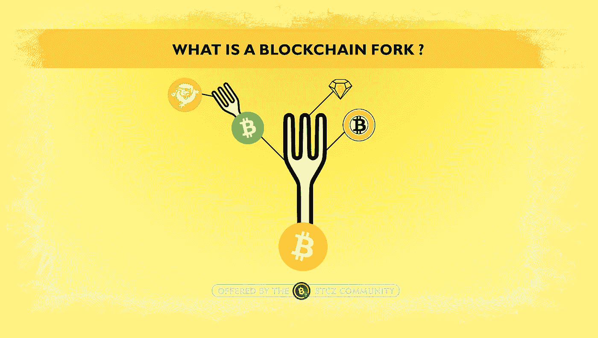
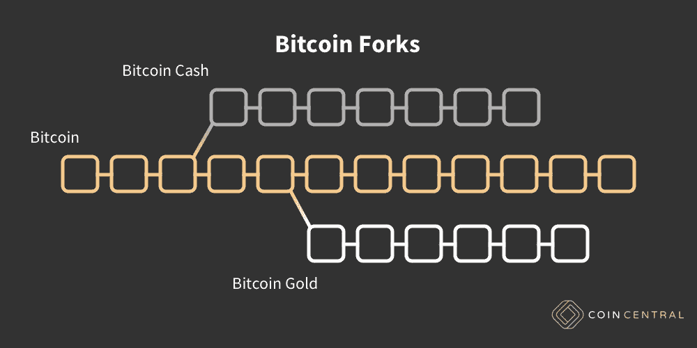
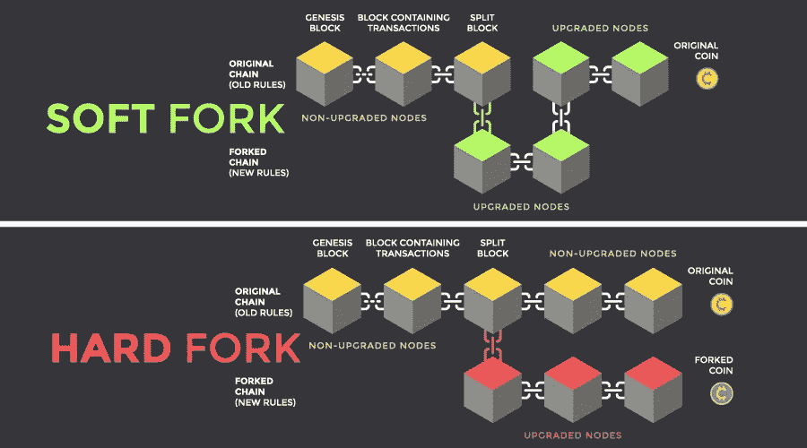
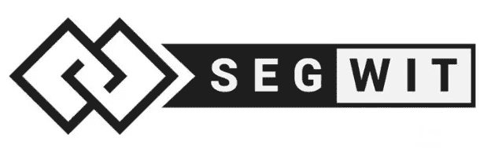
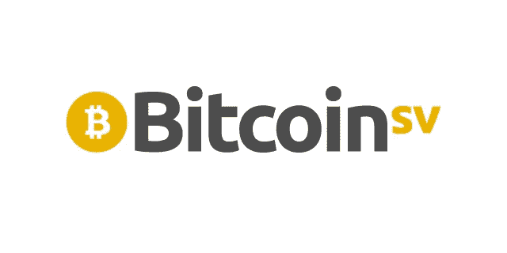

# 比特币叉子

> 原文：<https://medium.com/coinmonks/bitcoin-forks-a1b99e48fd9a?source=collection_archive---------52----------------------->

比特币和以太坊等加密货币运行在一个名为区块链的去中心化、开放的软件上，任何人都可以贡献自己的东西。它们被称为区块链，因为它们实际上是由数据块组成的。你可以把它想象成一列很长的火车，让你看到网络上的第一笔交易。

因为大多数数字货币都是开源的，他们有独立的开发团队负责网络的改变和改进。这些改进类似于互联网协议的变化，随着时间的推移，网络浏览变得更好。换句话说，分叉是为了使加密货币交易更加安全或添加其他功能等目的而进行的。当社区对区块链协议或一组基本规则进行更改时，将出现分叉。在这种情况下，链分裂，出现了第二个区块链，它与原始链有着共同的历史，但正朝着一个新的方向发展。

随着比特币变得越来越受欢迎，它所基于的区块链技术也慢了下来。这使得加密货币系统不可靠，交易费用更高。因为这种放缓是一个大问题，比特币需要拿出一个解决方案。这就是叉子发挥作用的地方。

叉子主要有两种:硬叉子和软叉子。

> 交易新手？试试[加密交易机器人](/coinmonks/crypto-trading-bot-c2ffce8acb2a)或者[复制交易](/coinmonks/top-10-crypto-copy-trading-platforms-for-beginners-d0c37c7d698c)

**硬分叉**:由于代码发生了巨大的变化，当新版本不能向后兼容旧版本时，就会发生硬分叉。在这种情况下，区块链被一分为二:原始的区块链和遵循新规则的新版本。这创造了一种全新的加密货币，这就是今天大多数公认的硬币是如何诞生的。像比特币现金和比特币黄金这样的加密货币是从最初的比特币区块链用硬叉子演变而来的。

在硬分叉之后，比特币和新型比特币之间不发生任何交易或通信。两者互不相同，它们的变化是永久性的。这意味着，如果你运行的是旧版比特币软件，你将无法再与升级到新版软件的用户互动。

我们可以将 forks 比作一个公司中的不同部门。就像一个公司有很多部门比如人力资源部门，IT 部门一样，硬分叉的新加密货币就像公司的各个部门。

软叉:你可以把软叉看作是区块链的软件升级。当被所有用户采用时，这就成了新的货币标准。软分叉已经被用来为比特币和以太坊带来新的特性或功能，通常是在编程层面。因为它毕竟是单个区块链，所以更改是向后兼容 fork 前的块的。

软分叉和硬分叉最大的区别在于软分叉是向后兼容的。换句话说，小的变化是在区块链的软叉上进行的。这意味着所实现的新协议和事务可以被系统中的新旧节点识别。但在硬分叉中情况并非如此。

**那么投资者如何才能从福克斯获益呢？**

投资者当然可以从福克斯中受益，而且有几种方法可以做到这一点。第一种叫做“空投”。空投发生在从现有加密货币的硬分支创建新的加密货币时。因此，当投资者拥有硬分叉加密货币时，他们可以获得“免费”的资金。比如比特币现金出来的时候，每一个拥有比特币的人也都收到了等量的比特币现金币。

也可以投资 hard fork 创造的新加密货币。假设，你可能从这项投资中获利。比如那些投资莱特币，被硬分叉后还保持收益的，赚了不少钱。

投资者也可以从软分叉中受益，因为他们经常通过软分叉使他们的加密货币变得更强。更强的加密货币往往对可能遇到的问题有更好的响应和弹性。这对价格有积极影响。

**比特币分叉的危险**

这些分叉的原因不是为了让区块链系统受益，而是为了轻松赚钱。规则的改变是这样的，开发商为自己保留了新硬币的很大一部分，并且在硬币一上市就把他们买的硬币卖掉。

有些叉子是明目张胆的骗局。可以作为例子展示的‘叉子’之一是:比特币白金。据称由一名韩国少年创建的比特币白金项目官方推特账号@bitcoinplatinum 声称将在 498577 块硬分叉比特币协议。这个账号还表示，应该通过为比特币创建 fud 来做空比特币。根据比特币白金发布的推文，比特币白金项目背后的动机显然是试图通过带来一个硬分叉来降低比特币的价格，并通过做空比特币来从中获利。

此外，有时 forks 可能会制造很多戏剧性事件，并导致矿工和开发者之间关于某些加密货币的争斗或争论。这方面最好的例子就是比特币 Segwit2X 硬分叉。2017 年 Segwit2X 一出，就彻底分裂了比特币社区，并引起了社区内部对立两派的激烈争论。因为没有达成共识，计划中的硬分叉被取消。虽然在比特币社区中会看到这样的讨论，但有时为了做出正确的决定，似乎有必要进行这样的讨论。

**比特币的 2 个重要软分叉:**

**1。SegWit:**

SegWit 协议更新是在 2017 年设计的，旨在使比特币能够扩展并增加其可靠性。

比特币在其基础层每秒只能处理 7-10 笔交易。比特币的底层技术虽然具有革命性，但却成为了比特币发展的阻碍。SegWit 是通过从比特币交易中移除签名数据来增加区块链的块大小限制的过程。当事务的某些部分被删除时，就产生了向链中添加更多事务的容量和空间。

SegWit 还修复了交易可能被解密的问题，该问题导致在不执行网络交易的情况下交换 BTC 交易数据。这个问题可能会让你的会计记录变成一场噩梦。塞格维特；允许将签名信息存储在相关事务所在的块之外，同时设法验证它们。

SegWit 没有被比特币参与者完全采用，因为它不是强制性的，并在生态系统的用户中引起不同的意见。尽管有 SegWit 的好处，但并非比特币网络的所有参与者都选择使用它。随着交易费用下降，利润率下降，矿商选择使用 AsicBoost 固件，这与 SegWit 不兼容。

目前，SegWit 钱包和工具的使用率超过 50.5%。

**2。主根:**

这是比特币网络上最大的更新之一，发生在 2021 年 11 月 14 日。此次更新是自 2017 年 SegWit(隔离见证)更新以来，比特币协议最受期待和最重要的技术升级之一，旨在提高比特币网络的效率和隐私。

此次更新还推动了比特币智能合约的实施，将中间人从交易中移除，为比特币的 DeFi(去中心化金融)铺平了道路。

简而言之，Taproot 更新结合了多个动作和签名。在实现 Taproot 之前，比特币网络上的交易速度很慢，因为每个签名都是根据公钥进行验证的。这种方法大大增加了需要多次输入和签名的复杂交易的时间。Taproot 允许批量操作，允许一次验证多个签名。通过这种方式，在涉及多方并将多种投入集中于单一投入的交易中实现了极高的效率。这一更新还对隐私产生了重大影响，使观察者难以区分单签名和多签名交易，并消除了区块链参与者之间的区别。

**5 个重要的比特币分叉:**

**1。比特币现金(BCH):**

比特币现金(BCH)于 2017 年 8 月由比特币社区内部的一个团体推出，该团体不同意比特币的缩放路线图和 SegWit 升级。这个名为比特币现金的新链条是由矿工和开发者创建的，他们希望通过实现更大的区块来解决比特币规模限制，这些限制导致交易时间长和交易费用高。

比特币社区反对更大区块的理由是，随着区块链的规模最终将膨胀，个人更难自己管理节点，它最终将导致集中化。

**2。比特币 SV (BSV):**

比特币 SV (BSV)，一个叉子的叉子，2018 年 11 月发布，作为比特币现金的硬叉子。BSV 已经被一群由 Craig S. Wright 和 Calvin Ayre 领导的 BCH 社区成员所分裂，他们声称 BCH 的特征没有重要到足以满足成功扩展比特币现金区块链的要求。此外，BSV 的支持者强烈支持恢复到比特币 0.1 版本所代表的最初比特币设计。比特币 SV 使用“Satoshi Vision”这个名称来指代不支持第二层、链外扩展解决方案的比特币白皮书。

在技术层面上，BSV 设计的默认块大小为 128MB，在下一次更新中将增加到 2GB。新的结构旨在提供更多的交易费用，并处理更多的交易，以此鼓励矿商发行新的区块，即使区块奖励最终到期。

BSV 领导人 Craig S. Wright 继续声称自己是中本聪，比特币的创造者，尽管他没有证据。由于赖特的主张对 BSV 的存在理由很重要，他无法证明自己的主张也影响了替代硬币的价格。

**3。比特币黄金(BTG):**

比特币黄金(BTG)创建于 2017 年 10 月，口号是“让比特币再次去中心化”。

Jack Liao 和其他联合创始人旨在通过创建一个可以使用 GPU 挖掘的比特币版本来实现这一目标，任何人都可以在家里运行该版本。他们认为采矿已经变得太复杂和昂贵，人们无法使用他们的个人电脑来开采 BTC，所以他们选择了一种 GPU 矿工友好的工作证明算法，称为 Equihash BTG。

BTG 已经成功成为家庭矿工中受欢迎的硬币，但除此之外，它未能建立一个重要的用例。

**4。比特币钻石(BCD):**

比特币钻石(BCD)分叉发生在 2017 年 11 月，当时比特币分叉正在流行。BCD 创始人推出了自己的链，目的是通过增加交易次数、降低交易费用和增加隐私来改善比特币协议。
他们实施了一种新的工作证明一致性算法，旨在阻止网络攻击，并将事务签名与链上事务分离，以提高容量，从而实现每秒更高的链上事务吞吐量。

**5。比特币私人(BTCP):**

比特币私人(BTCP)于 2018 年 3 月从比特币和 Zclassic (ZCL)的硬分叉中创建。创建比特币私有的目的是将 Zclassic 的隐私特性与比特币的安全性结合起来。

比特币私有并不是一个标准的分叉，而是从比特币协议中分叉出来，并与 Zclassic 相结合的“分叉组合”。

**先简单说一下比特币分叉的市值。**

爱不爱；比特币的一些最大分支的市值达到了数亿甚至数十亿:尽管这些项目的支持者声称替代币应该获得这一市值，但该领域的顶级投资者预计这些价值将脱离他们的链条，流入这两个市场。:比特币和分散金融(DeFi)

根据 crypto startup 和对冲基金 Spartan Group 的投资者 Jason Choi 的说法，目前没有理由投资长期比特币分叉。

据这位投资者称，这条链上的价值，Choi 称之为“美化的数字资产”，最终将流入 DeFi 和比特币。

**因此**，软分叉和硬分叉都可能在加密货币领域引发大量争议。这是因为分叉创造了变化。许多人不接受加密货币的变化，因为他们希望更喜欢原始的硬币，他们希望它保持真实性。

然而，加密货币行业天生具有创新性。在密码世界里有不断的改进和变化，也有很多人想去做。自 2009 年以来，比特币统治市场的时间比任何其他加密货币都长。这在加密市场中创造了高度的信任，尽管有许多硬分叉，但它仍然是市值排名第一的加密货币。