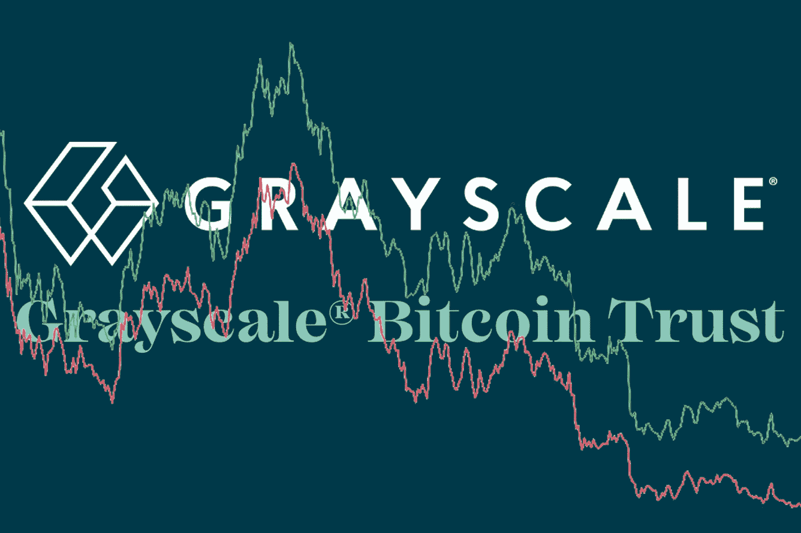
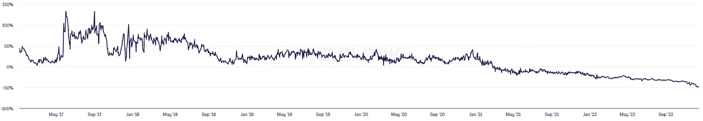
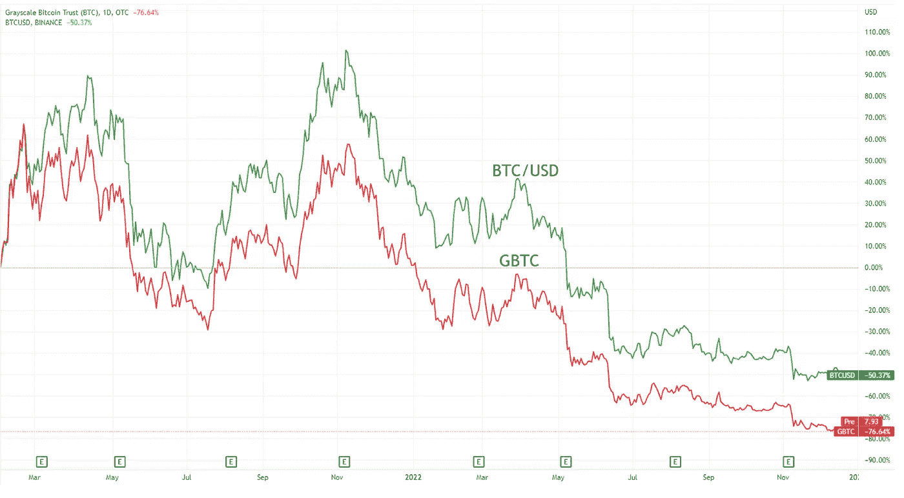

# 比特币半价。GBTC 的麻烦

> 原文：<https://medium.com/coinmonks/bitcoin-half-price-gbtc-troubles-a8c19a5921f1?source=collection_archive---------12----------------------->

## 数字货币集团(Digital Currency Group)的子公司灰度投资(gray Investments)的主要产品灰度比特币信托(GBTC)正遭遇严重问题。根据 ycharts.com****的数据，GBTC 股价在 12 月 13 日达到了-48.89%。****

****

**灰度投资是一只允许不直接投资加密货币，而是通过其投资工具进行投资的基金。例如，灰度比特币信托的唯一资产是比特币，因此其股价跟随 BTC 价格。然而，价格图表并不 100%相关。直到 2021 年 2 月趋势改变之前，该基金一直以相对于净资产值(NAV)的溢价交易。GBTC 目前的交易价格正处于接近 50%的创纪录折价水平。**

****

***Daily GBTC Premium/Discount to NAV***

**简单地说，现在可以购买资产为比特币的信托公司的股票，比比特币本身更便宜。听起来很划算，但是你不应该期望有保证的利润。这么大的折扣是有原因的。**

****比特币下跌。****

**信托股票价格所依赖的唯一资产正在变得越来越便宜。加密货币市场的悲观情绪并不鼓励投资者选择比特币相关工具。自 2021 年 2 月以来，GBTC 下跌了 76%，而比特币仅下跌了 50%。**

****

****数字货币群体的问题。****

**在文章[中，谁是下一个？创世纪和 DCG·FUD](https://www.observers.com/who-is-next-genesis-dfg-fud/)我们报道了加密经纪人创世纪即将破产的可能性。该公司是 DCG 的子公司，以及灰度投资。gray 的管理层表示，Genesis Global Capital 不是他们产品的对手或服务提供商，但负面消息仍然影响了投资者的信心。**

****SEC 否认。****

**gray 在 2021 年 10 月向美国证券交易委员会申请将 GBTC 信托基金转换为交易所交易基金(ETF)，这将使其可供更广泛的投资者使用。该请求被拒绝。该决定的动机是基础资产不受监管，因为加密现货市场不受监管。格雷不同意，并于 2022 年 6 月起诉美国证券交易委员会。需要注意的是，SEC 注册的是 ETF，ETF 的基础资产是加密货币期货，而不是加密货币本身。迄今为止，GBTC 是在场外市场交易。**

****针对杉树的诉讼。****

**对冲基金 Fir Tree Capital Management 起诉 Tree 披露信息，以调查该基金可能存在的管理不善。他们想迫使该公司降低管理费(2%，高于许多竞争对手)，并开始回购股票。**

**所有这些情况的压力导致灰度的主要产品创下新低纪录。几乎 50%的折扣似乎是一个很好的切入点，但必须明白，现在购买 GBTC 并不等同于以半价购买比特币。不能保证公司的问题不会进一步恶化。试图在底部买入会把你带到另一个底部，一个更深的底部。**

**与此同时，如果母公司和基金本身的主要问题得到解决，并且 SEC 允许 GBTC 信托基金转换为 ETF，灰度基金将获得新的投资者流入。无论如何，GBTC 的未来很大程度上取决于这个隐秘的冬天多快会变成春天。**

> **交易新手？试试[加密交易机器人](/coinmonks/crypto-trading-bot-c2ffce8acb2a)或者[复制交易](/coinmonks/top-10-crypto-copy-trading-platforms-for-beginners-d0c37c7d698c)**
> 
> **多样化的密码持有，了解[币安替代品](https://coincodecap.com/binance-alternatives)**
> 
> **加入 Coinmonks [电报频道](https://t.me/coincodecap)和 [Youtube 频道](https://www.youtube.com/c/coinmonks/videos)获取每日[加密新闻](http://coincodecap.com/)**

# **另外，阅读**

*   **[复制交易](/coinmonks/top-10-crypto-copy-trading-platforms-for-beginners-d0c37c7d698c) | [加密税务软件](/coinmonks/crypto-tax-software-ed4b4810e338)**
*   **[网格交易](https://coincodecap.com/grid-trading) | [加密硬件钱包](/coinmonks/the-best-cryptocurrency-hardware-wallets-of-2020-e28b1c124069)**
*   **[密码电报信号](/coinmonks/top-3-telegram-channels-for-crypto-traders-in-2021-8385f4411ff4) | [密码交易机器人](/coinmonks/crypto-trading-bot-c2ffce8acb2a)**
*   **[最佳加密交易所](/coinmonks/crypto-exchange-dd2f9d6f3769) | [印度最佳加密交易所](/coinmonks/bitcoin-exchange-in-india-7f1fe79715c9)**
*   **开发人员的最佳加密 API**
*   **最佳[密码借贷平台](/coinmonks/top-5-crypto-lending-platforms-in-2020-that-you-need-to-know-a1b675cec3fa)**
*   **[免费加密信号](/coinmonks/free-crypto-signals-48b25e61a8da) | [加密交易机器人](/coinmonks/crypto-trading-bot-c2ffce8acb2a)**
*   **杠杆代币的终极指南**