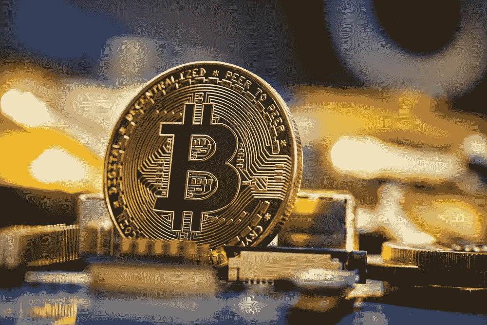

# 比特币减半日期

> 原文：<https://medium.com/coinmonks/bitcoin-halving-dates-2356ad307bca?source=collection_archive---------9----------------------->

> 从顶级交易者那里复制交易机器人。免费试用。

比特币减半日期是加密货币社区的重要事件。每隔四年，矿商因验证交易而获得的比特币奖励金额会减半。这一事件被称为“减半”，是比特币基础代码的重要组成部分，对加密货币的价格有着重大影响。的…