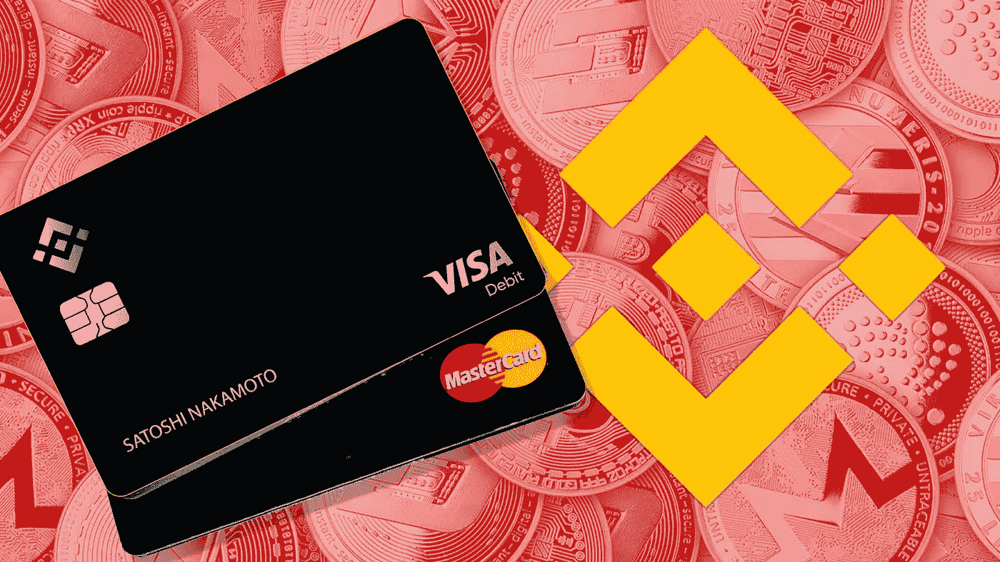
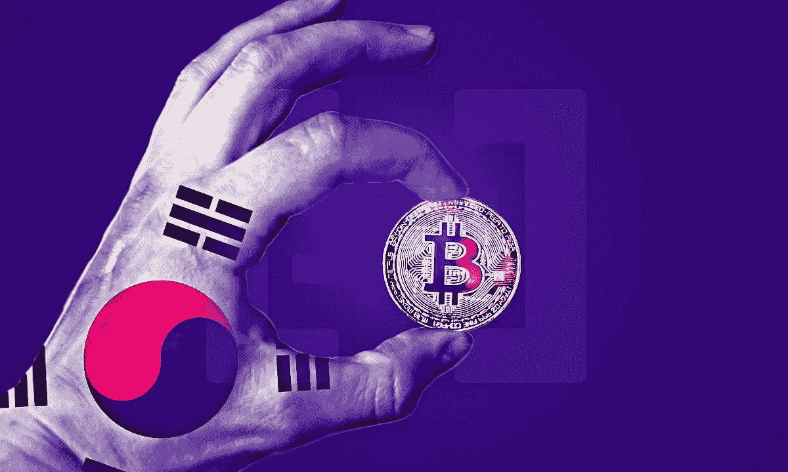
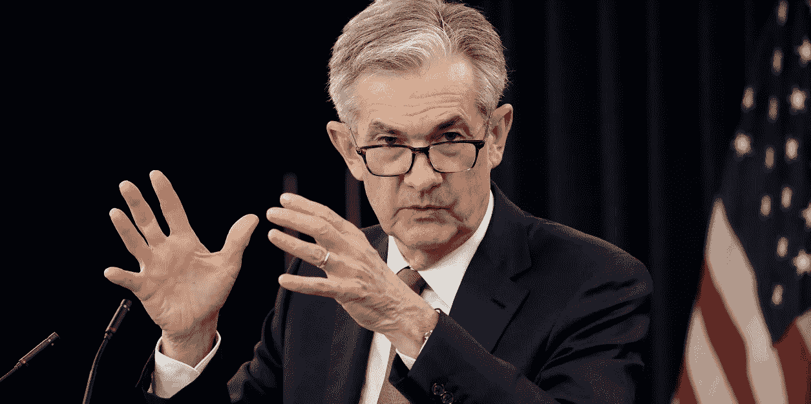
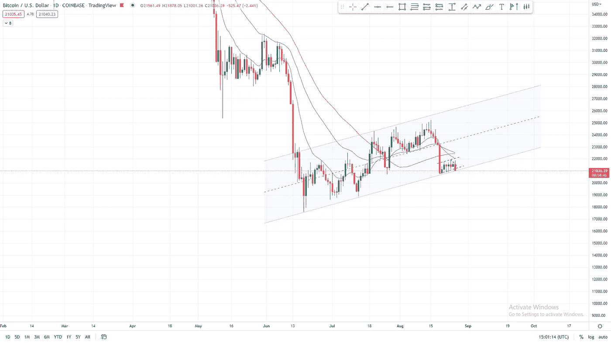
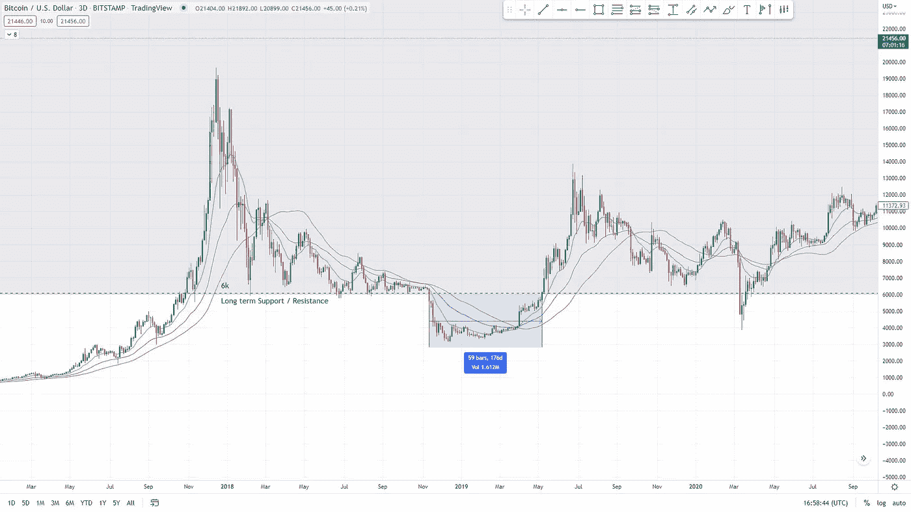
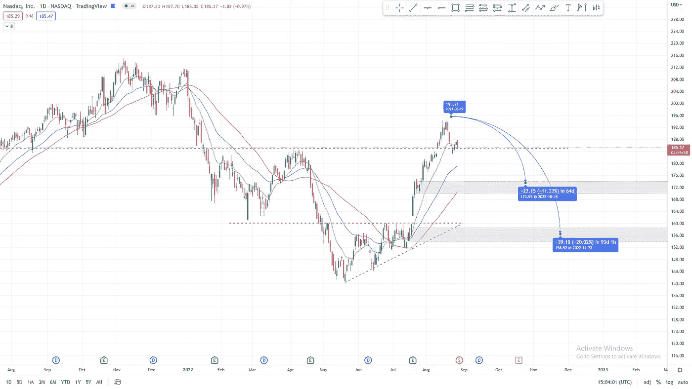

# 比特币在熊市中继续被机构采用

> 原文：<https://medium.com/coinmonks/bitcoin-institutional-adoption-continues-amidst-bear-market-e40afa50d520?source=collection_archive---------24----------------------->

For a more smooth experience, continue your read on [www.boomish.org](http://www.boomish.org)

# 本周简讯**(8 月 26 日—9 月 2 日):**

*   尽管价格行动似乎不靠谱，但机构的采纳并没有动摇
*   万事达卡和币安合作
*   VISA 在巴西发行加密支付卡
*   三星计划推出自己的加密交易所
*   杰罗姆·鲍威尔警告不要继续收紧政策
*   比特币标志崩溃越来越近了
*   纳斯达克试图抓住次要支持

‍

‍

# 万事达卡、维萨卡和三星进入加密领域

‍

**万事达卡**

8 月 25 日，万事达卡首席执行官迈克尔·米巴赫(Michael Miebach)在他的个人 LinkedIn 个人资料上透露，该公司正在与币安合作，以便在超过 9000 万家商店中使用加密货币进行购物。

虽然万事达卡已经积极探索加密领域一段时间了，但与世界领先的加密交易所的整合仍然是加密领域的大新闻。

万事达卡还将推出返现功能。对于某些购买，持卡人可以赚取高达 8%的加密返现。

币安将为持卡人提供一个适当的界面来管理他们的加密货币、卡和交易历史。

*英国《金融时报》图片*

**‍**

**签证**

VISA 也因一家名为 Ripio 的阿根廷加密公司在巴西推出预付费 VISA 加密卡而成为新闻。

该卡允许用户以 28 种不同加密货币中的任何一种支付，并在所有购买中获得 5%的比特币返现奖励。

比特币返现奖励将于 10 月份发布，每位用户每月上限为 50 美元。

Ripio 计划发行约 25 万张新卡，希望数百万巴西公民能够接受这种新卡。

该公司还计划今年晚些时候在阿根廷推出这种信用卡。更多的计划潜在地将加密卡扩展到其他国家，如哥伦比亚、墨西哥和乌拉圭。

**‍**

**三星正在创建加密交换**

根据韩国新闻来源，8 月 22 日，三星证券宣布他们正在考虑推出自己的加密货币平台。

三星证券是三星技术集团的附属公司。

这一消息似乎更有可能通过，因为萨尔瓦多总统布克勒总统最近也会见了三星的消费电子产品总裁。

此外，早在 2022 年 6 月，三星证券就率先在亚洲推出了全球区块链交易所交易基金(ETF)。

*图片由 BeInCrypto.com 拍摄*

‍

‍

杰罗姆·鲍威尔主席在杰克逊霍尔的演讲

自本周初以来，市场参与者一直在热切等待鲍威尔的评论。

鲍威尔的评论经常对市场走势产生巨大影响，就像他们在 8 月 26 日再次做的那样。

鲍威尔的评论非常保守，让许多投资者放弃了他们的冒险行为，导致资产价格大幅下跌。

杰罗姆·鲍威尔(Jerome Powell)警告不要过早放松政策，预测未来将进一步加息，他表示，“历史告诫不要过早放松政策”。

他在随后的讲话中进一步证实了这一点，称市场“可能需要一段时间的限制性政策”。

就目前而言，市场上的避险态度似乎仍是投资者最安全的选择。

‍

‍

*Sharecast.com 美联储主席杰罗姆·鲍威尔*

‍

**总结**

随着贝莱德(Blackrock)等大型买家与比特币基地合作，万事达(Mastercard)和维萨(VISA)等支付网络创建全球加密支付卡，以及三星(Samsung)寻求创建自己的加密交易所，机构的采用绝不是可以忽略的。

尽管价格行动似乎不可靠，但机构的采纳并没有动摇。

很明显，大投资者和大公司都想在比特币中占有一席之地。

‍

# 比特币价格分析

‍

## 短期

比特币目前位于前面提到的熊市底部。

崩溃似乎迫在眉睫，但尚未发生。

8 月 26 日，在董事长杰罗姆·鲍威尔(Jerome Powell)发表演讲后，股市出现了快速下跌，随后熊市旗出现了小幅下跌，这将在本新闻稿的后面部分详细介绍。

比特币不仅打破了它的高时间框架标志，而且它在较低时间框架上形成了一个较小的标志，这个标志也在打破(见图 1)。

总结一下，比特币在这里真的不太好。

## 长期的

我们都可以用全新的视角来看待比特币当前的市场状况。

所以，我们来对比一下 2018 年的熊市。

在 2018 年的熊市期间，花了 176 天才反弹到 6k 长期支撑和阻力上方(图 2)。

目前的长期支持和阻力位于 30k(见图 3)，

如果市场需要同样长的时间来突破之前的长期支撑和阻力，那么在今年 11 月初之前，30k 上方的反弹不会出现。

另一个好消息是自突破关键水平以来的百分比下降。在 2018 年的熊市中，我们从关键水平下跌了约 48%。到目前为止，在这次熊市中，我们已经下跌了约 40%，如果这一趋势成立，这可能意味着没有多少痛苦了。

另有 8%的人认为 BTC 在 15500 点。不幸的是，在 15500 点没有太多的支撑。唯一真正的支撑是 2017 年牛市高点期间出现的盘整。

15500 点似乎不是一个积累更多比特币的太糟糕的区域。

*图 1 1D BTC 2022 年 2 月—2022 年 8 月(TradingView)*

*图 2 3D BTC 2017 年 2 月—2022 年 8 月(TradingView)*

*图 3 3D BTC 2020 年 2 月—2022 年 8 月(TradingView)*

**纳斯达克价格分析**

纳斯达克指数似乎已经在 185 美元的水平找到了一些立足点，进行小幅整合(图 4)。

尽管多头还没有表现出真正的信心，但这一立足点可能仍然稳固。

8 月 26 日星期五，杰罗姆·鲍威尔在杰克逊霍尔发表了一次演讲，他在演讲中透露了对当前金融市场的极端强硬态度。

通过鲍威尔透露出的谨慎，市场出现了大幅下跌，纳斯达克形成了一根 2%的长红烛。

172 和 155 的缺点似乎仍在发挥作用，并不是特别不可能。

纳斯达克指数有很大的空间在任何一个指示水平形成一个新的更高的低点，之后继续上涨仍然是可能的。

*图 4 1D 纳斯达克 2020 年 8 月—2022 年 8 月(交易视图)*

订阅 BOOMISH 时事通讯获取每周经济报道！

 [## 时事通讯

### 8 月 19 日至 8 月 26 日的一周简讯。在本周的时事通讯中，我们将介绍 VISA 和 Mastercard 创建加密…

www.boomish.org](https://www.boomish.org/newsletter) 

> 交易新手？试试[密码交易机器人](/coinmonks/crypto-trading-bot-c2ffce8acb2a)或[复制交易](/coinmonks/top-10-crypto-copy-trading-platforms-for-beginners-d0c37c7d698c)