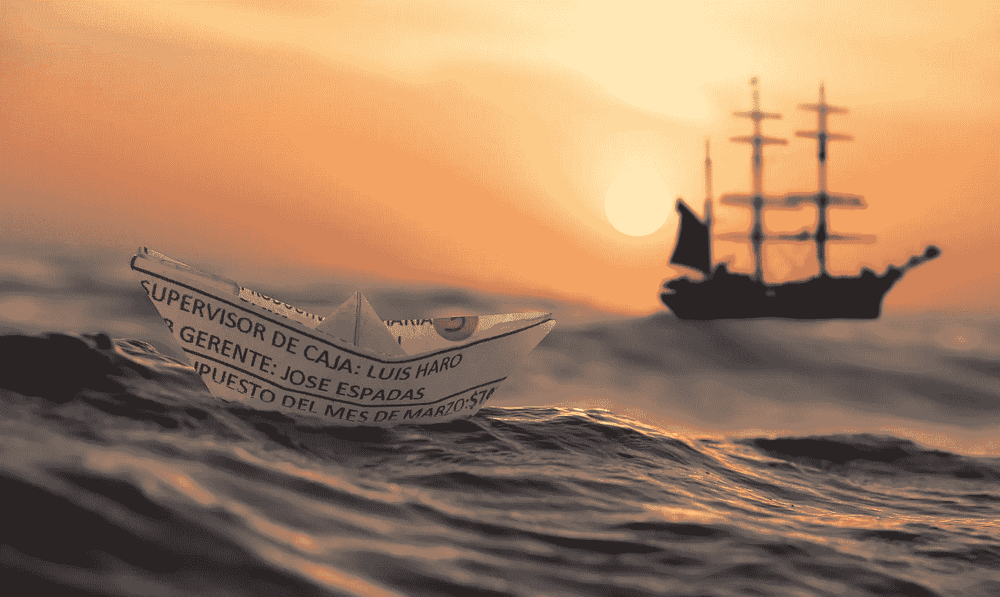
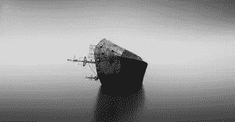
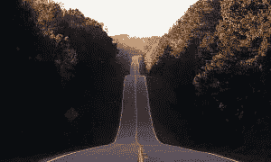

# 比特币是一项糟糕的投资

> 原文：<https://medium.com/coinmonks/bitcoin-is-a-bad-investment-8adfe67c82aa?source=collection_archive---------10----------------------->

杰里米投资了很多东西，经常不成功。杰里米变得越来越缺乏热情，他开始寻找一些稍微超出“传统”投资范围的东西。他听说比特币正在改变货币体系的基础，并且是过去十年中表现最好的资产。此时此刻，杰里米开始了臭名昭著的“模仿行动”,并尽可能多地购买了比特币，这是他半受创的银行账户所能收集到的。

对杰里米来说不幸的是，他在金钱上的轻浮经历使他对赚钱失去了耐心。因为这种不耐烦，他忘记了投资最重要的规则:**明白你投资的东西**。

# 糟糕的吹牛

尽管对比特币的社会影响程度仍然相对视而不见，但杰里米开始利用他的各种社交媒体渠道大肆宣扬他的超级投资。他试图让他的同行相信他即将获得的利润，因为他热情地放出“…这将使我赚很多钱！”—啊，这就是……他的第一个错误。这个错误即将让杰里米和他所有的野心变成一个可悲的#rekt 三明治。

杰里米认为比特币是达到目的的一种手段，是获得更多“真金白银”的工具，由于缺乏理解，他仍然认为这是法定货币的头衔。

这里的问题是，杰里米无意中错过了比特币的整个要点:成为更好的货币*。尽管他反复背诵了这句话——无论是在脑子里还是在推特上——但由于缺乏深刻的理解，他不可能真正相信这句话。他就是看不出来，你看不出来，你大概也不信。他可能只是对自己隐瞒了这一事实，以避免面对自己摇摆不定的投资习惯。*

# *泰坦尼克号，还是救生艇？*

**

*尽管如此，当压力来临时，隐藏的东西会显现出来，当他的 sat 来找我们时，比特币会暴跌。*

*看，霍德勒夫妇明白比特币是一种糟糕的投资，因为他们明白比特币根本不是一种投资。红烛棒底部的钻石指针和交易视图图表上的倒置 Bart 模式是比特币的支柱，这不仅仅是因为它们很聪明。这是因为他们有一个特别有力的观点，一个中肯的信念，比特币不是泰坦尼克号；是救生艇。尽管遗留系统正在努力应对，但这一微弱的希望是，中本聪正在给我们扔绳子。*

*杰里米是一个相信河对岸的草非常绿的人，但他从来没有看到他那边的草有多黑。因此，当冬天来临，流动性的海洋变得不稳定时，他跳了船，完全没有意识到这不是一艘船，而是一艘他跳过的救生艇。*

# *方式*

**

*这就是为什么一个好的比特币教育不是专注于比特币。亚里士多德曾经说过:*

> *自然厌恶真空*

*在 2009 年之前，我们既没有创造也没有找到令人满意的货币形式；这留下了一个有待填补的真空。碰巧的是，比特币是最适合这个空白空间的东西。因此，不要试图通过学习各种形式的密码学和令人费解的计算机知识来理解比特币，而是要了解比特币所处的空白空间。*

*研究当前的系统。了解它的历史以及我们是如何走到今天的。通过这种方式，你可能会开始理解我们可能会从这里走向哪里，正是从这种理解出发，比特币的价值将变得不言而喻。请参阅 FastBitcoins 库了解更多信息。*

*如果你想理解救生艇的价值，你不能孤立地看待它。这是一块很小的充气橡胶，大约可以容纳六个人。与 5.2 万吨的泰坦尼克号相比，它看起来就像一粒灰尘:微不足道。但是，只有当你看到泰坦尼克号驶向何方时，你才会恳求在那些小块充气橡胶上占一个位置。*

*这就是为什么在 [FastBitcoins](http://fastbitcoins.com/) 我们致力于尽可能提供最顺畅的比特币入职(是的，他们称之为入职是有原因的)程序。现在注册，并获得一个免费的救生艇与每个 sat 你栈！(不尽然……不过你仍然可以注册……或者至少在 [Twitter](http://twitter.com/fastbitcoins) bro 上关注我们)。*

> *交易新手？试试[密码交易机器人](/coinmonks/crypto-trading-bot-c2ffce8acb2a)或[复制交易](/coinmonks/top-10-crypto-copy-trading-platforms-for-beginners-d0c37c7d698c)*