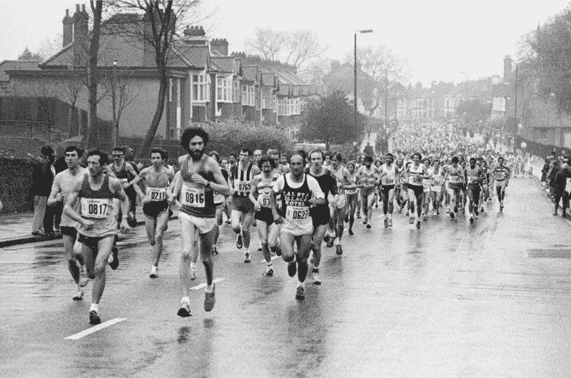

# 比特币是一场马拉松，不是短跑

> 原文：<https://medium.com/coinmonks/bitcoin-is-a-marathon-not-a-sprint-ea166d66c873?source=collection_archive---------9----------------------->

# 采用新技术需要时间

比特币和马拉松。有两件事我可能花了太多时间去思考。

在谷歌上快速搜索“比特币是一场马拉松，而不是短跑”，半秒钟内就有 482，000 个结果。热门话题。

*historyextra.com photo*

说真的，比特币的旅程已经并将继续是一场马拉松，而不是快速冲刺…