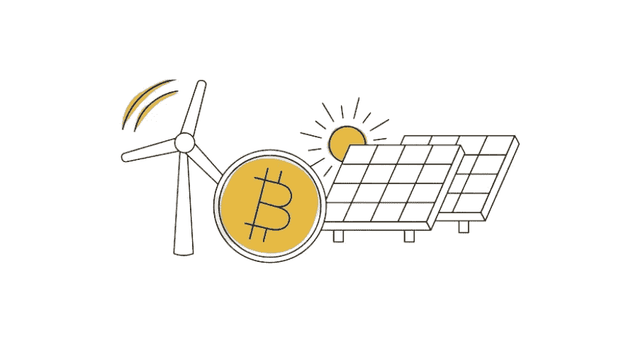

# 比特币是数字化的能源

> 原文：<https://medium.com/coinmonks/bitcoin-is-digitized-energy-6b95d348372e?source=collection_archive---------22----------------------->

## 比特币解决的基本突破，如双重支出问题和在没有可信第三方的情况下进行点对点转移，意义深远。比特币的替代突破涉及解决经济学或公用事业市场从未见过的货币能源优化。

