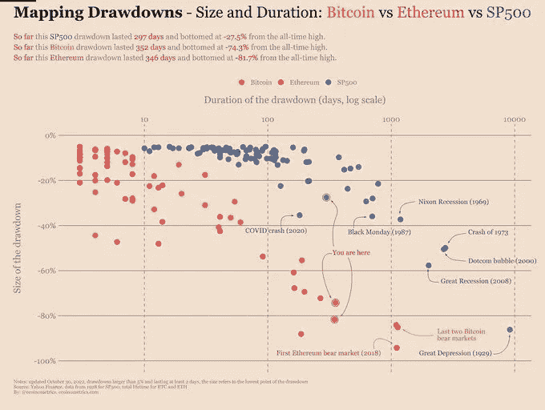
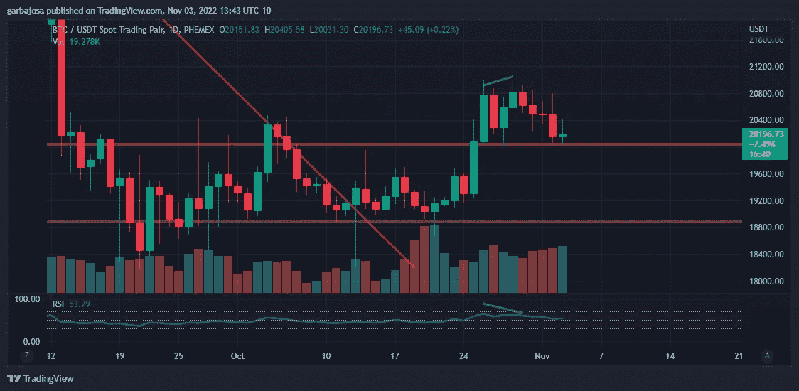
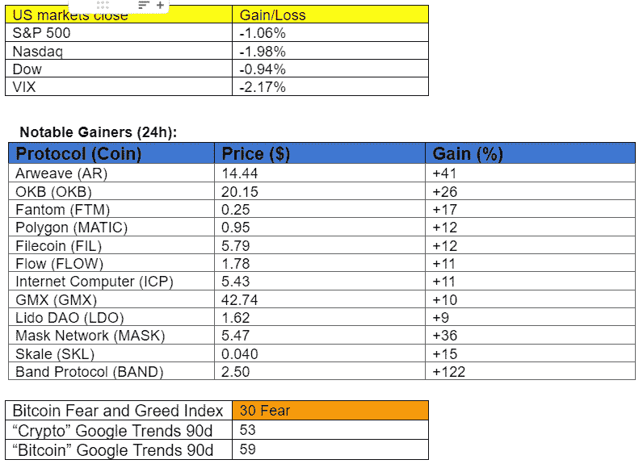

# 比特币处于历史上第三糟糕的贬值中。有多糟糕？

> 原文：<https://medium.com/coinmonks/bitcoin-is-in-the-third-worst-drawdown-in-history-how-bad-is-it-40ed0a38266b?source=collection_archive---------18----------------------->

## 每日征服#119

***最好的每日新闻、见解和阿尔法来源。***

Photo by [charlesdeluvio](https://unsplash.com/es/@charlesdeluvio?utm_source=medium&utm_medium=referral) on [Unsplash](https://unsplash.com?utm_source=medium&utm_medium=referral)

***密码市场是一个狂野、奇妙而令人生畏的地方；不要一个人跋涉！订阅加密征服者，让我们成为您的向导。***

**S** [***订阅***](https://tradergabi.substack.com/subscribe?) ***到此每日简讯，永不错过一期。*(零成本)**

**概述**

*   与过去相比，crypto 目前的缩减情况有多糟糕？
*   市场:各种山寨币满天飞；BTC/ETH 保持沉默。
*   富达推出免佣金加密交易。
*   日本将研究 Dao，探讨其在政府/经济中的整合可能性。

早上好，家人，

这些年来，加密和股票市场已经见证了他们的份额下降。那么这个相比之下有多差呢？

Crypto 的主要提款是周期性的，因为该行业与比特币减半有关。这并不奇怪，因为比特币在基本层面上是一个数学等式，矿工的发行供应量每四年减少 50%。

因此，在做研究的时候，我从 [@ecoinmetrics](https://twitter.com/ecoinometrics) 中找到了这张图表，它可以帮助我们比较过去的下跌和市场目前正在经历的下跌。

*来源:* [*推特，ecoinmetrics*](https://twitter.com/ecoinometrics/status/1587983168988069888?s=20&t=eTJXxqgL53aWnkSdWIjy1w)

今年比特币和以太坊的跌幅分别为 77%和 82%，仍是有记录以来最糟糕的之一，仅次于上两次熊市底部，超过了 BTC 80%和以太坊 84%的跌幅。有趣的是，就持续时间而言，这是以太坊第二长的缩减。

这两种资产在本轮周期中是否已经触底，仍有待确定。尽管如此，历史告诉我们这两个指标都处于极端。尽管如此，我们必须考虑到比特币是在历史上持续时间最长的股市反弹期间增长的，持续了十多年。BTC 还没有经历过像现在这样的大衰退。

**在这种情况下，与股票的显著脱钩可能会大大增加比特币和加密作为世界舞台上可行资产的认知度。**

相反，股票市场在其 100 多年的历史中经历了 8 次更大规模的提款。在所有宏观不利因素的影响下，包括四十多年来最严重的通货膨胀，市场最近未能看到多少缓解，这引发了人们对进一步缩减的担忧。历史表明，潜力是存在的。

如果你喜欢这份报告，并且认为它值 20 分(0.01 美分)，请按下面的按钮来支持我的写作。(最多 50 次！)谢谢！

# 市场更新🌍

**BTC/USDT 1D**

在股市的挣扎中，比特币价格的波动仍然温和，而下面列出的各种替代币经历了强劲的反弹。BTC 价格在过去七天内第三次测试并拒绝了 20k 美元的支撑位(黄色)。BTC 收盘上涨 0.25%，至 20201 美元。

*高分辨率* [*图表*](https://www.tradingview.com/x/tQUyWpFm/) 。

# 新闻观察📰

**富达的加密推送。**投资巨头富达，管理着 9.9 万亿美元的资产(AUM)，正在[**推出**](https://www.cnbc.com/2022/11/03/fidelity-to-open-commission-free-crypto-trading-to-retail-investors.html) **面向散户投资者的免佣金加密交易**产品，价差为 1%。该公司昨天一早就为客户开了一个等候名单。

**日本探索道。**日本数字产业省希望创建一个去中心化的自治组织(DAO)来[扩展其对治理结构的理解并了解其局限性。此举进一步推动了日本将 Web3 技术融入政府和经济的探索。DAO 是一种数字治理结构，通常用于分散平台，项目令牌的持有者成为治理的投票者。](https://twitter.com/Cointelegraph/status/1588223250555076608?s=20&t=bK8XGuk_v0uBrJrNkdTW-w)

**新闻花絮:**

*   Zero Hash [在巴西开展](https://www.coindesk.com/business/2022/11/03/zero-hash-launches-operations-in-brazil-as-first-step-in-latin-america/)业务。
*   Circle [将](https://www.coindesk.com/business/2022/11/03/circle-begins-putting-reserves-into-new-blackrock-fund/)储备投入贝莱德基金。
*   加拿大将[启动](https://twitter.com/CoinDesk/status/1588274628262240257?s=20&t=MbWdCGRYJWx3-apXEyyajg)关于 crypto、stablecoins 和 CBDCs 的咨询。
*   到[解锁](https://www.coindesk.com/markets/2022/11/03/nft-platform-immutablexs-66m-unlocking-looms-putting-sell-pressure-on-imx-token/)价值 6600 万美元的 IMX 代币。
*   跆拳道[在欧洲非法藏匿](https://watcher.guru/news/south-korean-prosecutors-reveal-terra-co-founder-do-kwon-is-in-europe)吗？
*   Golden Sach to [推出](https://twitter.com/Hugh_Son/status/1588164886864994305?s=20&t=JDCFvAV89EXLmYLRk-oS2g)基于加密的数据服务。
*   Aave [提议](https://twitter.com/OlimpioCrypto/status/1586889122626637825?s=20&t=eOkC2KLQ97vnE8-Agoy2IA)在 zkSync 2.0 上部署。
*   比特币基地的收益令人失望

**NFT &元宇宙更新🐵**

*   北海巨妖交易所[在一个新的“无汽油”市场推出](https://decrypt.co/113462/kraken-launches-70-ethereum-solana-nfts-new-gasless-marketplace) 70 个 NFTs 系列。

我的五分钱…

在加密熊市中，这是独特而激动人心的一周。

首先， **crypto 似乎正显示出与美国股市脱钩的迹象**，面对美联储资产负债表的放松，美国股市仍在苦苦挣扎。此外，还有几个重要的公告，如 Instagram 的 NFT 推送，Meta 的 Arweave 集成，以及 Twitter 的币安/加密相关的猜测。让我们记住 Dogecoin 的再次出现，两周内上涨 104%。所有这些都在昨天的那一期上报道了。

目前一切似乎都很好，但是新的铁矿石价格通胀(CPI)数据将于下周四在 T21 公布，美联储已经提到这是他们用来跟踪通胀的主要指标。因此，如果超出或低于预期，市场可能会经历激烈的竞争。

保持关注，保持积极，正如他们所说，在加密中永远不会有无聊的时刻！

祝你周末愉快！

# 加百列

*关注我* [*推特*](https://twitter.com/web3_gabri) *每日更新！*

仅供娱乐，非理财建议。

> 交易新手？试试[加密交易机器人](/coinmonks/crypto-trading-bot-c2ffce8acb2a)或者[复制交易](/coinmonks/top-10-crypto-copy-trading-platforms-for-beginners-d0c37c7d698c)