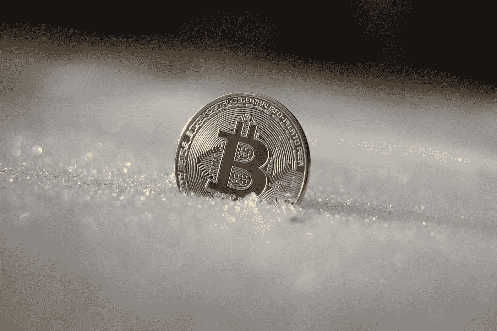

# 比特币坚不可摧，行业首席执行官重申 BTC 的优势

> 原文：<https://medium.com/coinmonks/bitcoin-is-indestructible-industry-ceos-reaffirm-btcs-strengths-cdd7ce6a6cd3?source=collection_archive---------28----------------------->

## CZ 最近重申了比特币在当前“加密冬天”面前的弹性。

Photo by [Rythik](https://unsplash.com/@rythik?utm_source=medium&utm_medium=referral) on [Unsplash](https://unsplash.com?utm_source=medium&utm_medium=referral)

币安首席执行官赵昌鹏(CZ)最近重申了比特币在“加密冬天”和加密怀疑论者试图抑制它的韧性，指出尽管过去和现在的障碍，比特币仍然…