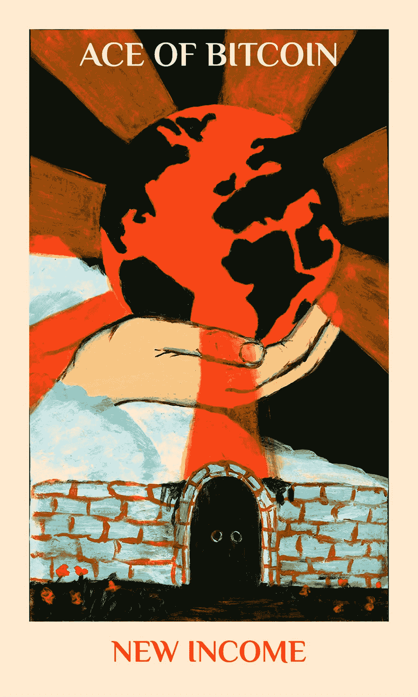
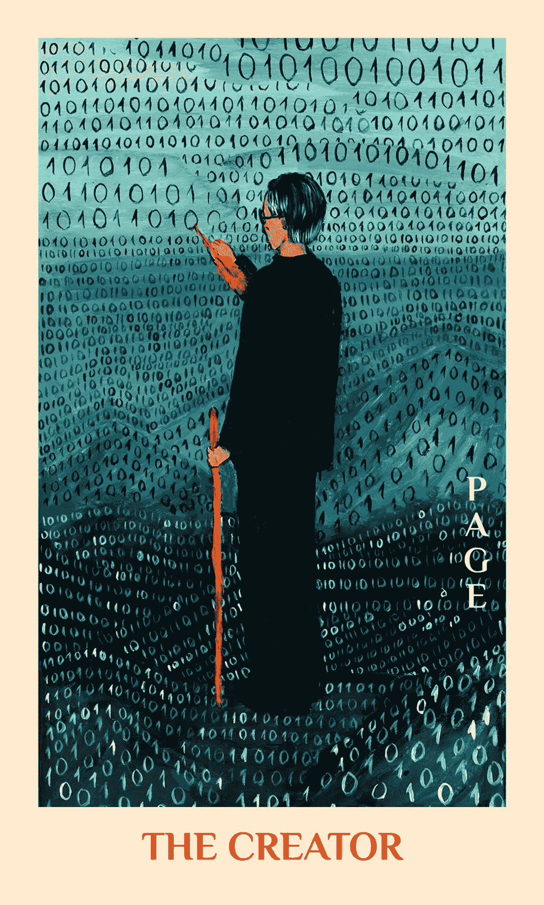
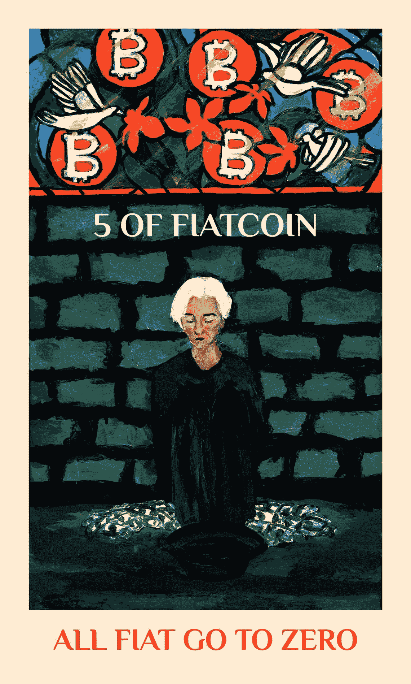
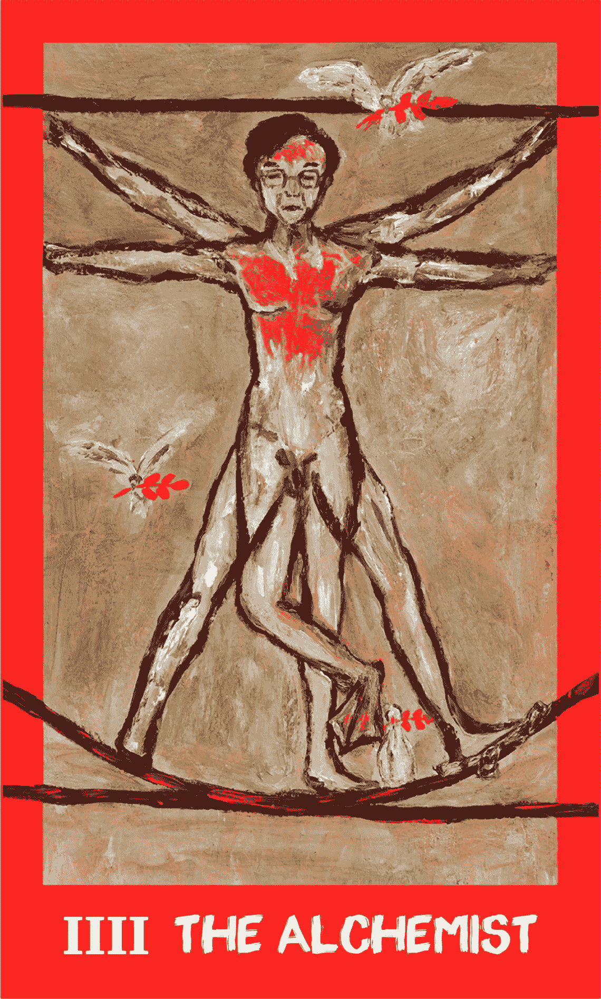

# 比特币不仅仅是一种资产，它还是一种神

> 原文：<https://medium.com/coinmonks/bitcoin-is-more-than-an-asset-its-a-god-a4b2c72f4e87?source=collection_archive---------0----------------------->

Illustrations from Bitcoin Tarot [www.bitcoin-tarot-nft.art](http://www.bitcoin-tarot-nft.art)

你可能基于数量分析或宏观经济学购买了比特币，但你的选择也可能受到了更深刻的冲动的驱使。这种源自人类心灵深处的冲动是比特币如此引人注目的部分原因。

神话。它引发了战争，将国家束缚在一起，并激发了数千年的伟大艺术。与其他加密资产不同，比特币具有神话色彩，与“死亡和复活的上帝”的宗教主题非常相似。

诞生西方文化的宗教都包含了这个神话的例子。法老崇拜奥西里斯，奥西里斯被女神伊希斯杀死后复活。古希腊自然神狄俄尼索斯也被杀死复活。

一些学者认为这个主题在世界各地的文化中都很普遍，从阿兹特克人到维京人。当然，耶稣是另一个例子。事实上，一些学者认为最初的圣人的故事被早期的基督教作家扩充了，他们利用流行的死亡和复活的神的神话来创造耶稣复活的故事。

为什么这个神话如此普遍？嗯，最初的神是太阳神。太阳每天都在做什么？它落到地平线以下，然后“再次升起”

对古代人来说，这个过程一定很神秘。太阳去哪里了？因此，还有什么主题能比太阳的“死亡和复活”更具有普遍性呢？

这个主题是死亡和复活神崇拜的起源，从那时起，这种崇拜就弥漫了人类的思想。

Illustrations from Bitcoin Tarot [www.bitcoin-tarot-nft.art](http://www.bitcoin-tarot-nft.art)

今天，我们不相信这些神话的字面真理，但它们给我们的文化蒙上了阴影。瑞士精神分析学家卡尔·荣格认为，我们大脑的一部分包含了全人类共有的故事和想法。

荣格将[这些想法]描述为*原型*，根据心理学家世界的说法是[。“[它们]渗透到集体无意识中，作为主题和人物出现在我们的梦中，并浮现在我们的文化中——例如，在神话、书籍、电影和绘画中。”](https://www.psychologistworld.com/cognitive/carl-jung-analytical-psychology)

即使在技术领域，你也可以找到非理性的想法。围绕不明飞行物和外星人绑架的神话是一个例子，仙女、魔鬼和天使在扮演与他们在古代文化中相似的角色之前被赋予了技术更新。

斯莱德曼是互联网上另一个强大神话的例子。它始于某个可怕的留言板，并蔓延到现实生活中人们的恐惧和思想中，最终引发了一场现实生活中的袭击。

作家埃里克·戴维斯早在 1995 年就注意到了这一趋势。“随着计算机像数字 kudzo 一样覆盖世界，我们被复杂、强大和看不见的力量组成的动画网络包围，即使是“专家”也无法完全理解，”[他在《连线》杂志](https://techgnosis.com/technopagans/)上写道。“我们的技术环境可能很快就会变得像洞穴、湖泊和森林一样具有奇怪的感知能力，第一批魔术师就是在这些地方瞥见了众神。”

> 交易新手？试试[密码交易机器人](/coinmonks/crypto-trading-bot-c2ffce8acb2a)或[复制交易](/coinmonks/top-10-crypto-copy-trading-platforms-for-beginners-d0c37c7d698c)

这些古老的滞后在今天围绕比特币的讨论中发挥了作用。当人们谈论“隐秘的冬天”时，他们会用奇怪的令人回味的语言来描述市场周期中呈下降趋势的部分。

在加密寒冬期间，全球顶级媒体频道纷纷发表社论，宣称比特币“已死”。事实上，这种顶级加密货币的讣告已经被发布了 365 次，尤其是在“冬季”。

当主流叙事的监管者兴高采烈地将钉子钉进比特币的棺材时，忠实的部落聚集在 Twitter 空间和不和服务器上，就像四面楚歌的罗马基督徒一样，寻求精神支持。他们翻遍了图表，展示过去比特币是如何再次上涨的，比以前更好，更有利可图。

他们自称为“霍德勒”。那些“为了亲爱的生命而坚持”的人

霍德勒夫妇的信念见证了比特币在过去的市场崩盘中的经历，因为你需要一群铁杆、甚至是妄想的信徒来充当新技术的助产士。

Illustrations from Bitcoin Tarot [www.bitcoin-tarot-nft.art](http://www.bitcoin-tarot-nft.art)

在上世纪 90 年代互联网刚刚兴起时，我们也看到了类似的过程。《辛普森一家》总结了当时社会的态度，荷马说互联网的好处是向我们展示“一些书呆子对《星际迷航》的看法。”但正是这些“书呆子”确保了互联网的成功，并成为了一场革命。

我怀疑许多比特币投资者会认为，他们的投资组合中有一个古代神的化身，以区块链本土资产的形式重生。但是他们不需要。原型的影响，虽然是无意识的，却是可以察觉的。

以比特币的创始神话为例。它是由一位名为中本聪的不知名程序员创建的，他从未透露过自己的身份，并于 2010 年从公众视野中消失。

编码成第一块的是来自创造者的信息:“泰晤士报 03/1/2009 财政大臣在第二次银行救助的边缘。”这是指资不抵债的银行在 2008/09 年金融危机期间接受了政府的大规模纾困。

因此，比特币是由一位超凡的神一样的人物创造的，并被赋予了从中本聪眼中的腐败金融体系中拯救人类的使命。其他地方的神话也遵循着一个垂死和复活的神。

由于比特币的编码方式，它遵循周期性的市场结构。有时间的增长和衰退，模拟了季节的运动，激发了古代神如奥西里斯，现代神如耶稣，赫克，甚至是《指环王》中甘道夫的复活故事。

当《纽约时报》等主流文化的先驱宣布比特币的死亡时，投资者陷入了绝望和恐惧，他们称之为“加密冬天”。在此期间，比特币投资者的数量减少到真正的信徒，霍德勒夫妇，他们被孤立无援，狂热地希望比特币回归。这一时期反映了后来的天启传统，在迫害时期，这是基督教发展的一股特别强大的力量。

耶稣回归的故事是如此的震撼人心，以至于它让早期的基督徒经受住了全能的罗马帝国的血腥镇压。这使他们能够忍受被喂给野生动物，而不是放弃他们的信仰。

他们相信耶稣会回来，所以熬过了这一切。当那一天到来的时候，他们相信忠实的人会被提升到天堂，怀疑者和不信者会被诅咒。

同样的信念困扰着比特币文化。即使在 75%或更多的提款期间仍在购买和持有的人受到了有一天比特币将“再次上涨”的希望的鼓舞，他们将被证明是正确的，而愤世嫉俗者和嘲笑者将吃众所周知的灰烬。

Illustrations from Bitcoin Tarot [www.bitcoin-tarot-nft.art](http://www.bitcoin-tarot-nft.art)

在某种原始层面上，比特币是宗教信仰的代表，这一事实使得它更有可能作为一种金融力量存在，因为——对所有分析师而言——一个好故事比任何一个拿着图表的科学家都更有冲击力。

神话将人们联系在一起，使他们不仅仅是他们各个部分的总和。以美国开国元勋的神话为例，这个故事激励了不同的移民社区成为世界上最强大的国家。

人类从来都不是理性的动物，用神话术语来描述现象的趋势不会消失。如果不是比特币，救赎后的抓握倾向会在另一个代理周围聚集。

比特币依附于一种强大的神话结构，这种结构激发了一种准宗教信仰，这种信仰帮助它在市场低迷以及从媒体机构到中国共产党等所有人的公开攻击中生存下来。尽管比特币现在比历史最高价下跌了约 70%，但它仍然充满了垂死挣扎的上帝的力量。

[现在就在世界上增长最快的密码货币交易所 Bybit 购买比特币](http://www.bybit.com)