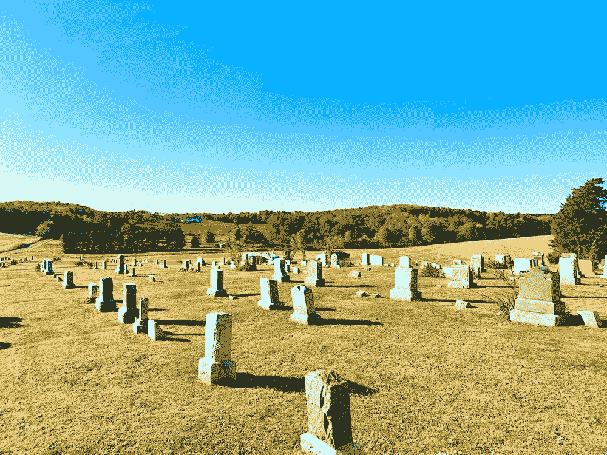

# 比特币是真实的，因为你可以把它带进坟墓

> 原文：<https://medium.com/coinmonks/bitcoin-is-real-because-you-can-take-it-to-your-grave-d9c2f9a35f29?source=collection_archive---------20----------------------->

From Unsplash, [Hannah Wernecke](https://unsplash.com/@hannahwernecke)

“比特币怎么是真的？”是我首先听到的最常见的问题。你摸不到，看不到，闻不到，尝不到。如果比特币只是信号和代码，就像网络空间的其他部分一样，那么它怎么可能是真实的？

网络空间不像现实世界，现实世界是有后果的。在现实世界中，有摩擦力和重力。一个人失足跌落悬崖，再多的钱也无法改变万有引力定律来拯救他。他已经死了。后果。

现在，如果他在没有物理备份短语的情况下，仅通过记忆来自我保管他的比特币，那么他的比特币也将永远丢失。现实世界中再多的钱也无法改变比特币的法则来找回它。他死了——后果。

现在比较一下这个人在现实世界中储存的财富。银行账户、财产、股权——它们不会随他而去。事实上，即使他想，再多的钱也不能保证这笔财富能被带进坟墓。甚至每一个认为他可以带着他的黄金去来世的法老，最终都被洗劫了他的坟墓。

从这个简单的思想实验中，我们可以看到比特币甚至比其他所有现实世界的资产都更真实。只有比特币能给我们对财富的最终和绝对的主权。但比特币不仅仅是这样，因为它在网络空间创造了我们需要的后果，使网络空间成为现实。

现在，网络空间就像一个虚无缥缈的领域，在那里没有摩擦，没有重力，也没有最终的结果来让任何事情变得重要。我们所拥有的是现实世界的影子和幽灵，没有绝对不变的自然法则的约束和限制。任何程序都可以被重新编程，任何算法、政策或数字交易都可以被逆转和重写。

这听起来好像我们是无限的，但事实上，这意味着我们正在一个不存在的基础上建立。如果没有地面和摩擦力推动我们前进，我们就无法行走。事实上，如果没有摩擦和自然约束，我们所有的现实世界工程都不会存在，网络空间也不会存在。

因此，是的，比特币不仅本身是真实的，而且它也是在网络空间创造现实的东西。有了比特币，我们可以在网络空间创造地面、重力、摩擦力、阳光和能量守恒等自然法则。它创造了真实的结果，从而让我们能够设计出重要而持久的事物。除其他因素外，这也让比特币变得很重要。

> 交易新手？试试[加密交易机器人](/coinmonks/crypto-trading-bot-c2ffce8acb2a)或者[复制交易](/coinmonks/top-10-crypto-copy-trading-platforms-for-beginners-d0c37c7d698c)