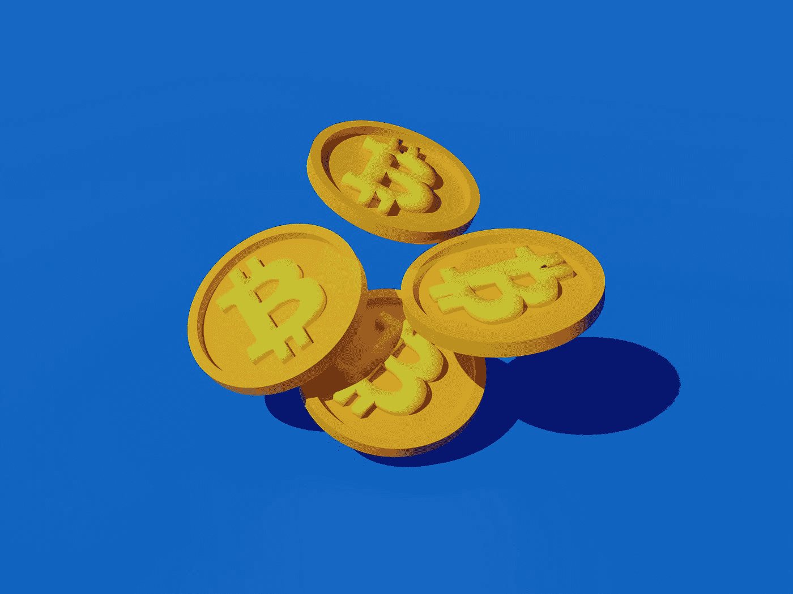

# 比特币:鲜为人知的有趣事实

> 原文：<https://medium.com/coinmonks/bitcoin-lesser-known-interesting-facts-c61842b90507?source=collection_archive---------17----------------------->

Photo by [Muhammad Asyfaul](https://unsplash.com/@asyfaul?utm_source=medium&utm_medium=referral) on [Unsplash](https://unsplash.com?utm_source=medium&utm_medium=referral)

过去有人告诉我，我是一堆无用的信息，这可能是真的。我希望你和我一样喜欢这个细节！

**2 个披萨换 1 万比特币:**2010 年 5 月 22 日 Laszlo Hanyecz 用 1 万比特币换了 2 个棒约翰的披萨。快进到 2022 年 9 月，10，000 个比特币可以买 13，333，333 个披萨饼，每个披萨 15 美元。在拉兹洛当时的辩护中…