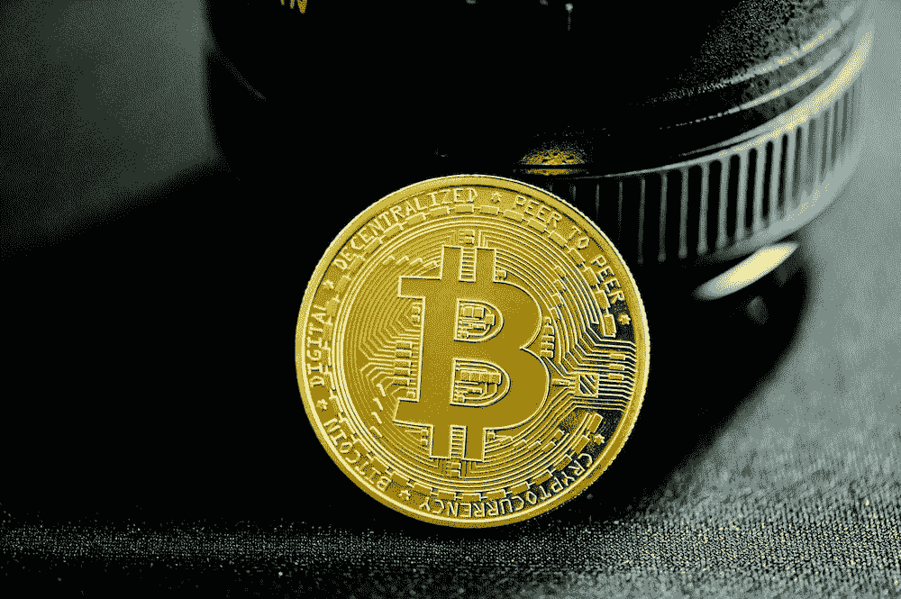

# 比特币生活方式

> 原文：<https://medium.com/coinmonks/bitcoin-lifestyle-475be5dfb4ac?source=collection_archive---------49----------------------->

比特币席卷全球，成为金融界最热门的话题之一。这种数字货币于 2009 年由一个不知名的人或一群化名为中本聪的人创造，已经成为一种流行的投资和在世界各地快速安全转移资金的方式。它也已经成为一些人的生活方式，他们拥抱加密货币，作为一种更独立的生活方式，摆脱…