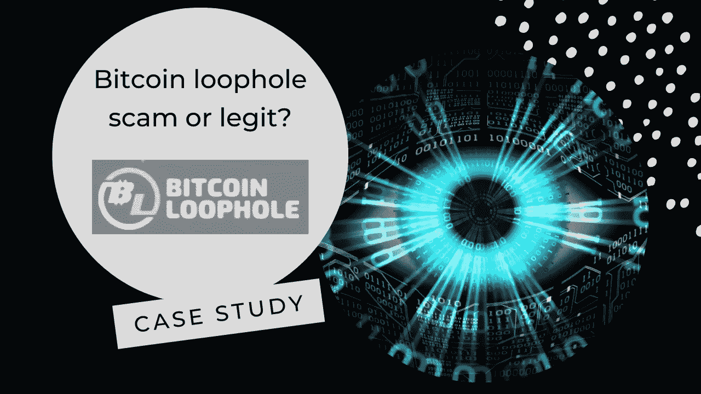
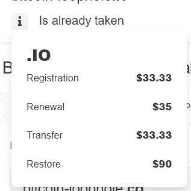
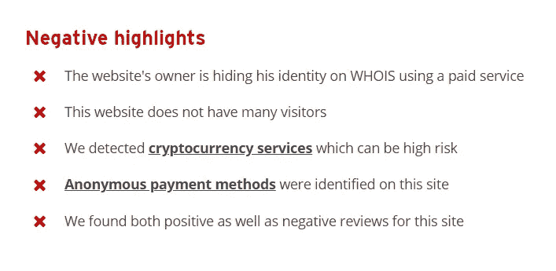
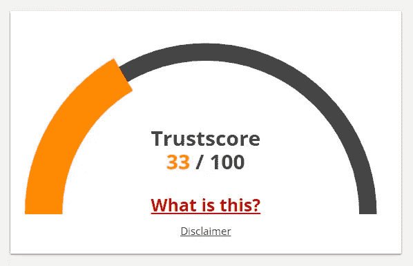
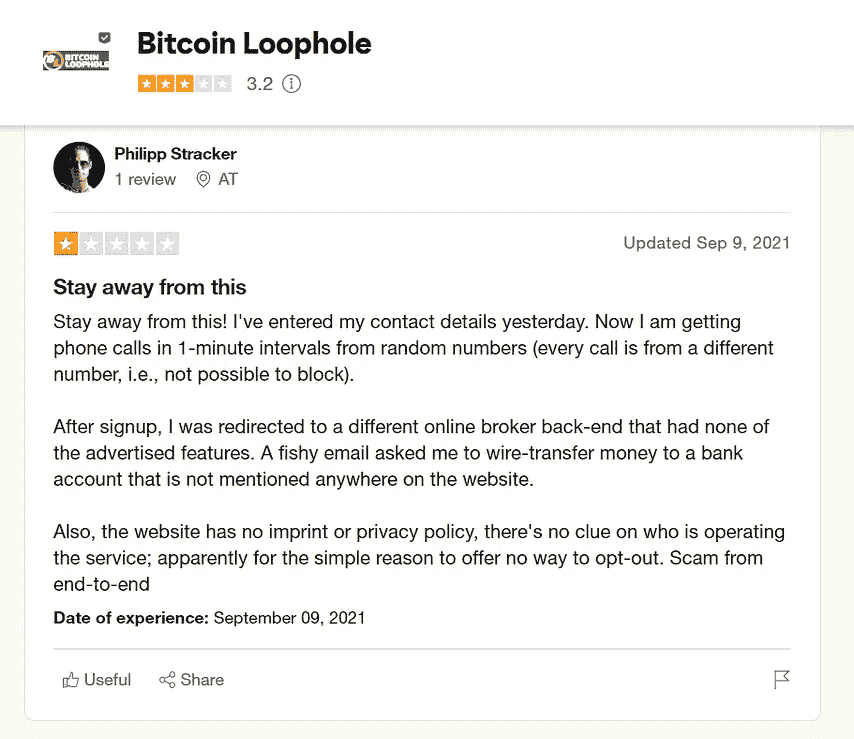
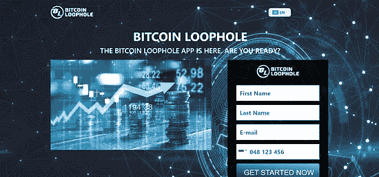
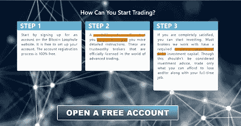
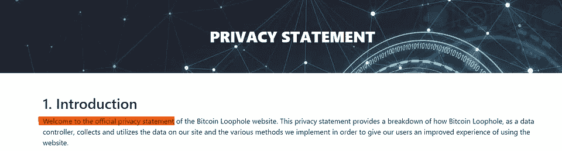

# 比特币漏洞骗局还是合法？/案例研究/

> 原文：<https://medium.com/coinmonks/bitcoin-loophole-scam-or-legit-case-study-72cc9034b974?source=collection_archive---------16----------------------->

> 在拍摄视频和根据之前的帖子制作案例研究时，之前被调查的平台已被删除。为什么？
> 
> 我想你可以自己回答这个问题。
> 
> 在今天的帖子中，我们来看看[https://bitcoin-loophole.io/](https://bitcoin-loophole.io/)。
> 
> 这是下一个要提防的平台，还是合法的？

# 1.名字

*首先，我们要标记名称本身。那就是在未来用户面前的存在。正如我们所见，没有任何一种是独一无二的。它由两部分组成——比特币和漏洞。令人担忧的是第二个词，它是“法律上的门”/“法律上的漏洞”的同义词。我们可以将其标记为审核中的第一个危险信号。*

# 2.组

*在投资/使用任何网站服务之前，你应该熟悉它的团队。你只需使用* [*谷歌搜索符*](https://ahrefs.com/blog/google-advanced-search-operators/) *就能轻松找到它们。找不到关于他们的任何数据。也没有媒体在场。*

> 请记住，任何合法的平台都会公布其所有团队，如开发人员等，并有强大的媒体存在(例如 Crypto.com 币安和 ByBit)

# 3.领域

*每一个平台、应用等的创始人。有自己选择域名的自由。所以很可能你的问题是“那我们为什么要检查它”？正如我在之前的* [*博文*](/@viktor.osint/identifying-a-scam-crypto-platform-88ecf2486122) *中提到的，我们应该使用*[*WhoIs*](https://who.is/)*和*[*scam adviser*](https://www.scamadviser.com/)*等工具来做我们的 DDD(域名尽职调查)。*

# 4.WhoIs/诈骗顾问/Trustpilot

【WhoIs 研究显示的关于上述平台的信息——匿名所有者，于 9 月 2 日使用 Epik.com 服务购买，无联系方式。价格是 33.33 美元。

根据 Trustpilot 中的一项审查，可以添加一个额外的危险信号。

# 5.隐私政策/网络内容审查

回顾完上述所有内容后，让我们进入决策步骤的最后一步。我们应该经常阅读内容，并尽可能多地注意到内容。

就有用的内容而言，主页“很差”——我们能看到的只是一个注册表单，左侧有一张图片。使用假新闻揭盖器(反向图片搜索的一个有用扩展)后，我们可以注意到图片已经从 Google 下载(“商业利润的真实衡量标准”是查找图片所有者的原始搜索字符串)。

> 请注意，大多数具有“注册，我会让你看得更远”这种工作“风格”的网站很可能是骗局。

*向下滚动我们可以看到如何开始的快速介绍——还有一些危险信号。请记住之前帖子中的危险信号(直接(冷)电话、高最低存款额)——它们就在这里。为了首先开始，你应该与他们所谓的代表持牌经纪人(记住，我们没有找到任何有关该团队的信息)，最低存款是 250 美元。

在 FAQ 版块，我们可以从第一句话看到标点错误。此外，关于“这在我国合法吗？”问题，作者给出了错误的信息——慢慢熟悉加密领域的实体和法规。“比特币漏洞是骗局吗？”—没有一个合法的平台会在 QA 部分添加这样的问题。

网站的隐私政策和网站其余内容一样“差”。没有一个合法的平台是从政策页面欢迎用户开始的(下图)。仅提及关于数据收集重要信息缺失(例如与币安隐私政策相比)。*

# 6.结论

*根据以下危险信号，我认为该平台是一个骗局:*

> —网站名称
> —缺少关于团队的团队信息
> —Whois/scam adviser/trust pilot 调查结果
> —最低押金
> —隐私政策和网络内容

> 完整的 PDF 报告可以从我的 LinkedIn 个人资料中下载。
> 
> 一如既往地感谢您抽出时间阅读案例研究。
> 
> 如果你偶然发现一个你不确定的平台——不要犹豫，通过我上面的社交媒体账户联系我——我将非常乐意帮助你！
> 
> 交易新手？尝试[加密交易机器人](/coinmonks/crypto-trading-bot-c2ffce8acb2a)或[复制交易](/coinmonks/top-10-crypto-copy-trading-platforms-for-beginners-d0c37c7d698c)