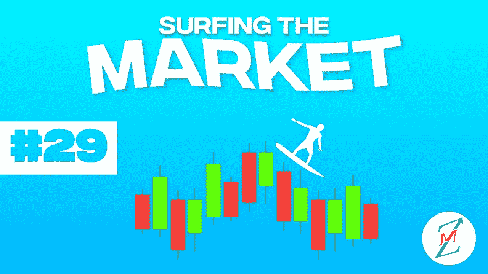
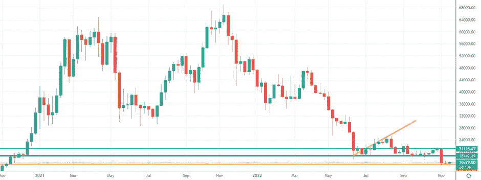
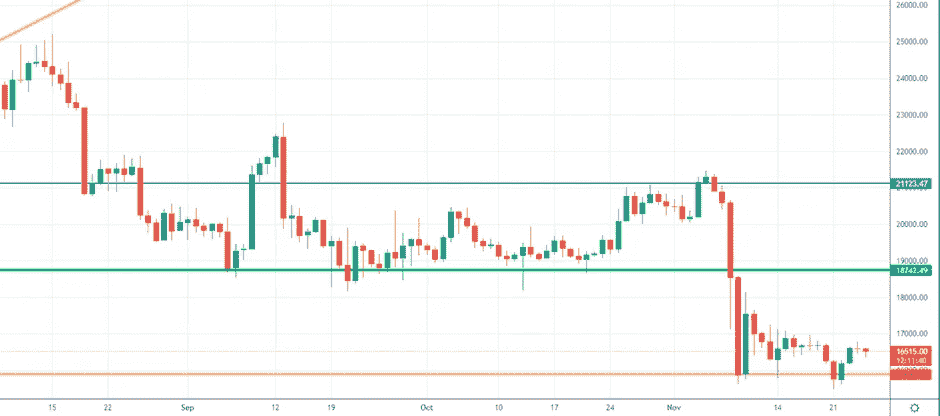
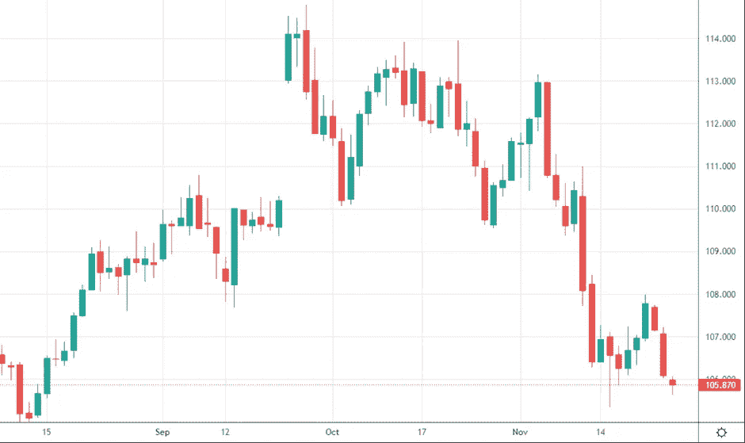
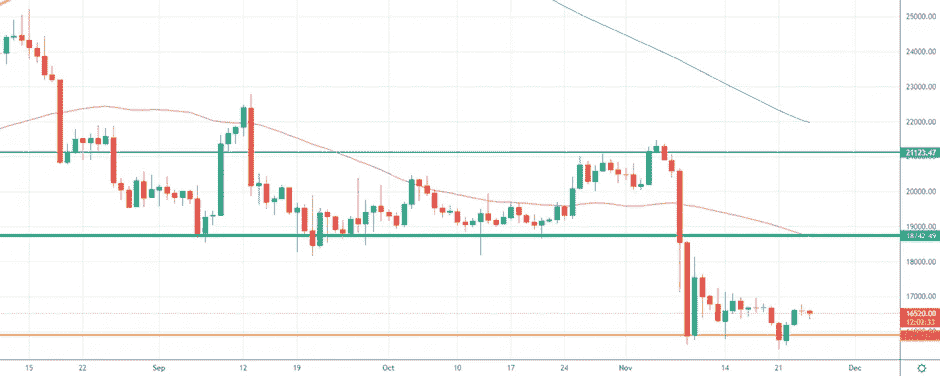
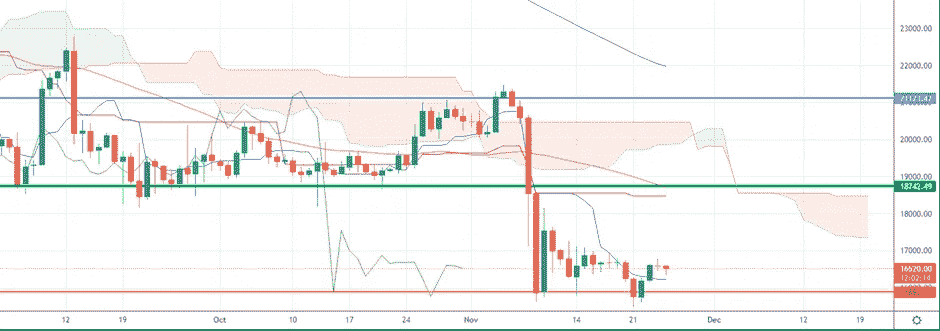
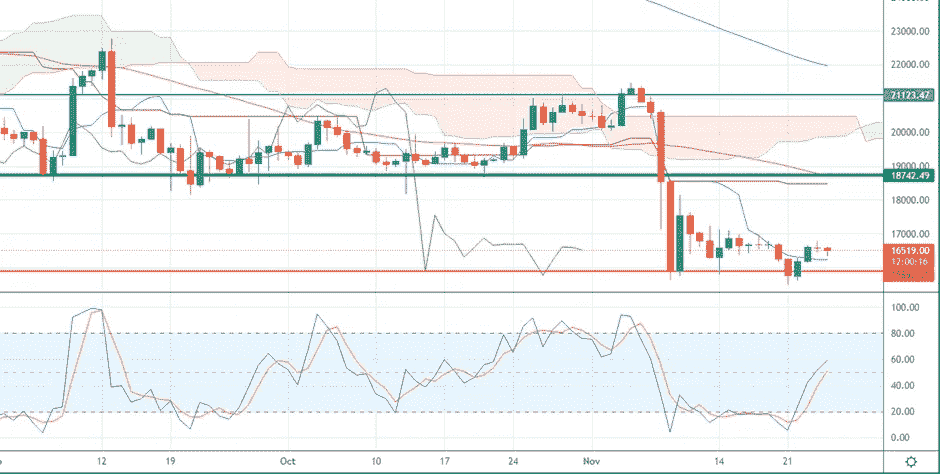

# 比特币市场等待所有储备的证明再次攀升

> 原文：<https://medium.com/coinmonks/bitcoin-market-waiting-for-all-the-proof-of-reserves-to-climb-again-b4897c964913?source=collection_archive---------20----------------------->

我们将进入什么样的市场阶段一直是我们上次约会的开场白问题。我们要听牛市还是熊市？我们会看到牛市还是熊市？
欢迎来到“市场冲浪”,我们已经进行了第 29 次约会，我希望这些简单的技术分析能在某种程度上帮助你，甚至只是评估不同的市场观点。

## 让我们从我们通常的每周视角开始

Weekly chart — Source Tradingview

*“在这个“后 FTX 时代”，我们正在 16500 美元区域的新价格水平上盘整，波动性下降。投资者现在买卖都很谨慎。目前的价格仍有机会朝着绿线上涨一点点，但我们必须看看其他交易所是否会很快违约。关于 Crypto.com 和 Gate.io 的一个潜在弱点的声音正在运行。你可以在这里阅读我关于这个主题的最后内容"*

这是我在最后一次浏览市场分析时写的，正如你所看到的，该地区的价格仍然稳定，波动性仍然很低，交易量也不高。

我将继续引用我自己的话:
*“如前所述，在我个人看来，如果出现重大的坏消息，如巨大的电力危机、移动网络危机或俄罗斯的天然气限制，比特币的价格只能下降到 15000 美元左右。”
嗯，在这种情况下，重大事件发生了，但我没有考虑一级交易所的违约。更多的第一层现在在聚光灯下！*

## 从日常角度来看，我期望什么？

Daily Chart — Source Tradingview

橙色支撑目前正在抵抗，即使我不排除在即将到来的周末会出现一些假突破，在这个周末交易量会减少，市场可能更容易定向。

这是我上周写的。我们看到假突破，打破了橙色水平，实际上是立即恢复，因为它似乎形成了一个强大的价格阻力。

Source Dollar Strength Index

美元强势指数面临小幅反弹，但趋势仍然公开看跌，使得石油和黄金等几种大宗商品价格回升。

50MA 和 200MA 此时不再提供更多信息。

Daily Chart — Source Tradingview

市云仍然远离价格水平，即使在未来几天再次出现薄云区，就像我上周说的那样，它们在统计上更有可能被打破(在这种情况下向上)，但这将是 20%的运动，不太可能立即发生。

Daily Chart — Source Tradingview

随机指标正朝着超买区域上升，这意味着最近几天价格的静态行为显然给了投资者一些信心。

Daily Chart — Source Traadingview

**特别要观察什么？**

由于外汇储备审计证明和更多 FUD 可能进入，整个加密货币市场仍处于不确定的时刻。我悄悄看涨，在这些价格水平上，我在这里又买了一些比特币。

让我知道你对这个新的每周约会的想法，以及你希望更多地考虑(或甚至解释)哪些指标。

请继续关注，当我的内容出来时，请务必关注。

## 促销建议

还有一点:如果你真的不关心技术分析，或者你不喜欢花时间在市场上，一定要去看看 Zignaly 平台，这是币安的一个官方经纪合作伙伴，管理着巨大的交易量。他们提供很好的利润分享交易服务，你可以模仿其他专业交易者，与他们分享利润！一定要给个眼神！

如果您有兴趣提前了解我们合作伙伴的指标发布情况，请在此留下评论，以便我们了解您是否有兴趣！

> **我写的任何东西都不能代表任何形式的财务建议。所以，在采取任何行动之前，先做好自己的研究。**

> 交易新手？试试[密码交易机器人](/coinmonks/crypto-trading-bot-c2ffce8acb2a)或[复制交易](/coinmonks/top-10-crypto-copy-trading-platforms-for-beginners-d0c37c7d698c)