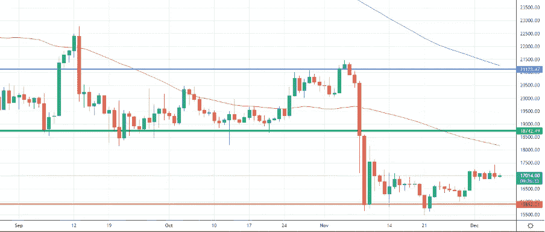

# 比特币市场等待所有储备的证明再次攀升

> 原文：<https://medium.com/coinmonks/bitcoin-market-waiting-for-all-the-proof-of-reserves-to-climb-again-f215c9590114?source=collection_archive---------20----------------------->

我们将进入什么样的市场阶段一直是我们上次约会的开场白问题。我们要听牛市还是熊市？我们会看到牛市还是熊市？
欢迎来到“市场冲浪”,我们已经进行了第 30 次约会，我希望这些简单的技术分析能在某些方面帮助你，甚至只是评估不同的市场观点。

## 让我们从我们通常的每周视角开始

Weekly Chart — Source: Tradingview

*“在这个“后 FTX 时代”，我们正在 16500 美元区域的新价格水平上盘整，波动性下降。投资者现在买卖都很谨慎。目前的价格仍有机会朝着绿线上涨一点点，但我们必须看看其他交易所是否会很快违约。关于 Crypto.com 和 Gate.io 的一个潜在弱点的声音正在运行。你可以在这里阅读我关于这个主题的最后内容"*

这是我在两期《冲浪市场分析》中所写的，正如你所看到的，该地区的价格仍然稳定，波动性仍然很低，交易量也不高。

我将继续引用我自己的话:
*“如前所述，在我个人看来，如果出现重大的坏消息，如巨大的电力危机、移动网络危机或俄罗斯的天然气限制，比特币的价格只能下降到 15000 美元左右。”
嗯，在这种情况下，重大事件发生了，但我没有考虑一级交易所的违约。更多的第一层现在在聚光灯下！*

## 从日常角度来看，我期望什么？

Daily Chart — Source: Tradingview

橙色支撑目前正在抵抗，即使我不排除在即将到来的周末会出现一些假突破，在这个周末交易量会减少，市场可能更容易定向。

这是我上两周写的。我们现在相当稳定地在 17000 美元区域交易。

Source: Screenshot Dollar Strength Index

美元强势指数在 104 点区域找到了强有力的支撑。通常 DXY 像那样反弹意味着许多市场下跌。无论如何，在这个时刻，比特币因为 FTX 的情况遭受了更大的损失，所以我会说，DXY 的更高反弹已经“包含”在比特币的价格中。

50MA 和 200MA 目前没有给出相关信息。由于价格的概率密度，我们越来越接近 50MA，这是一块磁铁，但下周我们可能会面临更强的迹象。

Daily Chart — Source: Tradingview

市云仍然远离价格水平，但在这一刻，他们非常薄，几乎消失了。这种行为可能会导致潜在的冲动爆发，这将证实我略微乐观的预期。

Daily Chart — Source: Tradingview

随机指标处于超买区，这可能会导致向下移动，但在牛市运动中，振荡指标几乎在所有趋势中都停留在超买区。

Daily Chart — Source: Tradingview

**特别要观察什么？**

由于外汇储备审计证明和更多 FUD 可能进入，整个加密货币市场仍处于不确定的时刻。我**依然**默默看涨。

我特别关注来自 DEX 交易所的代币，比如 JOE token(在币安有售)。未来一段时间对 dex 的关注可能会呈指数级增长。

让我知道你对这个新的每周约会的想法，以及你希望更多地考虑(或甚至解释)哪些指标。

请继续关注，当我的内容出来时，请务必关注。

## 促销建议

还有一点:如果你真的不关心技术分析，或者你不喜欢花时间在市场上，一定要去看看 [Zignaly](https://zignaly.com/app/signup/?invite=mikezillo) 平台，这是一家币安官方经纪合作伙伴，管理着大量的交易量。他们提供很好的利润分享交易服务，你可以模仿其他专业交易者，与他们分享利润！一定要给个眼神！

如果您有兴趣提前了解我们合作伙伴的指标发布情况，请在此留下评论，以便我们了解您是否有兴趣！

> **我写的任何东西都不能代表任何形式的财务建议。所以，在采取任何行动之前，先做好自己的研究。**

> 交易新手？尝试[加密交易机器人](/coinmonks/crypto-trading-bot-c2ffce8acb2a)或[复制交易](/coinmonks/top-10-crypto-copy-trading-platforms-for-beginners-d0c37c7d698c)