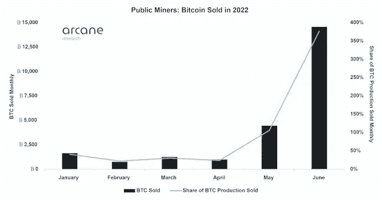
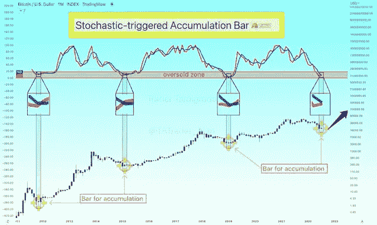
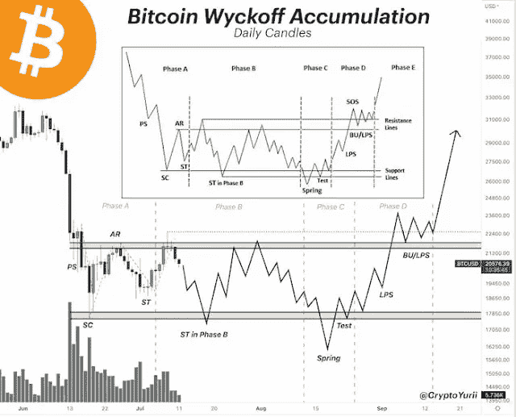

# 比特币可能刚刚进入投降阶段；BTC 已经触底了吗？

> 原文：<https://medium.com/coinmonks/bitcoin-may-have-just-entered-a-capitulation-phase-has-the-btc-bottom-been-reached-51aa75056d39?source=collection_archive---------38----------------------->

随着比特币( [BTC](https://mkt57.blogspot.com/search?q=BTC) )的价格回升至 22000 美元，许多密码交易员都在想，这种旗舰数字资产是否已经触底，或者只是在经历短暂的反弹。

经济学家和交易员亚历克斯·克鲁格(Alex Krüger)利用晦涩难懂的研究数据，对 2022 年每月出售比特币的公共矿工进行了研究，发现 6 月份每月出售的 BTC 产品的比例远远超过了前几个月。

值得注意的是，6 月份售出了 15，000 辆 BTC，几乎是月产量的 400%。7 月 17 日，克鲁格[写道](https://twitter.com/krugermacro/status/1548551733478952962?s=20&t=smZ0KhOrXeLZG6lyLp_tRg):

> *“6 月比特币矿工恐慌性大量抛售。又一个明显的投降信号。”*

公开矿工比特币出售。来源:神秘研究

# 三家加密货币公司已经宣布破产

值得注意的是，MKT57 还在 7 月 17 日表示，尽管行业破产，但全球加密市场资本总额在过去 30 天内增长了 8%。根据 CoinMarketCap 的数据，全球加密市场市值目前为 1.02 万亿美元，比前一天增长了 4.15%。

[为什么比特币不像数字黄金一样交易？](https://mkt57.blogspot.com/2022/03/why-is-bitcoin-not-traded-in-same-way.html) [不断给予的礼物:给予比特币的五种方式及其优势](https://mkt57.blogspot.com/2022/06/the-gift-that-keeps-giving-five-ways-to.html) [MicroStrategy 的比特币赌注变为负数，导致 3.3 亿美元的货币损失。](https://mkt57.blogspot.com/2022/05/microstrategys-bitcoin-bet-goes.html)

领先的加密货币市场分析师 Rekt Capital 在底部补充道:

"在新的宏观上涨趋势开始之前，典型的比特币熊市底部需要几个月的时间才能形成."BTC 几周前才开始按当前价格交易。

历史表明，期待宏观趋势这么快全面逆转为时过早。

与此同时，著名的密码分析师交易商 Tardigrade 提供了额外的数据来支持比特币已经触底的观点。该交易员表示，比特币价格的底部传统上是由超卖区的快慢随机线同时交叉发出的信号

这些都是历史上最好的累积月线。

随机触发累积棒线。来源:Trader Tardigrade

最后，流行的加密交易商和 YouTuber CryptoYurii 认为比特币的价格行为是威科夫设置的一部分，这可能会看到 BTC 到 2022 年 9 月达到 3 万美元。该设置是一个技术指标，表明在大幅下跌后出现了牛市行情。

> 交易新手？试试[加密交易机器人](/coinmonks/crypto-trading-bot-c2ffce8acb2a)或者[复制交易](/coinmonks/top-10-crypto-copy-trading-platforms-for-beginners-d0c37c7d698c)

**免责声明:**本网站上的信息不应被视为投资建议。投资是一场赌博。当你投资时，你的资本是有风险的。

*原载于 2022 年 7 月 18 日*[*https://mkt57.blogspot.com*](https://mkt57.blogspot.com/2022/07/bitcoin-may-have-just-entered_18.html)*。*