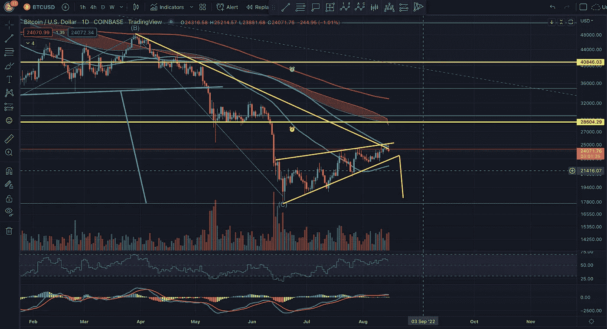

# 比特币:8 月中旬上升楔形

> 原文：<https://medium.com/coinmonks/bitcoin-mid-august-ascending-wedge-4f064286f683?source=collection_archive---------37----------------------->

## 加密货币技术分析更新#3

## 另一次对前期低点的潜在访问可能正在进行中

Potential ascending wedge shaping up.

我发誓我不是“永久熊”。我发誓我希望 crypto 和下一个月亮男孩一样上升。然而，图表让我保持真实…