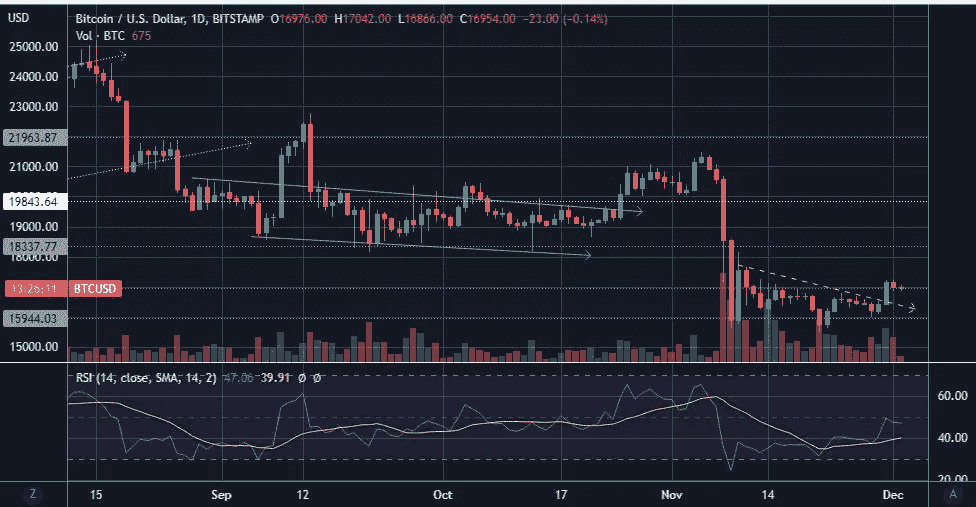
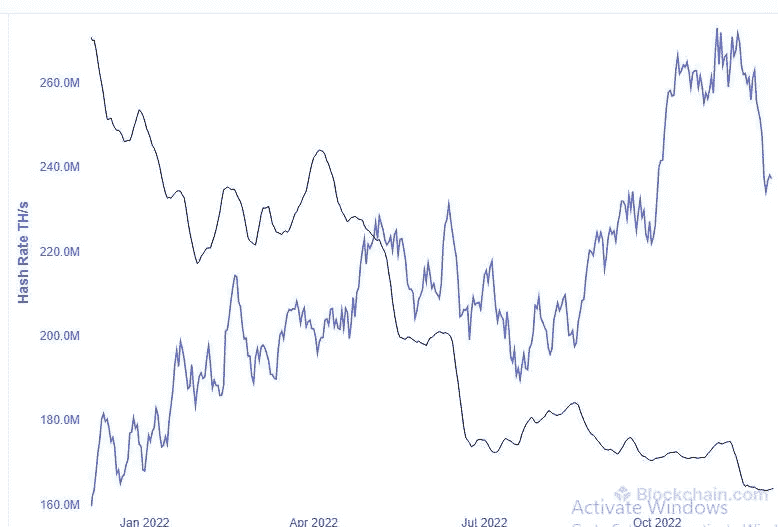
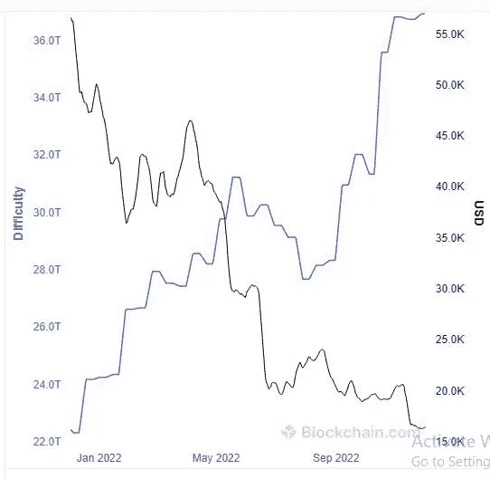

# 随着 BTC 价格跌破 18300 美元，比特币矿工的投降正在等待上演

> 原文：<https://medium.com/coinmonks/bitcoin-miner-capitulation-is-waiting-to-play-out-with-the-price-of-btc-below-18-300-fe590bd06f95?source=collection_archive---------23----------------------->

# 熊市景象让 BTC 买家不知所措…

嗯，熊市也是指投资者在加密价格下跌时不断买入，但由于价格仍在不断下跌，这些加密买入者总是不知所措):…

对…所以 BTC 的价格自去年 11 月以来一直在下跌，任何逢低买入 BTC 的人到现在都是亏损的，因为 BTC 现在有一段时间低于 20，000 美元…

现在，BTC 已经在 16，000 美元找到了支撑，并且已经从 11 月 ATH 价格 65，000 美元修正了至少 70%,但是 BTC 仍然可能进一步跌至新低，达到 14，000 美元、12，000 美元或 10，000 美元的价格水平。因此，我们可以预计 BTC 的 ATH 价格将出现 85%的回调。

[BTC price chart >>](https://www.tradingview.com/x/tTlD9Few/)

# 比特币矿工投降发生在 1 BTC 价格低于 18300 美元

有一个直接因素使得 BTC 的价格进一步下跌迫在眉睫。这个因素就是比特币矿工投降。

我在这里的意思是，许多 BTC 矿商被迫结束业务的时候已经到来，因为现在即使在盈亏平衡的水平下开采 BTC 也很困难，因为 BTC 的市场价格低于为矿商生产 1 BTC 的成本。

流行的加密货币数据分析网站 Glassnode 于 10 月 3 日[发布了一份报告](https://insights.glassnode.com/the-week-onchain-week-40-2022/)称，为矿工生产一个 BTC 的成本是 18300 美元，在此期间，BTC 的价格徘徊在这个范围附近，非常危险，BTC 的价格在 18400 美元到 20600 美元之间波动。

当 BTC 价格跌破 18300 美元时，矿商无法通过出售开采的 BTC 轻松覆盖生产一辆 BTC 的成本，因此亏损经营的他们必然会结束在 BTC 的采矿业务。

BTC 矿商有[投资 BTC 采矿设备的费用](https://cryptopotato.com/bitcoin-miners-in-trouble-btc-price-dangerously-close-to-cost-of-production/)，电费、租金和工资，他们不时通过出售开采的 BTC 来弥补。

过去几年以来，BTC 的采矿活动只可能由大型比特币采矿公司进行，其中一些公司已经上市，资产负债表良好。

这是因为运营比特币挖矿业务需要大量资本，而这个行业如今竞争非常激烈。这意味着他们需要拥有最新的比特币挖掘设备，以便能够以最具资本效率的方式挖掘比特币。

***随着 BTC 的价格跌破开采 1 BTC 的成本，比特币开采业务陷入严重困境。***

这种情况的一个自然结果将是比特币矿商的投降，这将使许多比特币矿商结束他们的业务，出售他们的比特币。这将降低比特币的杂凑率。

# 比特币矿工的挑战状态比特币的网络难度增加到 ATH

**ATH(历史新高)*

比特币散列率是保障比特币网络安全的计算能力。直到最近很长一段时间，比特币杂凑率一直在上升，触及 ATH，尽管 BTC 的价格在下跌。

换句话说，新的比特币挖矿玩家正在进入开采比特币，即使 BTC 的价格正在下降，使比特币矿工越来越无利可图。

Bitcoin Total Hash Rate. [Source](https://www.blockchain.com/explorer/charts/hash-rate)>>

自年以来，比特币散列率不断增加，这意味着更多的比特币矿工进入该空间开采比特币，比特币的网络难度也不断增加，达到 ATH 范围。

这意味着开采一块比特币的难度不断增加，比特币矿工需要投资更高效的比特币开采设备来开采 BTC。

Bitcoin Network Difficulty data chart. [Source >>](https://www.blockchain.com/explorer/charts/difficulty)

这里的问题是，对新比特币设备的投资增加了开采 1 BTC 的成本，影响了比特币开采业务的利润率。

# 比特币矿工投降后，熊市底部可能随之而来

现在，自 11 月 12 日以来，比特币价格已经下跌，但比特币的开采难度仍在 ATH 山脉。因此，比特币矿工的投降现在很可能开始发生。这将迫使比特币矿工关闭他们的比特币开采业务，引发比特币散列率和比特币开采难度的急剧下降。

这些比特币矿工最终也将出售他们开采的比特币，以弥补他们产生的任何运营成本，从而引发 BTC 价格大幅下跌。

这是剩下的情况，一旦比特币矿工投降完成，人们可以说我们接近找到比特币价格下跌的底部，这应该是一个更有信心购买 BTC 的好时机。

这是非常不可能的，BTC dip 买家将在那个时候购买 dip 的相当大的损失，因为 BTC 积累阶段将从这里开始，作为 BTC 下一个牛市阶段的舞台！！

# 还有其他几个原因导致 BTC 价格继续下跌

还有其他几个原因[为什么 BTC 的价格会跌至新低，例如不利的宏观经济和地缘政治气候已经导致 BTC 的价格跌至 20，000 美元。是的，我们很熟悉，美联储正在加息，这意味着没有多余的美元流动性来购买任何投机性资产。正在进行的俄罗斯-乌克兰战争导致石油和天然气价格上涨，因此通货膨胀没有尽头。](https://decrypt.co/115947/could-bitcoin-drop-10000-market-experts-weigh-in)

然后，我们看到了 FTX 崩溃的蔓延，创世资本(Genesis Capital)和 Gray Scale 现在正处于聚光灯下，因为它们面临流动性紧缩问题，资产负债表上有太多负债，它们陷入了困境，无法偿债。此外，谁知道可能还有其他普遍原因导致 BTC 价格进一步暴跌。

此外，看起来我们正处于衰退的宏观经济阶段，因此随着投资资金的减少和如此多不确定性的存在，加密资产价格的进一步下跌是不可避免的。

耸耸肩…

从积极的方面来看，保持冷静，这些循环肯定会发生，就像人生的起起落落一样。因此，实际应对这种情况是正确的做法。

***感谢阅读……***

> *交易新手？试试* [*密码交易机器人*](/coinmonks/crypto-trading-bot-c2ffce8acb2a) *或* [*复制交易*](/coinmonks/top-10-crypto-copy-trading-platforms-for-beginners-d0c37c7d698c)
> 
> *加入 Coinmonks* [*电报频道*](https://t.me/coincodecap)*[*Youtube 频道*](https://www.youtube.com/c/coinmonks/videos) *获取每日* [*加密新闻*](http://coincodecap.com/)*

# *另外，阅读*

*   *[复制交易](/coinmonks/top-10-crypto-copy-trading-platforms-for-beginners-d0c37c7d698c) | [加密税务软件](/coinmonks/crypto-tax-software-ed4b4810e338)*
*   *[网格交易](https://coincodecap.com/grid-trading) | [加密硬件钱包](/coinmonks/the-best-cryptocurrency-hardware-wallets-of-2020-e28b1c124069)*
*   *[密码电报信号](/coinmonks/top-3-telegram-channels-for-crypto-traders-in-2021-8385f4411ff4) | [密码交易机器人](/coinmonks/crypto-trading-bot-c2ffce8acb2a)*
*   *[最佳加密交易所](/coinmonks/crypto-exchange-dd2f9d6f3769) | [印度最佳加密交易所](/coinmonks/bitcoin-exchange-in-india-7f1fe79715c9)*
*   *面向开发人员的最佳加密 API*