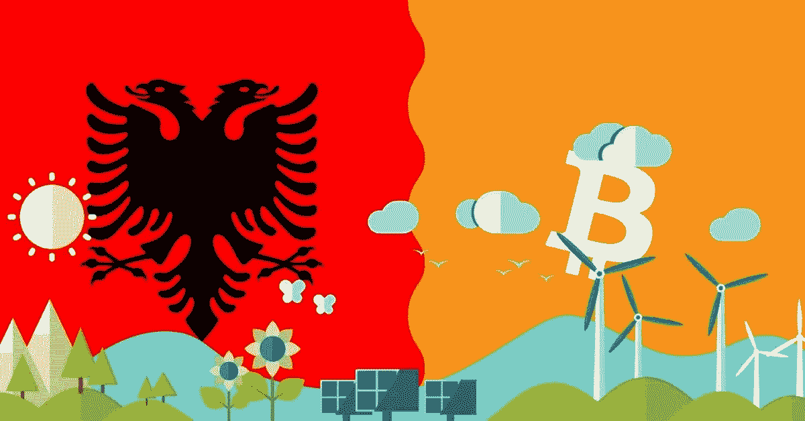
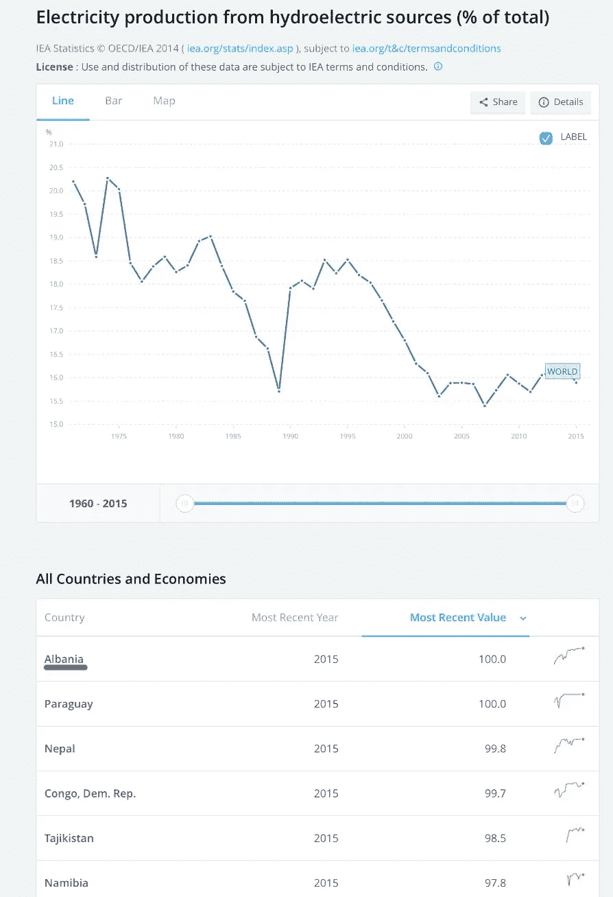
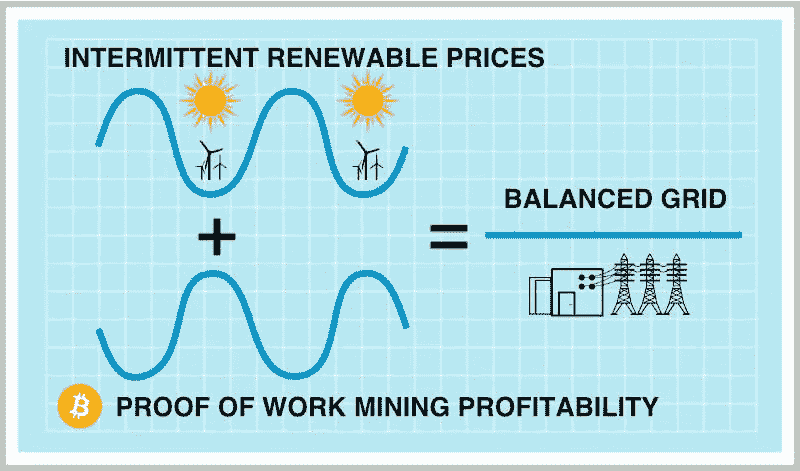
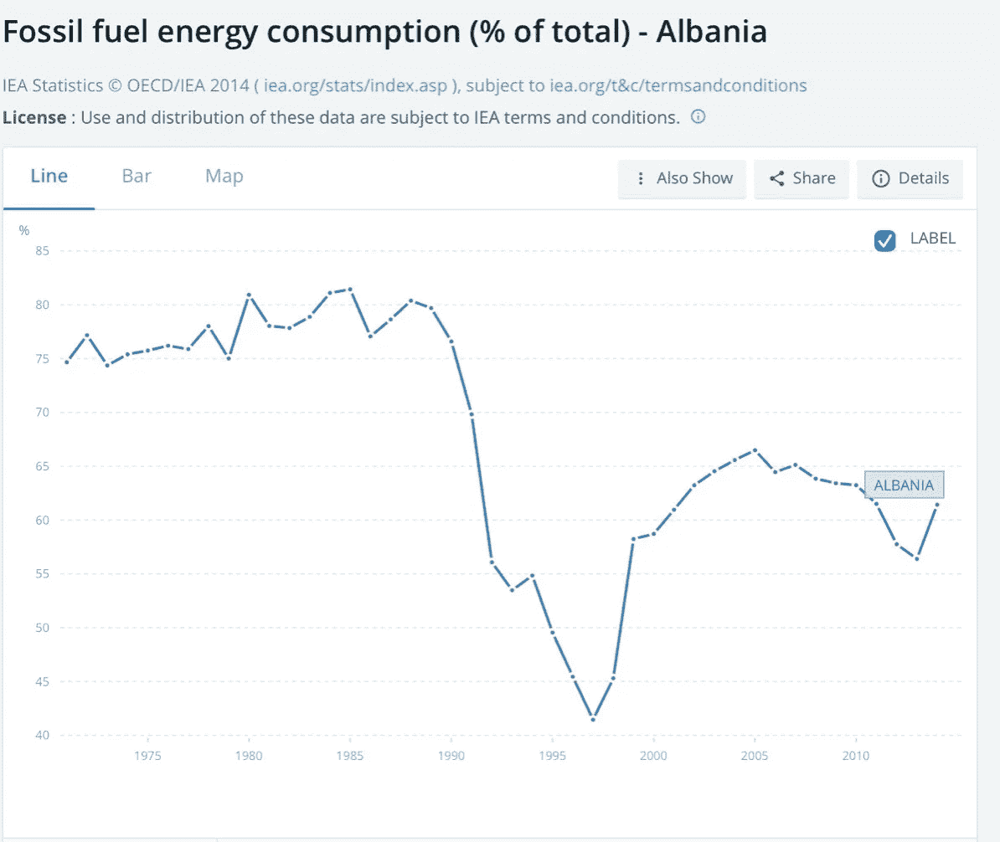
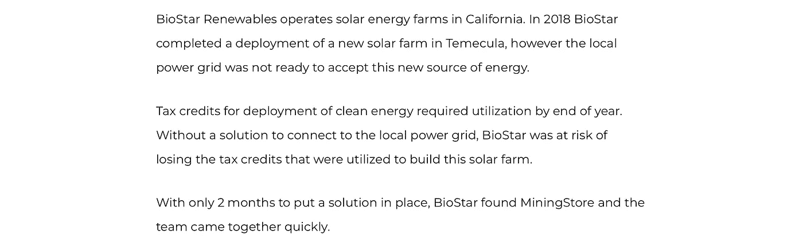
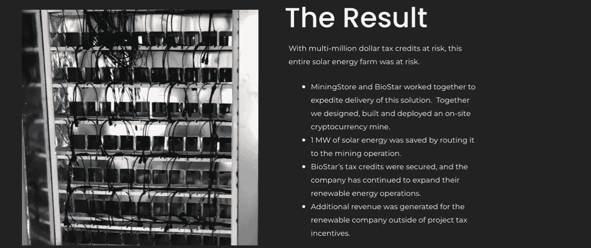
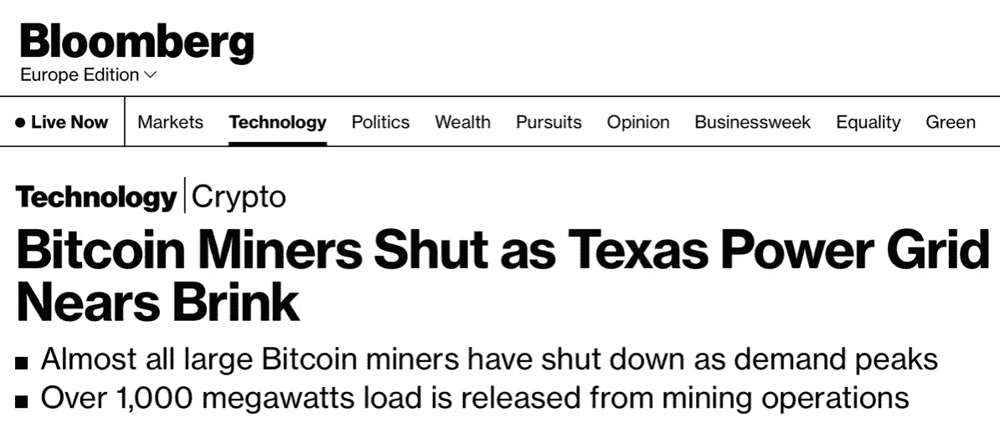
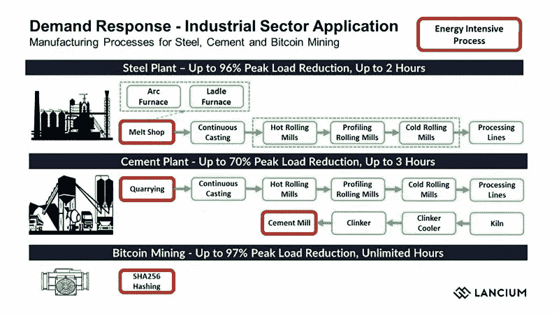

# 比特币采矿、能源和阿尔巴尼亚

> 原文：<https://medium.com/coinmonks/bitcoin-mining-energy-and-albania-4a03f445439f?source=collection_archive---------45----------------------->

耸人听闻的标题让不知情的公民相信，比特币与环保意识不相容。然而，一阶效应之外的观察表明，具有讽刺意味的是，比特币可能是未来丰富、清洁能源的关键，因为它通过充当市场需求响应能力和事实上的保险产品，从根本上改变了能源行业的激励结构。

- [比特币预示着能源丰富的未来](https://bitcoinmagazine.com/culture/bitcoin-promises-a-future-of-abundant-energy)

正如 Block Inc .和 ARK Invest 在他们的【2021 年 4 月的论文中指出的，比特币矿工使社会能够部署更多的太阳能和风能发电能力。

当你把这个应用到一个国家时，会是什么样子？一个大多数人在地图上指不到的小国？

在这篇文章中，我将通过关注一个国家，阿尔巴尼亚，来分享比特币采矿可以使能源网更有效和刺激其增长的不同方式。

# 比特币采矿和阿尔巴尼亚

阿尔巴尼亚是从水力发电获取能源最多的国家之一，大部分时间都是 100%。名单上唯一的另一个大国是巴拉圭。

在巴拉圭的 T4，比特币矿工与大坝和小城市合作，为其他人降低电费。在阿尔巴尼亚还没有这种情况。

**比特币挖矿如何稳定电网？**

需求响应计划创造了愿意在特定时间减少或完全停止电力消耗以向电网提供更多能量的电力购买者。这些计划有助于电网更好地支持高峰需求时期，因为矿工可以吸收多余的能量，所以生产比低需求时期通常需要的更多的能量是经济的。

矿工是最终的需求响应资源，因为他们的位置独立，易于调整功耗(从 0 到 100%，反之亦然，在几分钟内)。

根据为阿尔巴尼亚几家公司提供咨询的独立能源律师 Lorenc Gordani 的说法:

> *政府数据显示，中国已经批准了另外 1785 兆瓦的发电能力，这些项目尚未开发。他说，估计还有额外的“研究过的、尚未开发的水电潜力，约为 815 兆瓦。”*

阿尔巴尼亚需要这种能源生产。它的城市化速度很快，随着经济的增长，会有更多的需求。尽管政府采取了激励措施并向电气化发展，目前阿尔巴尼亚只有 0.35%的汽车是电动的。地拉那开始[在 2017 年逐步引入电动公交车](https://balkangreenenergynews.com/tirana-tests-electric-buses-following-introduction-electric-taxis/)用于公共交通&大多数新出租车和警车都是电动的。

这甚至不是需要激励的变化，我在地拉那遇到的大多数人都希望得到一辆电动汽车，主要是因为它更便宜。**即使在当前的能源危机之前，由于相对较低的能源成本，给电动汽车充电比去加油站还要便宜。**

> 交易新手？尝试[加密交易机器人](/coinmonks/crypto-trading-bot-c2ffce8acb2a)或[复制交易](/coinmonks/top-10-crypto-copy-trading-platforms-for-beginners-d0c37c7d698c)

就基础设施而言，地拉那的电动汽车充电是一种可以与欧盟同行相媲美的方式，但就其规模和发展水平而言，我已经认为它超出了其重量。

水电占“电力”生产的 90%以上，而化石燃料占“能源”生产的 60%。

目前阿尔巴尼亚的大部分石油来自欧洲最大的陆上油田 Patos-Marinza 油田，但是目前阿尔巴尼亚出口大部分原油，然后不得不重新进口精炼油。

2018 年，第 27 章下的进口达到近 6 亿美元，而出口达到 3.8 亿美元。随着电力开始减少对石油的依赖，阿尔巴尼亚可以转变为一个石油净出口国，用卖油的钱来发展当地经济(类似于挪威)

考虑到转向电动汽车，阿尔巴尼亚需要将能源产量翻一番，加上工业和经济增长，阿尔巴尼亚正在寻求能源产量的成倍增长。

通过成为首选买家，比特币采矿激励和补贴了未来水电项目的发展。

过度建设、比特币补贴的电网的切实影响是廉价、稳定的价格和增强的需求响应灵活性。

# 首选买家

比特币是首选能源的买家。

阿尔巴尼亚希望在两个不同的方面扩大能源生产:

1.  他们希望扩大水力发电，以生产更多的水力能源:据估计，到目前为止，阿尔巴尼亚只有三分之一的水力发电潜力得到了开发。
2.  他们希望建设太阳能和风能项目，使水力发电多样化:[投资者在阿尔巴尼亚开发 1.2 吉瓦的太阳能发电项目。](https://balkangreenenergynews.com/investors-developing-solar-power-projects-of-1-2-gw-in-albania/)

> ***阿尔巴尼亚目前没有风力发电能力*** *，尽管潜力巨大。然而，它在 2021 年年中为总计 100 兆瓦的陆上风电场启动了两阶段招标程序，最初的配额可能会增加到 150 兆瓦。*
> 
> *-* [*阿尔巴尼亚启动海上风电项目*](https://balkangreenenergynews.com/albania-launches-works-on-offshore-wind-project/)

这两个项目都花费了大量的资金，而且在短期内产生的能量将会超过消耗的能量。这就是比特币采矿的切入点，比特币矿工将向政府支付能源费用。这些项目可以协同工作，这样太阳能和风力发电场就可以从第一天开始销售能源，而不是在几个月后连接到电网。

这里有一个很好的案例研究，[生物之星可再生能源&矿业商店](https://miningstore.com/case-study/biostar-renewables-and-stranded-energy/)

比特币矿工可以进来，帮助激励新能源产品的开发，通过为可能被浪费的能源付费来补贴成本。一旦能源得到更好的利用，比特币矿工就可以离开/转移到新的项目。

# 最后的买家

2022 年 1 月，阿尔巴尼亚政府表示，他们希望启动他们的石油/天然气工厂，以填补能源危机造成的需求缺口。

> *呼吁的理由包括需要更多的电力来履行公共供应义务，建立备用容量来保证电力供应安全，补充水力和热力资源产生的电力，以及创造盈余收入。*

**创建备用容量**

这就是比特币可以解决问题的地方，而不必迫使政府回到燃烧化石燃料的道路上来。就在本周早些时候，比特币矿工帮助德克萨斯州电网应对高温带来的更高需求。

> *“有超过 1000 兆瓦的比特币采矿负载响应了 ERCOTs 的节能请求，关闭了它们的机器来为电网节约能源。”德克萨斯区块链委员会主席李·布拉彻在电子邮件回复中告诉彭博。“这代表了德克萨斯州几乎所有工业规模的比特币采矿负载，并允许超过 1%的总电网容量被推回电网用于零售和商业用途。”*
> 
> *-* [*比特币矿工关闭，德克萨斯电网濒临崩溃*](https://www.bloomberg.com/news/articles/2022-07-11/bitcoin-miners-shut-off-rigs-as-texas-power-grid-nears-brink)

下面的视频很好地涵盖了这一点。

但对阿尔巴尼亚来说，当他们开发现有能源项目时，如果他们与比特币矿业公司合作，矿商可以达成协议，在正常需求较高时关闭这些项目。

在冬季，有 1%的电力需求可以在用电高峰时关闭，而不是用一个油厂来满足 1%的需求。

# 为什么政府和比特币矿工需要合作

在 2021 年，当采矿的利润非常非常高的时候，比特币采矿在短期内是一个问题。类似地，人们偷电开采比特币在阿尔巴尼亚也是一个问题。

由于这两个原因，比特币矿工在该地区名声不佳，因为他们反对电力系统，而不是与电力系统合作。

但如果你看过去的几个害群之马，比特币采矿和阿尔巴尼亚政府都想要同样的东西。

阿尔巴尼亚希望开发更多的能源，并为其公民降低电价。

比特币矿工希望利用(并支付)阿尔巴尼亚浪费和滞留的能源，并在此过程中帮助稳定电网。

# 后续步骤

那么，这种动态的双方接下来应该采取什么措施呢？

首先，我认为阿尔巴尼亚政府应该建立一个监管框架，允许比特币采矿公司和个人与电力公司合法合作，利用电表背后的能源。

做以上两件事会向比特币矿工发出一个信号，即阿尔巴尼亚希望与他们合作。做到这一点，比特币制造者就会处理剩下的事情。

阿尔巴尼亚已经证明了自己对技术和商业非常友好，无论是简化开设和经营企业的流程，还是数字游牧签证(世界上最简单的签证)。我确实认为比特币，尤其是比特币采矿可以成为帮助阿尔巴尼亚的下一步。

正如萨尔瓦多所显示的，如果你提供一个安全的框架，比特币公司将进入你的国家，投资并创造当地就业机会，由于比特币开采是实物的，它创造了高薪的基础设施就业机会，并在此过程中改善了国家的基础设施。

感谢@level39 惊人的[线索](https://www.twitter.com/level39/status/1548550264218583040)帮助我写了这篇文章和这些图片。感谢 Arnold ( [@st4rnold](https://www.twitter.com/st4rnold) )帮我做了一份前期草稿。

关于作者:在过去的 5 年里，我去过阿尔巴尼亚 5 次，去过这个国家很多次。我为比特币领域的一些公司提供建议，并帮助萨尔瓦多[成立了最大的比特币教育非营利组织 MiPrimerBitcoin](http://miprimerbitcoin.io) ，为学生、教师、家长和周围社区提供免费课程。

*原载于 2022 年 7 月 15 日 https://jeremynoronha.com**[*。*](https://jeremynoronha.com/bitcoin-mining-and-albania/)*

> *加入 Coinmonks [电报频道](https://t.me/coincodecap)和 [Youtube 频道](https://www.youtube.com/c/coinmonks/videos)了解加密交易和投资*

# *另外，阅读*

*   *[投资印度的最佳密码](https://coincodecap.com/best-crypto-to-invest-in-india-in-2021)|[WazirX P2P](https://coincodecap.com/wazirx-p2p)|[Hi Dollar Review](https://coincodecap.com/hi-dollar-review)*
*   *[加拿大最佳加密交易机器人](https://coincodecap.com/5-best-crypto-trading-bots-in-canada) | [库币评论](https://coincodecap.com/kucoin-review)*
*   *[用于 Huobi 的加密交易信号](https://coincodecap.com/huobi-crypto-trading-signals) | [HitBTC 审查](/coinmonks/hitbtc-review-c5143c5d53c2)*
*   *[TraderWagon 回顾](https://coincodecap.com/traderwagon-review) | [北海巨妖 vs 双子星 vs BitYard](https://coincodecap.com/kraken-vs-gemini-vs-bityard)*
*   *[如何在 FTX 交易所交易期货](https://coincodecap.com/ftx-futures-trading)*