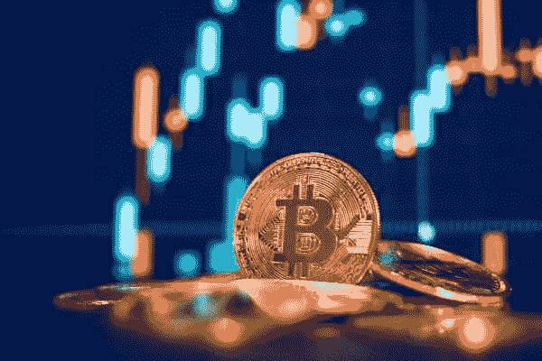
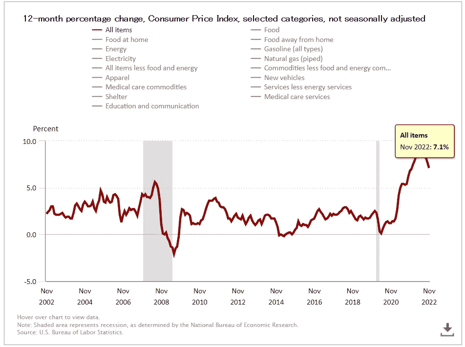
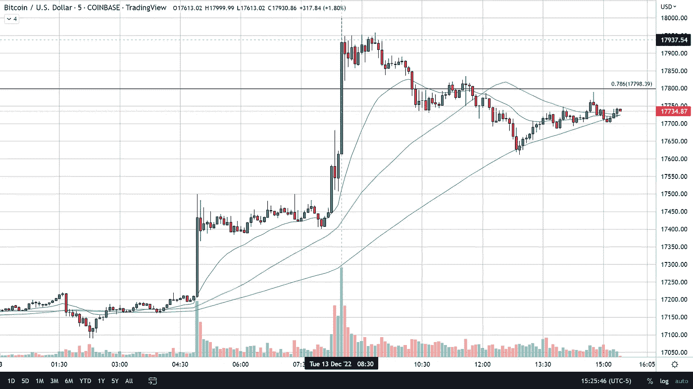

# 比特币因 CPI 数据走高

> 原文：<https://medium.com/coinmonks/bitcoin-moves-higher-on-cpi-data-53b3461237ac?source=collection_archive---------62----------------------->

# CPI 数据

今天发布了 2022 年 11 月的 CPI，过去 12 个月的预期为 7.3%至 7.1%，比上个月增长 0.1%。

到目前为止，住房指数是月度所有项目增长的最大贡献者，远远抵消了能源指数的下降。食品指数本月上涨 0.5%，家庭食品指数也上涨 0.5%。能源指数在这个月下降了 1.6%，因为汽油指数、天然气指数和电力指数都下降了。

# 官方 CPI 发布后，比特币暴涨

在五分钟的蜡烛图上，很明显，在 11 月 CPI 公布后，[比特币](https://www.fxempire.com/crypto/btc)大幅上涨。

# 基本原则

CPI 的发布将是美联储在 2023 年 2 月之前不得不发布的最后一大数据。随着报告的发布，在明年的会议上加息 25 个基点的可能性急剧上升。尽管如此，明天的 FOMC 仍有可能加息 50 个基点，权重为 79.4%至 20.6% (75 个基点)。

当交易者已经在市场上对近期前景的不那么悲观的预期得到证实时，更广泛的市场开始上涨。风险资产和风险资产都在今天的新闻中受到冲击，这支持了不那么鹰派的美联储向前发展。加密货币和黄金、白银等避险货币今天都有不错的反弹。

# 技术分析

如上图所示，在 11 月 CPI 数据发布前后的 5 分钟内，比特币价格上涨了 1.8%，即 317 美元，事实上，在同一时间段内，比特币价格达到了 18000 美元以上的高点。自那以后，比特币放弃了 11 月数据发布后的大部分涨幅。

在美国东部时间上午 12:55 CPI 公布(美国东部时间上午 8:30)后大约 4 小时 25 分钟，比特币将重新测试 17615 美元的价格，并从那里稳步走高。截至美国东部时间下午 3 点 38 分，比特币的价格为 17，748 美元，上涨了 3.13%，即 540 美元。

比特币仍然需要应对长期 78%回撤和 50 天均线的阻力，比特币今天在 50 天均线上方短暂交易，但很快回落到下方，目前正在试图回到这些水平上方，但似乎准备在下方收盘。

# 比特币价格预测

17，798 美元的长期 78%回撤所代表的阻力的重要性不应被低估，因为该价格曾是比特币自 2021 年 11 月创下历史新高以来的历史低点，直到 2022 年 11 月 11 月 9 日触及 15，512 美元的低点。尽管现在果断地将 15512 美元称为底部还为时过早，但我认为我们“接近”底部，我们对比特币底部在 14000 美元至 17000 美元之间下跌的估计在一年多时间里保持不变，下一轮牛市将于 2023 年春天开始。

*原载于 2022 年 12 月 13 日*[*【https://www.fxempire.com】*](https://www.fxempire.com/forecasts/article/bitcoin-moves-higher-on-cpi-data-1229713)*。*

> 交易新手？尝试[加密交易机器人](/coinmonks/crypto-trading-bot-c2ffce8acb2a)或[复制交易](/coinmonks/top-10-crypto-copy-trading-platforms-for-beginners-d0c37c7d698c)