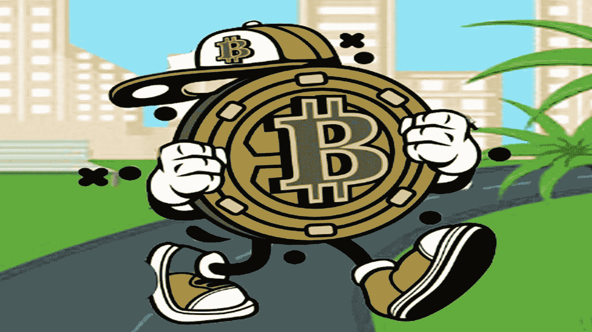
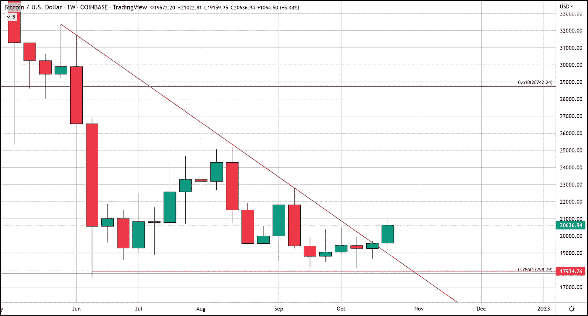
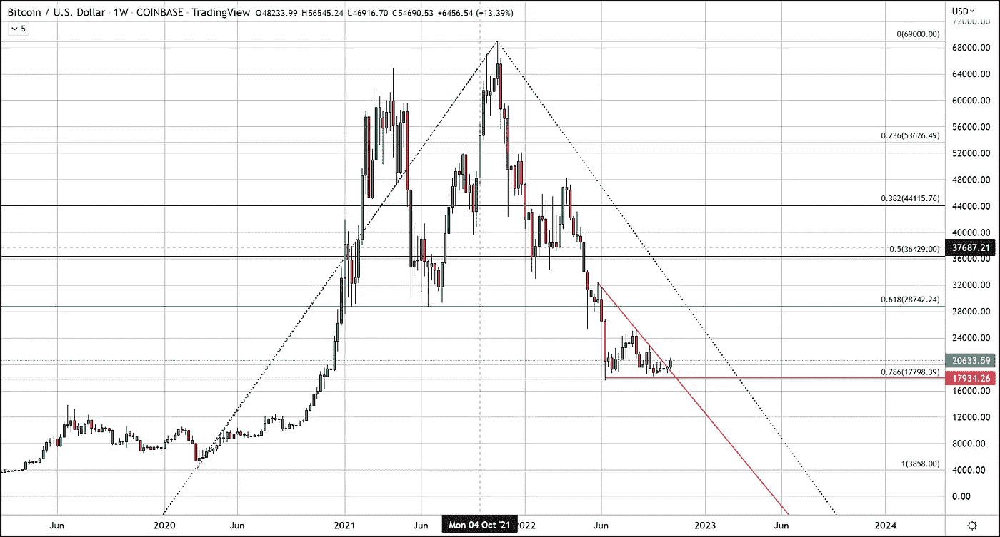
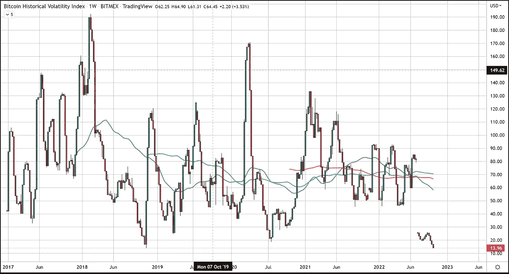
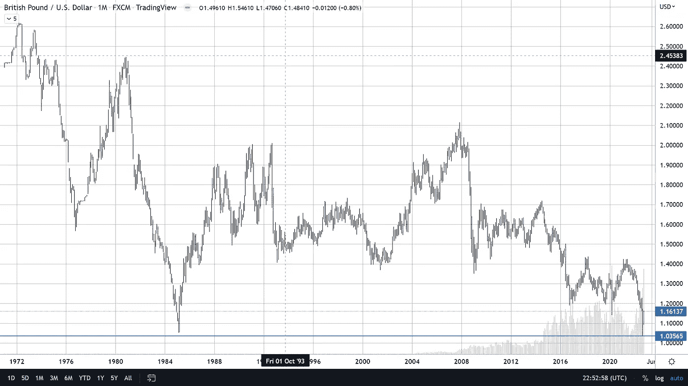

# 比特币基础稳固，但真正的新闻却隐藏在表面之下

> 原文：<https://medium.com/coinmonks/bitcoin-on-solid-footing-but-the-real-news-is-below-the-surface-faadad219be8?source=collection_archive---------24----------------------->

本周，比特币打破了自 5 月底以来定义其价格走势的下降三角形。在六月的第一周、八月中旬和九月中旬，我们分别在三个不同的场合测试了这个形态的上阻力趋势线的顶部。在每一次测试上方阻力的尝试中，看跌派都露出了牙齿。在这三次事件中，比特币都迅速跌至三角形底部，约为 18，000 美元，2022 年第二季度的第一次拒绝导致比特币跌至两年来的最低价格。

尽管这种看涨突破受到了 BTC 多头的欢迎，但这绝不意味着比特币已经出局。事实是，根据历史波动率指数(Bitmex)，市场的波动率已创下历史新低，下降三角形存在于一个更大的下降三角形内，该三角形始于 2021 年 11 月达到的历史高点，这将延续始于 2020 年 3 月的上升三角形。

从历史上看，比特币经历了同样的周期我们已经接近了四次周期的尾声，但在价格抛物线式上涨和随后的下跌之后，周期并没有结束，相反，BTC 在抛物线式波动之后往往会有一个漫长的盘整期。这是我们仍然深陷其中的安慰期，波动指数支持这一点。这就是为什么我和其他分析师认为比特币的下一轮牛市在一段时间内不会发生，我的时间表是 2023 年春天左右。

因此，尽管我对比特币能够突破 20，000 美元感到非常高兴，但我不认为我们看到了 BTC 下一轮牛市的开始。话虽如此，BTC 在黯淡的宏观经济环境下取得这些近期收益的事实，才是真正的潜在因素，使得这一举动远远不止是美元价值的上升。

让我对未来更加乐观的是，比特币在本周扮演的角色将它推上了更高的定价。我指的是比特币的避险吸引力，这种吸引力在本周英国大选动荡期间显现出来，许多投资者因担心英格兰国家货币的波动而选择退出英镑多头头寸，并选择进入比特币作为避险工具。本周，英镑/BTC 的交易量达到了历史最高水平，因为英镑跌至历史低点，跌至接近与美元平价或 1.03 英镑/美元。

这些交易员本可以投资黄金，但他们没有。整个一周以来，交易商一直在积极抛售黄金。尽管黄金确实略有上涨，但价格上涨完全是因为美元疲软。近十年来，比特币的避险功能似乎终于开花结果了。出于这个原因，我觉得价格上涨不是多头应该关注的最重要的事情，而是表面下发生的变化。

任何对比特币免费交易服务感兴趣的人，只需点击这个[链接](https://www.thegoldforecast.com/bitcoin)。

> 交易新手？试试[密码交易机器人](/coinmonks/crypto-trading-bot-c2ffce8acb2a)或者[复制交易](/coinmonks/top-10-crypto-copy-trading-platforms-for-beginners-d0c37c7d698c)