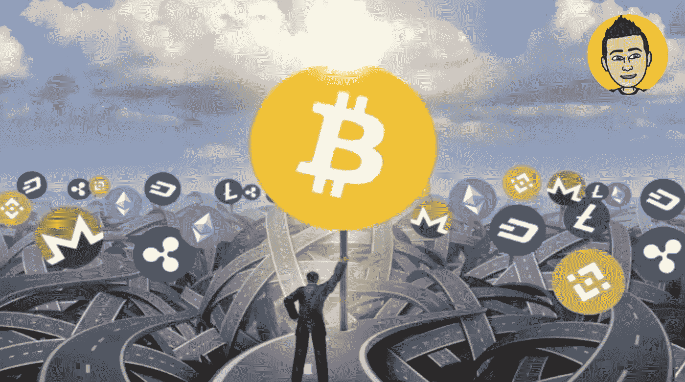

# 比特币还是 Altcoins？

> 原文：<https://medium.com/coinmonks/bitcoin-or-altcoins-34425ea39fc?source=collection_archive---------6----------------------->

永恒的问题，比特币还是替代币？这个问题取决于你问的是哪个人，你会得到不同的答案。许多变量开始发挥作用，以决定哪个选项最适合你。要考虑的事情是你的目标是什么，硬币的基本面，你会在市场上呆多久，风险承受能力，未来会发生什么，你是否试图最大化利润，价格单位偏差，以及你是否是一个交易者。还有…