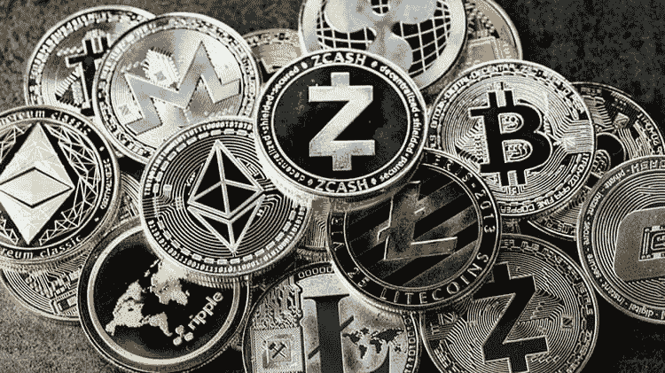

# 过去一周的比特币以及对下一个阻力位的预期

> 原文：<https://medium.com/coinmonks/bitcoin-over-the-past-week-and-expectations-for-the-next-resistance-level-80f1fb9e31af?source=collection_archive---------35----------------------->

***9 月 19 日至 9 月 25 日的一周，比特币在 1.81-1.99 万美元的水平之间横盘交易。在 9 月 19 日(星期一)和 9 月 21 日(星期三)观察到了急剧的下跌冲动。本周前半周，所有市场都因预期美国美联储利率会议的结果而保持不稳定。***

9 月 21 日，会议结束后，美联储连续第三次将利率上调 75 个基点，至每年 3.00%-3.25%。美联储的决定在市场预期之中，而杰罗姆·鲍威尔的讲话后，美元指数创下新高。鲍威尔专注于打击通货膨胀以遏制通货膨胀，而交易员则将其讲话视为继续加息 75 个基点直到通货膨胀开始下降的信号。

交易员预计，2022 年剩下的两次美联储会议将加息 1.25 个百分点，至 4.5%。市场目前认为 11 月 2 日加息 75 个基点的可能性为 72.9%。

美联储会议后，比特币利率从 1.99 万美元的价格区间上限跌至 1.81 万美元，形成下限，因市场参与者为应对美联储加息抛售风险资产。周四和周五，价格在周三的范围内。买家捍卫了 18000-19000 美元的支撑位，但不确定他们是否能够长期阻止卖家。

由于加密货币市场与股票指数相关，比特币也下跌了。美元指数升至 113.22 点。S&P500 下跌 1.71%，纳斯达克下跌 1.80%。

有可能美元现在被推高不是因为对美联储加息的预期，而是因为英镑和欧元的崩溃。能源价格上涨打击了欧洲最大的经济体，企业面临裁员。

高通胀威胁欧盟经济。欧洲央行在加息和抗击通胀方面行动迟缓，因此由于电价上涨和天然气短缺，并非所有企业都能熬过这个冬天。英国的情况类似。德国经济正处于衰退边缘。第一季度，欧元区的 GDP 增长达到 5.4%，第二季度为 4.1%。欧元区的消费通胀率从每年 5.0%跃升至 9.1%，工业通胀率上升了 37%。工业生产和商业活动降至今年年初以来的最低水平。

**下周期待**

下周没有重大数据发布，但我们应该关注美国美联储主席 J. Powell 在 9 月 27 日的讲话。

买家需要经历 2.05 万美元的比特币，在 2.1 万美元以上站稳脚跟。如果一周的交易收于 19500 美元以上，那么周线蜡烛线看起来就像一根大头针。买家需要坚持到月底，直到美国指数的增长阶段开始。对买家来说，最糟糕的情况是比特币回到 15 000 美元的水平。

最近，我们看到与 S&P 指数的相关性略有下降。虽然 S&P 暴跌了 5%，但比特币价格依然持平。下周，S&P 反弹正在等着我们，这可能会反映在 20，500 美元区域内的小幅上涨。在此之后，我们可能应该准备好重新测试 17500 美元区域。

**合并后的以太坊(ETH)**

与此同时，轰动一时的区块链硬币以太坊(ETH)的价格也在本周下跌，与 BTC 相比跌幅更大。在撰写本文时，ETH 的交易价格约为 1 390 美元。

然而，一些分析师指出，在 1 200 美元附近有一个强有力的支撑区域。如果价格设法反弹，这可能标志着调整的结束。

与此同时，如果 ETH 利率稳步降至 1 284 美元，目前持有价值约 430 万美元资产的 MakerDAO 金库将濒临清算。

本周，美国证券交易委员会(SEC)提请注意美国资本化第二大加密货币的节点集中。根据监管机构的说法，ETH 的这一立场允许美国法律适用于项目网络及其内部的所有交易。

**涟漪 XRP 崛起于市场之上**

Ripple 正处于与 SEC 法律战的最后阶段。由于预期该公司将取得积极成果，在加密货币市场下跌的背景下，其 XRP 令牌正在上涨。

在市值最大的 10 种加密货币中，XRP 是唯一一种在过去 7 天内上涨的货币。在过去的一天里，它增加了 9%以上，一周内增长了 7%。与此同时，剩余的加密货币在一周内损失了 7%到 20%。

据了解，正在考虑 SEC 对 Ripple 提起诉讼的法院收到了双方的请愿书，要求尽快做出决定。交易员和投资者认为这是一个积极的信号，因为各方的这种联合行为意味着他们之间达成了一些协议。

**与此同时，纽约州法院要求系绳公司证明 USDT 抵押品充足**

美国法院裁定，泰瑟公司有义务向法院提供证明 USDT 稳定币安全性的财务文件。stablecoin 系绳的发行人认为这一法院命令不合理，但同意提供所要求的文件。

纽约州法官 Katherine Polk Failla 裁定，USDT 稳定币的发行者必须披露财务文件，以确保其完全由美元支持。

由于被指控操纵加密货币市场，该公司目前正在诉讼中。除了有关交易时间的细节之外，还要求 Tether 提供总分类账、资产负债表、损益表和现金流量表。

# 顶级外汇学院

*   [外汇交易顶级 VPNs】](https://topforextrade.medium.com/top-vpns-for-forex-trading-comparison-of-high-speed-providers-for-safe-fx-market-exchange-at-the-b75f0bf7e740)
*   [远期交易讲解](https://topforextrade.medium.com/forwards-trading-explained-how-to-hedge-against-risks-and-make-a-profit-f04de922c5d6)
*   [如何从外汇经纪人那里获得奖金](https://topforextrade.medium.com/how-to-get-a-forex-bonus-and-benefit-from-it-ce998e4d81e7)
*   [带杠杆和保证金的外汇交易](https://topforextrade.medium.com/forex-trading-with-leverage-and-margin-explained-how-to-manage-risks-to-make-a-profit-316237b9349d)
*   [加密货币初学者终极指南](https://topforextrade.medium.com/ultimate-beginners-guide-on-cryptocurrency-top-platforms-to-buy-and-trade-bitcoin-ethereum-xrp-5b64b3d8a55d)
*   [外汇差价合约交易](https://topforextrade.medium.com/expert-review-of-forex-trading-of-cfds-what-is-it-and-how-to-trade-them-90d8e00669ea)
*   [使用 VPN 和 VPS 进行外汇交易](https://topforextrade.medium.com/secure-forex-trading-with-vpn-and-vps-free-offers-of-top-fx-brokers-8c13a3ece0d3)
*   [外汇期货交易](https://topforextrade.medium.com/forex-futures-trading-expert-guide-key-terms-and-how-to-make-a-profit-8f30fd902223)
*   [外汇风险管理](https://topforextrade.medium.com/forex-risk-management-effective-strategies-for-safe-fx-trading-for-beginners-adab8eee597f)

> 交易新手？试试[加密交易机器人](/coinmonks/crypto-trading-bot-c2ffce8acb2a)或者[复制交易](/coinmonks/top-10-crypto-copy-trading-platforms-for-beginners-d0c37c7d698c)