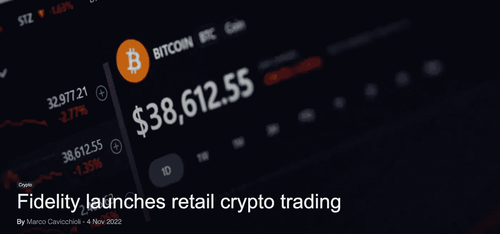

# 比特币作为支付网络克服了 Visa 和 Mastercard

> 原文：<https://medium.com/coinmonks/bitcoin-overcomes-visa-and-mastercard-as-a-payment-network-9c1c5be0163b?source=collection_archive---------19----------------------->

这周又有有趣的消息了！首先比特币和万事达！

 [## 比特币是最常用的支付方式

### “占主导地位的全球货币网络”:这是迈克尔·塞勒对比特币的定义。#比特币现在是全球的主导……

密码学家](https://en.cryptonomist.ch/2022/11/04/bitcoin-most-payment-method/) 

比特币现在是世界上交易量最大的货币网络，击败了 Visa 和 Mastercard。不是简单的目标，是完全的支配。请记住，链上数据不考虑闪电网络交易，这些交易不会在区块链上广播。

[https://en . crypto nomist . ch/2022/11/04/fidelity-launchs-retail-crypto-trading/](https://en.cryptonomist.ch/2022/11/04/fidelity-launches-retail-crypto-trading/)

富达推出加密交易服务。无论如何，许多人仍然在说比特币和加密货币是 s**t，所以我们仍然需要几年时间才能真正大规模采用。

 [## 桑坦德银行限制加密货币兑换交易-找出原因

### 银行巨头桑坦德银行的英国子公司桑坦德英国已经对其…

cryptonews.com](https://cryptonews.com/news/santander-bank-limits-cryptocurrency-exchange-transactions-find-out-why.htm) 

桑坦德银行限制向加密货币交易所转账。这是为了保护顾客的钱的安全。难道他们不认为限制银行交易只是增加了用户寻找“替代”方式(或多或少合法)的努力。

 [## 比特币现在比标准普尔 500 和纳斯达克的波动性小

### 由于美元出现罕见的每日大幅下跌，比特币(BTC)在 11 月 5 日保持在 21，000 美元以上的涨幅。数据…

cointelegraph.com](https://cointelegraph.com/news/bitcoin-is-now-less-volatile-than-s-p-500-and-nasdaq) 

有趣的事实:比特币现在比标准普尔 500 和纳斯达克波动性小。你的波动神现在在哪里？此外，Van Eck 的一项统计数据显示，去年，在 S&P500 上市的股票中，已经有 22%的股票比比特币的波动性更大。

 [## 摩根大通 Instagram 的多边形采用率增长 200%

### 11 月 3 日，多边形(MATIC)成为顶级加密货币中表现最好的资产，因为市场…

cointelegraph.com](https://cointelegraph.com/news/matic-price-eyes-200-gains-on-polygon-adoption-by-instagram-jpmorgan) 

MATIC 将被整合到 Instagram 中，并被摩根大通收购。我喜欢第一个，我不太喜欢第二个，但无论如何，这对于多边形链上的预期量来说是一个好消息。

 [## 来吧，都来吧！Meta 将 NFT 铸造和交易引入 Instagram

### 社交媒体平台 Instagram 将推出一系列与非伪造令牌(NFT)相关的工具，这些工具将允许…

cointelegraph.com](https://cointelegraph.com/news/come-one-come-all-meta-to-bring-nft-minting-and-trading-to-instagram) 

Meta 将把 NFT 的铸造和交易带到 Instagram 上，但这将会解雇成千上万的人。他们到底在做什么？

> 交易新手？试试[密码交易机器人](/coinmonks/crypto-trading-bot-c2ffce8acb2a)或者[复制交易](/coinmonks/top-10-crypto-copy-trading-platforms-for-beginners-d0c37c7d698c)