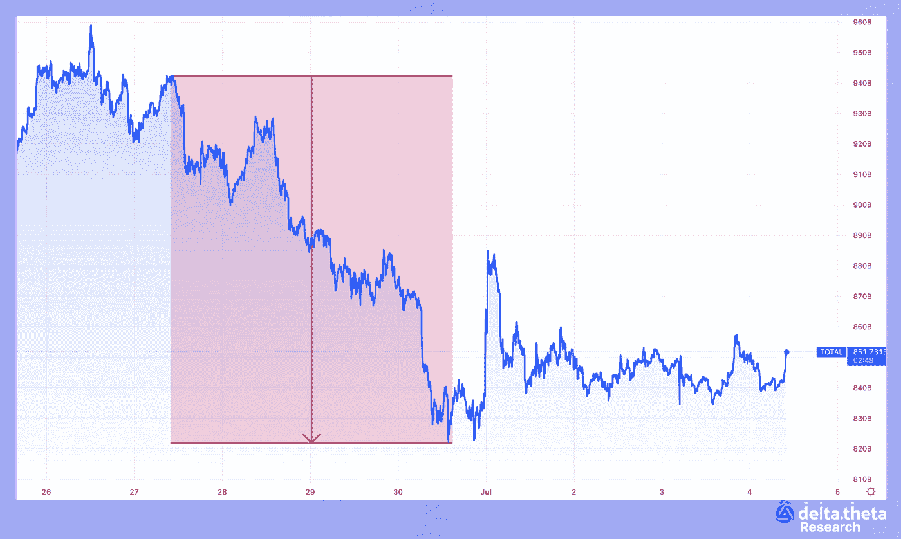
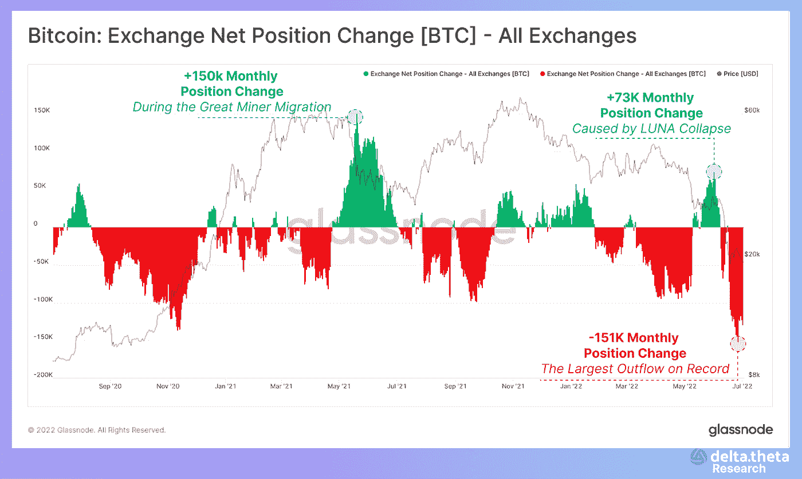
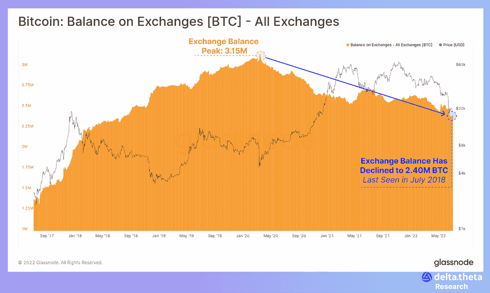
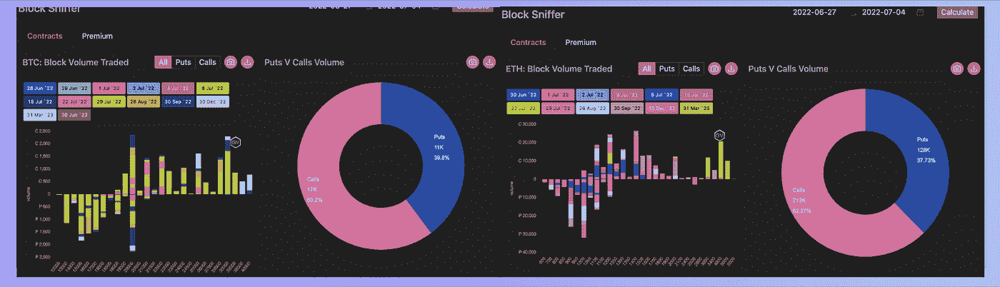
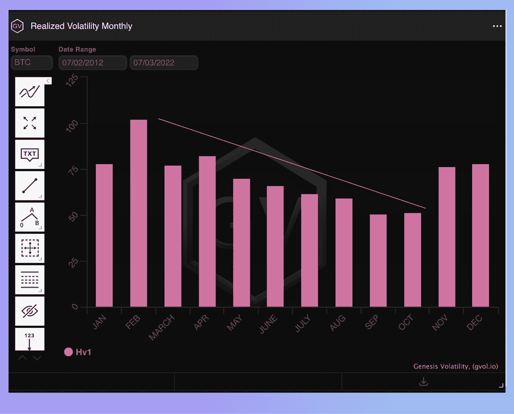

# 比特币超卖:谁买的深？

> 原文：<https://medium.com/coinmonks/bitcoin-oversold-who-buy-the-deep-f1ef7a2937e4?source=collection_archive---------16----------------------->

加密货币市场连续第三周继续围绕“隐含底部”水平盘整。仍然存在高度的恐惧和不确定性。尽管宏观经济指标表现积极，但今天没有人能肯定地说市场是否已经停止下跌，或者市场是否会继续下跌。

6 月 28 日至 7 月 5 日之间，市场处于平稳的、近乎“横盘”的下跌趋势。总加密市值指数始于 9235.5 亿美元。然后，到周中，它下降到 8245.5 亿美元。到这一时期结束时，该指数达到 8703 亿美元。该指数本周的最终变化为-5.7%..

“第一种加密货币”于本周开始于 20 990 年。然后，在本周中期，在 18 757 点达到了一个局部底部。这一时期结束时，比特币价格稳定在 19 750 英镑。该期间的总价格变化为-5.9%。

与比特币相反，以太坊价格图在审查期间波动性更大。从 1220 点开始，到中期达到 1006 点的局部低点。到期末，价格稳定在 1130 点。总变化为-7.3%。

# 新闻

币安实验室，币安的风险投资部门和加速器，和 Republic [共同领导了 Magic Square](https://cointelegraph.com/press-releases/magic-square-raises-3m-seed-funding-co-led-by-binance-labs-and-republic) 的种子基金，这是第一个社区驱动的多链分散应用市场。Magic Square 提供 Web3 解决方案，让每个人都更容易使用加密货币。用户可以在一个空间中找到并体验各种分散的应用程序、CeFi 和 DeFi、NFTs、游戏等。该项目将把收益用于“超大规模”用户增长、产品开发和团队扩张。Magic Square 正准备很快正式推出封闭测试版，同时正在处理应用程序列表的验证。随后不久将面向 50，000 名预注册用户进行公开测试。

> 交易新手？试试[密码交易机器人](/coinmonks/crypto-trading-bot-c2ffce8acb2a)或者[复制交易](/coinmonks/top-10-crypto-copy-trading-platforms-for-beginners-d0c37c7d698c)

在加密货币市场崩溃之际，萨尔瓦多政府购买了 80 枚 BTC。该国花费了 150 多万美元购买这些资产。总统 Naib Bukele 感谢市场“廉价出售”。萨尔瓦多现在共有 2381 个 BTC。为了在过去几个月里获得这一数额，该国已经支付了超过 1 . 05 亿美元。然而，由于目前的下降，该国现在有近 6000 万美元的未实现损失。

兰博基尼 square Corse GT vincento Sospiri Racing 宣布[它将开始使用 NFT 认证和认证工厂车辆零件](https://cointelegraph.com/news/lamborghini-backed-gt-racing-team-to-authenticate-car-parts-using-nfts)。此举是 Go2NFT 试点计划的一部分，go 2 NFT 是一家专门为企业创建企业 NFT 的公司。该公司在一份声明中表示，该项目还可能扩大到商品和其他官方产品的验证。今年 3 月，该公司从 Skey Network 获得了 500 万美元的投资。

在三次交易中，T2 偿还了分散贷款协议制造商 1.2 亿美元的债务。目前正经历严重流动性危机的集中贷款公司摄氏，此前曾以“包装”比特币(WBTC)为抵押，向 Maker 借入数亿美元。通过偿还制造商的债务，摄氏降低了潜在的信用头寸清算的风险。在分散化金融中，当交易员未能按时偿还贷款且协议自动出售其抵押资产时，就会发生清算。

# 市场情况

根据 Glassnode analytical service 的数据，BTC 的提款达到了 1.51 亿 BTC 的历史最高水平。这一数字间接证实了矿商和密码银行/经纪人的大规模销售，也标志着买卖双方利益的重要整合。

比特币从交易所取款的总体趋势仍在继续。尽管缺乏新的重大公共购买，但两类比特币持有者——余额低于 1 BTC 的和余额超过 1000 BTC 的——继续增加积累。这种分布表明了老练的散户投资者和大型企业市场参与者的浓厚兴趣，他们正在为下一阶段的市场增长做准备。

BTC 期权交易动态的变化反映了密码市场的普遍超卖性质。虽然之前我们注意到了看跌期权的失衡，但上周交易者专注于买入 25，000–30，000 水平的看涨期权(交易量增加了几倍)，到期日在 7 月底。在 7 月的最后一周，美联储期货市场委员会预计将就再融资利率举行会议。鉴于目前所有的目光都集中在美国经济上，预期与最终决定之间的分歧可能会显著影响加密资产的市场价格。

对于 ETH 期权，值得注意的是与 2023 年第一季度价值增值预期相关的几项大型交易。一个可能的动机是，当全球市场解冻，本地增长驱动力得以最大化时，扩大视野。

从历史上看，波动性会在夏季月份下降，假期也会对金融行业造成影响。然而，今年全球经济面临许多挑战，并非所有市场参与者——尤其是立法者和监管者——都做好了准备。6 月底的美联储会议和美国企业财报季可能会给市场带来额外的波动，这应该在中期交易规划中加以考虑。

**货币市场——为有经验的加密用户提供的附加服务**

这些信息使我们能够比较不同方式产生“有机”回报的稳定债券收益，这些方式包括向分散的交易所、分散的存款提供流动性，或通过出售期权(一周期限、中央罢工、稳定债券的看跌期权、瑞士联邦理工学院/BTC 的看涨期权)进行流动性配置。