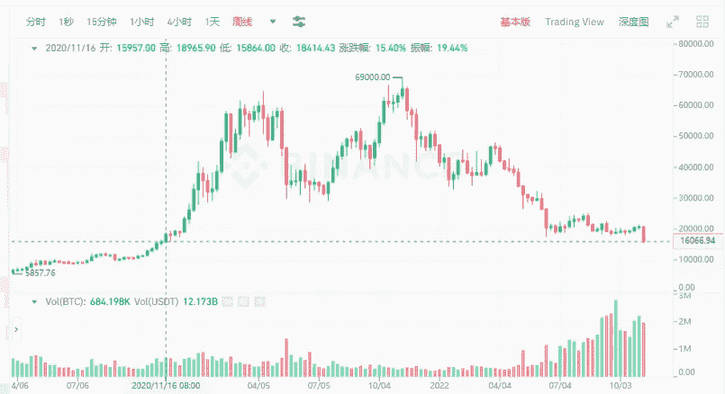
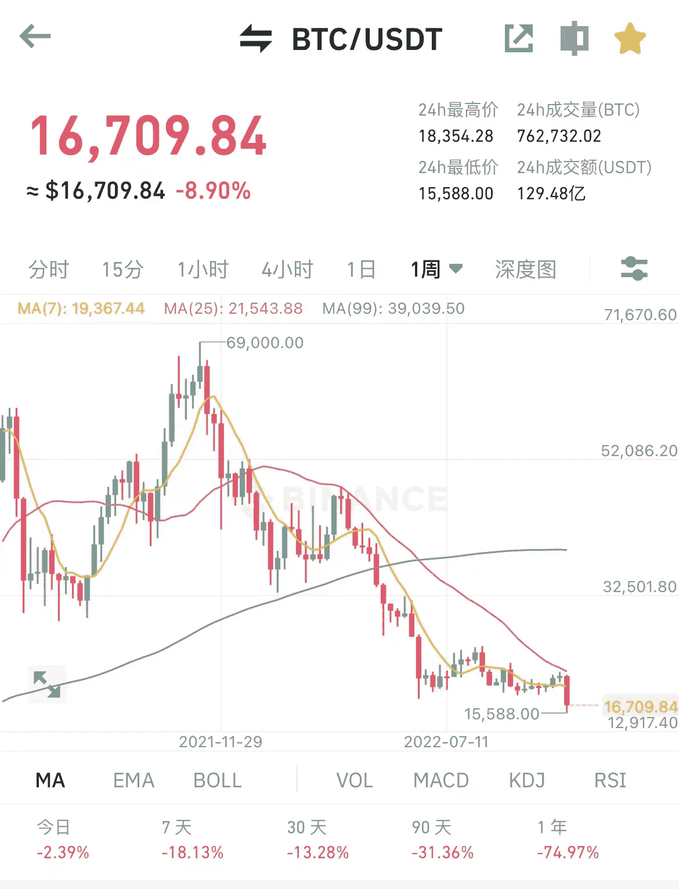
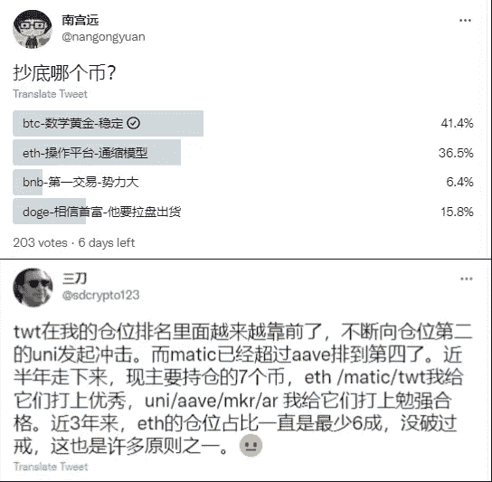
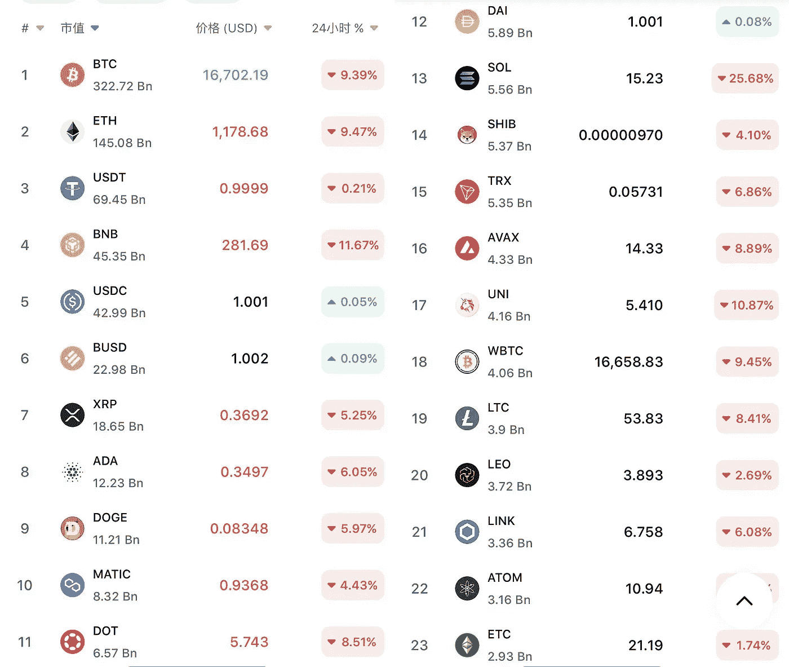

# 比特币暴跌至 15880 美元，价格创下两年来新低

> 原文：<https://medium.com/coinmonks/bitcoin-plummets-to-15-880-the-price-is-a-2-year-all-time-low-9ff756da1cec?source=collection_archive---------5----------------------->

比特币在 11 月 10 日凌晨跌破 16k，跌至 15880 美元。

这一价格是自 2020 年 11 月以来的历史新低，比去年 11 月的 69k 高点下降了超过 76.9%。受 FTX 爆炸和整个市场流动性不佳的影响，比特币连续 4 天下跌，跌幅超过 25%。

17k、16k 以下，下行阻力更小。目前价格已经在 16k 保持了几个小时，上涨动力很小。那些在 17–18k 抄底的，都不是真正的底部。

Bitcoin sees biggest drop in 2 years

自 11 月 6 日全球第二大交易平台 FTX 被爆资不抵债后，FTT 一落千丈，从第 25 位跌至第 2 位，跌幅超过 92%。经过数据挖掘和披露，FTX 的账面上有 80 亿美元的资本缺口。多个机构来回沟通，没有达成收购意向。FTX 可能会申请破产。

FTX 挪用客户资金，未能履行平台责任，其创始人 SBF 可能面临法律制裁。

用户也对平台失去了信心。这一轮熊市，收盘跌到零的大事务所，可能就是 2usdt 到 0 的距离。

Is SBF bringing down BTC?

每一轮熊市都有经典回顾，看着价格一路下跌，继续安慰受伤的心灵。经历了 69k 的高点，再看看现在的 16k，真的不可想象，已经跌了 76.9%。

群里的新玩家已经失去希望，卸载软件默默离群，选择不关注，简直是无底洞掉下去。
那些经历过牛熊交替的老韭菜们似乎无动于衷，只能看着自己钱包里的余额，暗自心酸。

想留在场上的人也准备躺下来，盘算着如何度过漫长的冬天。

Where has the bear market progressed?

当然，事物都有两面性。

比特币从 69k 下跌，对于去年入市的人来说，资产缩水了四分之三；如果现在是一个起点，那就已经跑赢大多数人了。

对市场未来仍有信心的，准备逢低买入，但市场上的选择实在太多了，真不知道哪一个会归零，哪一个会是下一轮机会。

看了很多 KOL 的观点，每个人都有不同的看法。有的从定位选项目，有的从心情选系列，有的从功能选方向。选择真的太多了。

在你没有判断力的时候，如果要选择一个 KOL，不妨看看他过去的盈利经历，是否取得了显著的成绩。

Which bear market dips?

或者从市值上选择一个体量较大的系列，跟着市场的选择走。

比如从目前的市值排名来看，BTC 市值 3100 多亿美元，ETH 市值 1400 多亿，遥遥领先其他标的。

除了 stablecoins，还有 BNB、XRP、阿达、多格、MATIC、DOT、SOL、SHIB 等排名前 10 的代币。只是不知道哪家能熬过熊市寒冬，迎来下一轮腾飞。

如果选错了对象，比如上一轮 EOS，2017 年声势浩大，很多人大量拿 EOS，2021 年却没有起飞，一直保持沉默。

很多人倒在 EOS 上，虽然没有归零，但也没有引起一点水花。

TOP10 project TOKEN by market value

市场从来不按剧本推进，就像现在的 16k BTC 是不是底部，谁也不知道；更难的是，是否会出现另一轮牛市，还是市场会止步于此？

加密世界从诞生的第一天起，就伴随着质疑和批判，也面临着重生，不信任也会伴随着后续的循环。

如果你承受不了归零的风险，就承受不了熊市的低迷，未来就没有希望。

任何机会都来自巨大的不确定性，就像你我看到的市场一样。市场波动很大，玩家要注意风险。

以上只是我个人观点，没有投资建议。我是楚小莲，我正在关注元宇宙和 web3。​​

> 交易新手？试试[加密交易机器人](/coinmonks/crypto-trading-bot-c2ffce8acb2a)或者[复制交易](/coinmonks/top-10-crypto-copy-trading-platforms-for-beginners-d0c37c7d698c)