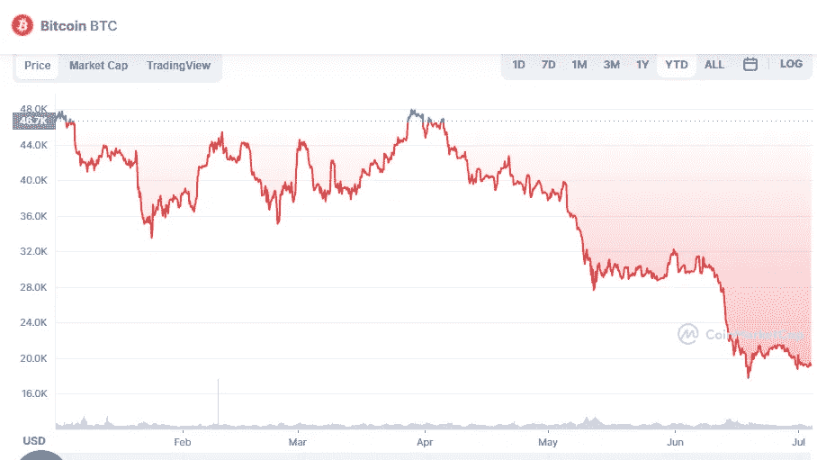

# 7 月 4 日比特币价格分析

> 原文：<https://medium.com/coinmonks/bitcoin-price-analyse-4th-of-july-36c73bfd00e4?source=collection_archive---------34----------------------->

Source photo [Bitcoin price today, BTC to USD live, marketcap and chart | CoinMarketCap](https://coinmarketcap.com/currencies/bitcoin/)

当比特币的价格超过 20 天指数移动平均线(21，396 美元)时，其 7 月 1 日烛台上的漫长灯芯表明，空头正在继续推动更低的价格。即使空头已经将价格推低至 19，637 美元以下，这种动力也没有持续下去。

要回到 19，637 美元以上，多头需要将价格推高。BTC/USDT 组合可能会向 20 天指数移动…