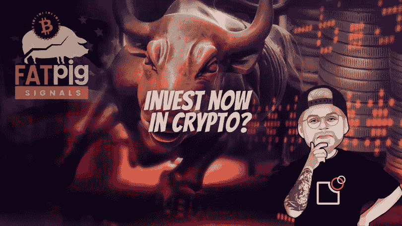

# 比特币价格发现——熊市何时结束？

> 原文：<https://medium.com/coinmonks/bitcoin-price-discovery-when-is-the-bear-market-over-ff62411c531d?source=collection_archive---------10----------------------->

FTX 崩溃后，用户从交易所取出硬币，自己管理密钥。好事！但随着交易所流动性枯竭，这是否会让操纵价格变得更容易？

大多数人应该同意的一件事是:FTX 的残酷崩溃，一夜之间损失了 120 亿美元，同时掠夺了每个客户的账户，这表明受托人应该…