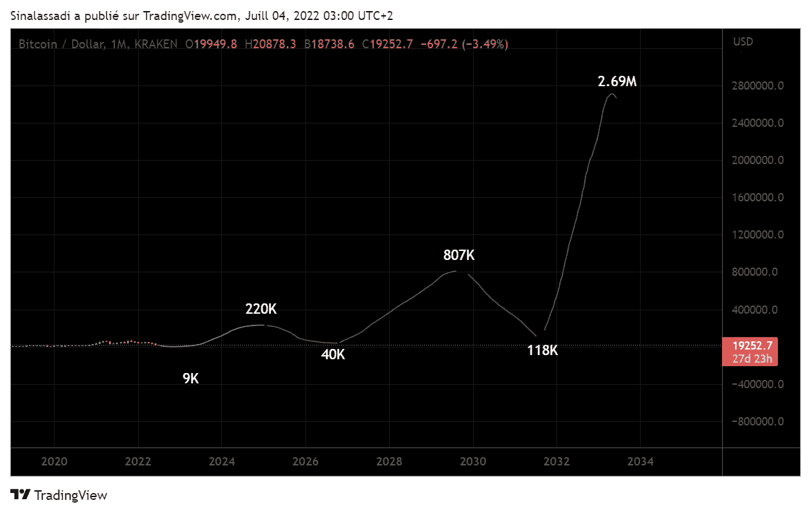

# 2024 年、2028 年、2032 年的比特币价格。

> 原文：<https://medium.com/coinmonks/bitcoin-prices-in-2024-2028-and-2032-56bc8c78d9d2?source=collection_archive---------28----------------------->

## 根据最新趋势的预测。

Photo by [Alesia Kozik](https://www.pexels.com/fr-fr/photo/mouvement-investissement-donnees-graphiques-6770775/)

在这次熊市中，绝望比比皆是。许多投资者正在放弃。但我想给你信心。实力！

*让我们用斐波那契指标来衡量趋势。*

*让我们看看它给出了什么，叠加在 S2F 模型上。*

你会感到惊讶的。

*   **本文不是财务建议，仅提交给我****

## **趋势计算。**

让我们记住，加密货币市场仍然非常年轻。这解释了它的波动性。

**99%的加密货币持有者都是为了投机金融收益。**相比之下，我们很少有人对**技术**有热情。

我们发现前两个周期的低点在 78.6 和 100 回撤之间。详情请看我上一篇文章[这里](/coinmonks/what-im-watching-for-before-purchasing-273200329d5c)。

一旦知道了，**我们就用低点来计算趋势**。然后是可能的价格。这就是它们的样子。首先，考虑到**我们在当前周期**不会低于 9k。

Price prediction for future cycles according to the last tendencies

这些价格适合你吗？

完美！因为他们可能，**低估了**。我们将位于 S2F 型号的下方，如下图所示。

Price predictions over the S2F model

此外，在 2017 年的周期中，泵是暴力的。**斐波纳契上涨超过 4.236** ，如下图。

Huge pump power during the 2017 cycle

以这样的实力，我们可以在 2024/2025 年**超过 26 万美元**对应 4.236 斐波纳契。

然后，**达到 70 万美元。**

如果这种情况发生，也只会是短暂的，就像 2017 年 12 月一样。

> 交易新手？尝试[加密交易机器人](/coinmonks/crypto-trading-bot-c2ffce8acb2a)或[复制交易](/coinmonks/top-10-crypto-copy-trading-platforms-for-beginners-d0c37c7d698c)

总之。对于买入 DCA 的长期投资者来说。

在目标范围内，**在 4-5 年内获利回吐**。这项投资仍然非常有利可图。

还需要观察市场的实际情况和宏观经济背景。

如果全球经济再次增长，加密货币很有可能大幅升值。比任何其他风险资产都要快。

持有人(长期投资者)永远是赢家！

