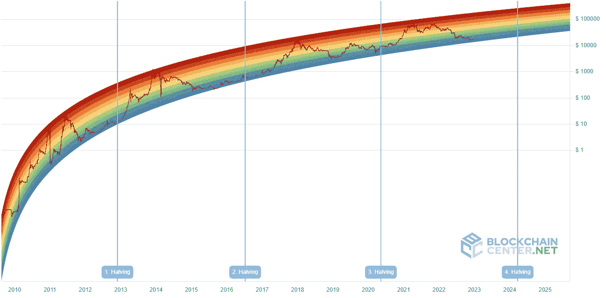

# 比特币彩虹图

> 原文：<https://medium.com/coinmonks/bitcoin-rainbow-chart-77684b66d3?source=collection_archive---------16----------------------->

比特币等加密货币近年来越来越受欢迎。用来分析比特币表现的最有用的工具之一就是比特币彩虹图。这张图表直观地展示了比特币价格随时间的变化。在本文中，我们将讨论什么是比特币彩虹图，它是如何工作的，以及如何用它来分析比特币的表现。