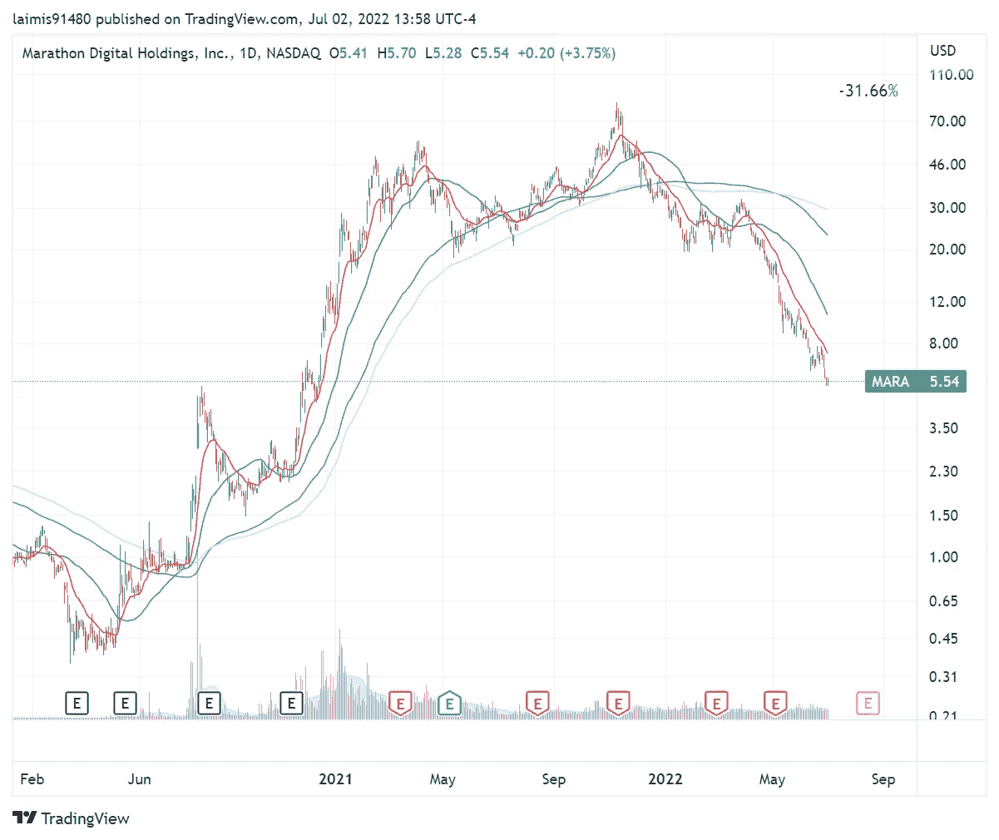

# 比特币矿工股票

> 原文：<https://medium.com/coinmonks/bitcoin-related-stocks-ddcf009f2ee3?source=collection_archive---------38----------------------->

熊市遍地都是，作为交易者，眼下也没多少事可做。我们可能已经到达了一个阶段，不管它是多么短暂，在这个阶段，下行和上行都没有太大的空间。顺便说一句，我完全期待在我发表这篇文章后事情会有所改变，呵呵呵。

有了充足的时间，我决定浏览一下我手头的一些图表和观察清单，并缩小一点。一个这样的名单是一群公开交易的比特币区块链公司/矿商。我在过去交易过这些股票，并且习惯于观察这个群体的总体情况以及它的走势。但我现在浏览图表时意识到一件事，比特币价格和矿业公司股价的相关性有多高！不确定是真的关系，还是只是整体市场造成了这种关系。无论哪种方式，都可以看到一些令人兴奋的收获和下降。

首先，这是我跟踪的所有股票代码:HIVE、HUT、MARA 和 RIOT。让我们看看他们的图表，从大约 2020 年 1 月到 2020 年 3 月的下跌，2021 年的高点，以及当前的价格:

储备

小屋

玛拉

暴乱

最后，让我们也在这段时间发布比特币:

他们都经历了一段史诗般的旅程，不是吗？看看现在的矿工，我看到了这个:

看到数字这样排列真是难以置信。增益栏显示从 2020 年低点到高点的百分比增益。drop 显示了 2020 年从高点到低点的下降百分比。

从 2020 年 3 月到 2021 年 11 月的一年多时间里，MARA 理论上从低点入场到最高点出场的 23，743%的涨幅简直太疯狂了…

比特币大致有两个峰值，一个在 2021 年 2 月，另一个在 11 月。你可以看到矿业股票也有这些峰值…一点也不奇怪。他们的 3 月低点几乎都在同一天下跌。

> 交易新手？试试[加密交易机器人](/coinmonks/crypto-trading-bot-c2ffce8acb2a)或者[复制交易](/coinmonks/top-10-crypto-copy-trading-platforms-for-beginners-d0c37c7d698c)

有太多的多余和收获要洗去。也可能只是一个巧合，也可能不那么巧合，但成长型股票基本上在 2021 年 2 月开始下跌。这与比特币的一个高峰以及它是一种资产风险的想法非常吻合。

温斯坦的阶段分析迷应该真正欣赏图表，因为它显示了他的进场和出场方法非常有益。所有照片都是完美的第二阶段/第三阶段/第四阶段照片。