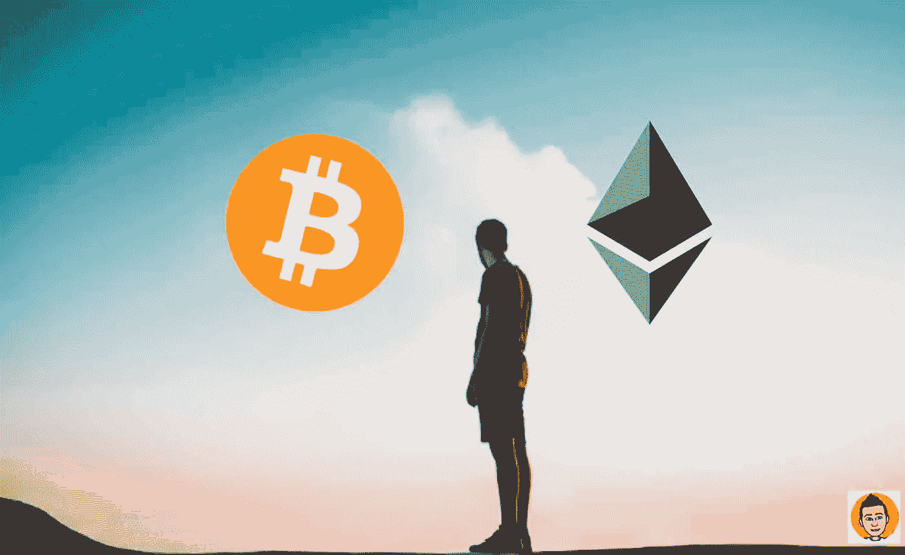

# 比特币:散户不见了

> 原文：<https://medium.com/coinmonks/bitcoin-retail-buyers-are-gone-cce3f955ec71?source=collection_archive---------8----------------------->

毫无疑问，我们目前正处于熊市。甚至那些最有信心的人也慢慢得出了这个结论。现在的问题不是我们是否处于熊市，而是现在已经转变为“价格会跌到多低？”价格是否已经触底，或者对于密码持有者来说是否有更多的痛苦？