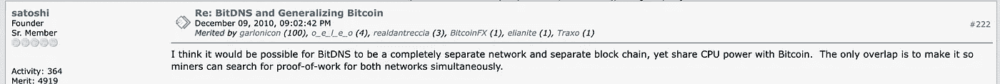
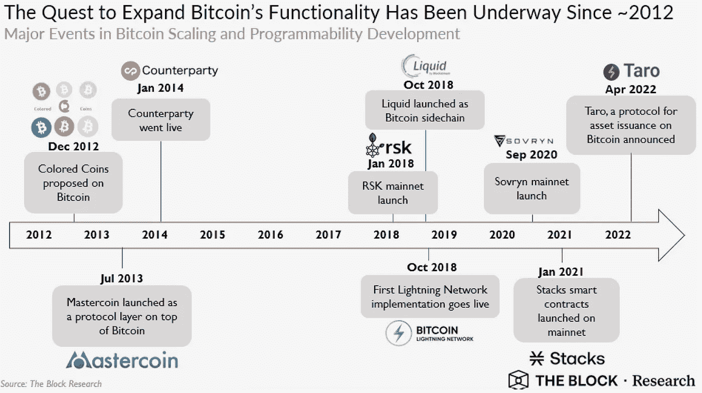
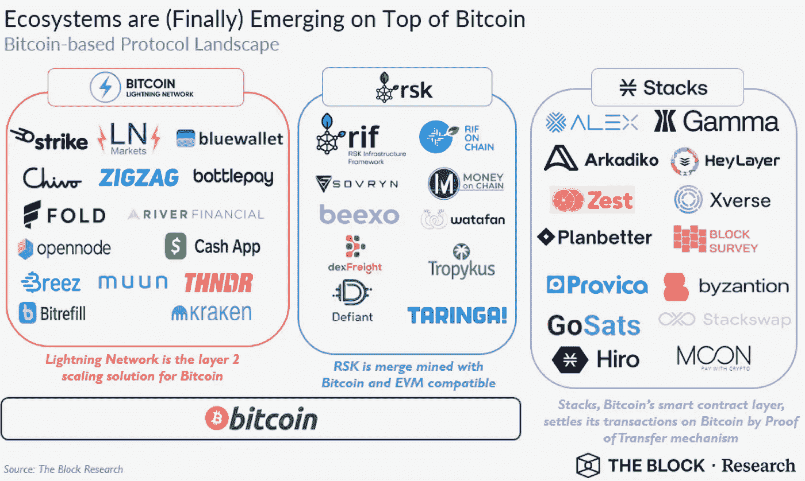
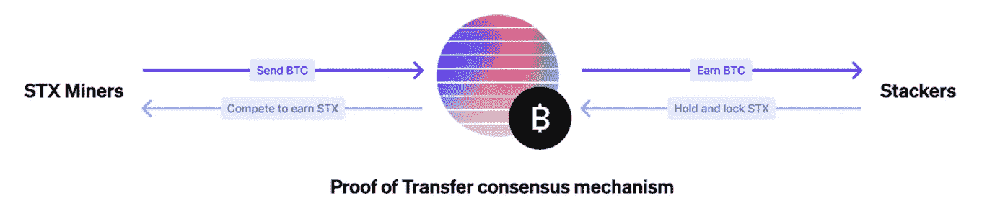
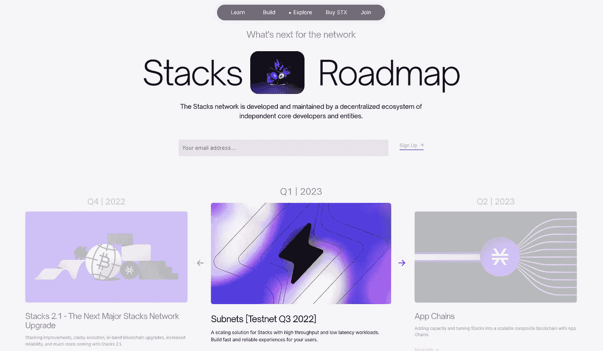
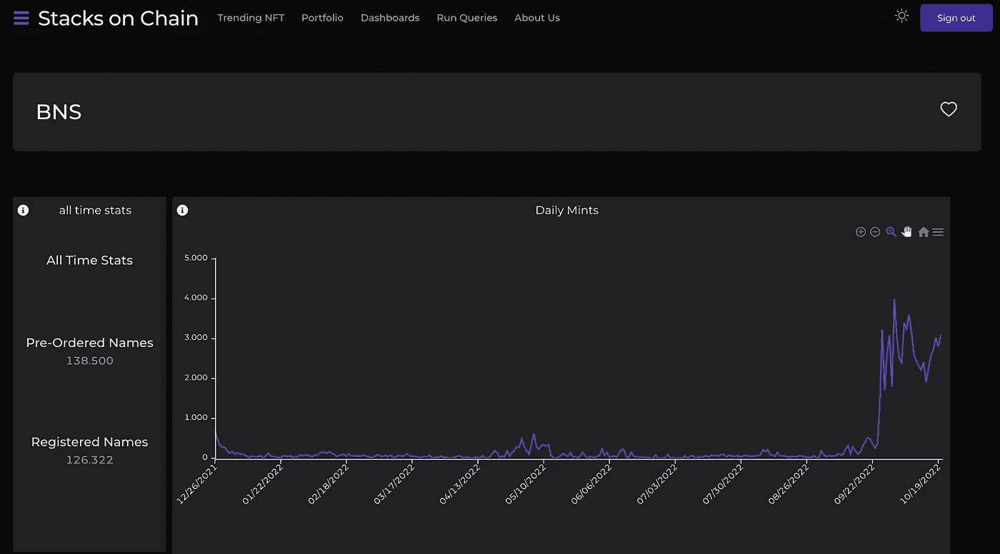
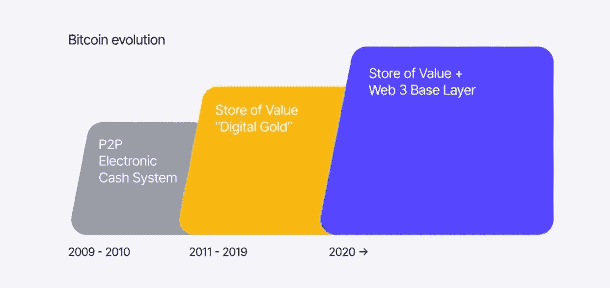

# 比特币智能合约:加密的真正圣杯

> 原文：<https://medium.com/coinmonks/bitcoin-smart-contracts-the-true-holy-grail-of-crypto-bf98ce82776e?source=collection_archive---------5----------------------->

## 对堆栈的深入基本面分析。

`A lot happened in December 2010\. Some of these events include SpaceX's launch of the Dragon spacecraft, making it the first private company to launch, orbit, and retrieve a spacecraft successfully. Stockholm suffered a terror attack involving two explosions in a busy shopping area. Barack Obama signed the repeal of the "Don't Ask, Don't Tell policy," which openly banned homosexuals from serving in the US military. And Frank de Boer succeeded Martin Jol as coach of AFC Ajax. As an Ajax supporter, certainly not an insignificant event. Despite winning four league titles, his unattractive style of play was unpalatable during his following years.`

`Nonetheless, the pseudonym Satoshi Nakamoto was busy brainstorming about very different things in that period. He came up with the idea that later partly laid the foundation for bringing programmability and scalability to Bitcoin. What Nakamoto saw back then was the opportunity for Bitcoin to be more than just money.`

在这份报告中，我将首先描述比特币从点对点数字现金系统发展到多层网络的过程。然后，基于此，我将解释为什么不同的协议精确地建立在比特币网络上是至关重要的。最后，我解释了为什么 Stacks 项目最适合这个目的，以及为什么在我看来，它目前被严重低估了。声明:这不是财务建议；我写的一切都是基于我自己的想法和观点。

## 基于比特币的协议之路

自诞生以来，比特币一直在迷宫般的叙述中穿行。开始是一种投机性的数字收藏品，发展到一种新颖的点对点形式的数字现金，发展到数字黄金，现在转变为基础层货币，上面有不同的层，可能是未来数字资本市场的基础。比特币最初的概念是一个区块链，可以处理用户的所有交易需求。然而，人们很快发现，对于日常支付和现代数字解决方案来说，底层网络速度太慢、效率太低。随着比特币经历不同的成熟阶段，它获得了可信度。最终，它缓慢而稳定的步伐将最终成为它的超级大国。

## 信任的根源

交易速度不够是因为它的核心设计原理。事务被捆绑成块，这些块大约每十分钟创建一次。预期阻塞时间被设置为 10 分钟的恒定值，以确保矿工不会通过增加更多的计算能力来影响网络的安全性。每 2016 个方块，评估平均方块时间，并进行难度判定。如果不到十分钟，比特币会提高解锁挖矿奖励所需的数学问题的难度，如果超过十分钟，就没那么复杂了。(阿摩斯，2018 年，第 173 页。)散列标识区块链内的每个块，该散列是在块的报头上使用 SHA256 加密散列算法生成的，并且每个块还引用其前一个块。将每个块链接到其当前块的散列序列创建了一个链，该链可以追溯到第一个块，称为起源块。比特币的信任根源在于其使用创世区块到当前区块作为最长信任链的原则(Antonopoulos，2017，第 271 页。).比特币的散列率使其成为现存最安全、不可改变的区块链网络。[【5】](https://www.blockchain.com/explorer/charts/hash-rate)

## 基层

比特币是一个安全的全球结算网络，其基础层是价值资产的本地存储。比特币的开发社区在推动其基础层的变化方面一直很保守。修改它的核心协议需要几个月，甚至几年的时间来实现。在“比特币改进提案(BIPs)”中对它们进行了详细讨论，以确保比特币的去中心化、稳定性和安全性的核心价值不会被用来换取更多功能，而这些功能可能会导致其核心技术中的漏洞。比特币社区不断表示，比特币有意限制的用例是其定义性特征，而不是一个缺陷。[【6】](https://www.theblock.co/post/153283/bitcoin-beyond-the-base-layer-commissioned-by-trust-machines)毕竟，当设计由不同层上的服务组成的复杂应用程序时，您应该仔细检查安全架构，以确定信任放在哪里。最终，唯一应该明确信任的是经过完全验证的区块链。

## 在基层之外

比特币相对较长的阻塞时间阻碍了它在需要更快速交易确认的应用中的使用。此外，比特币的个人交易费用相对较高。此外，它的脚本语言不直接支持在其基础层上创建智能合约和应用程序，这使得在比特币上进行构建非常困难。[【7】](https://www.theblock.co/post/153283/bitcoin-beyond-the-base-layer-commissioned-by-trust-machines)

随着以太坊等其他区块链引入分散式应用程序(D'Apps ),以太坊平台上对更多层的需求也得以实现。然而，基于比特币的项目的最终目的是让比特币不仅仅是一种数字货币。基于比特币的项目希望使其成为分散金融(DeFi)、不可替代令牌(NFT)、D'Apps 等的基础，同时使网络可扩展到数百万用户。为比特币带来可编程性和可扩展性的尝试早在 2012 年就开始了。正如下面的时间表所示，一种新的比特币相关协议已经出现，并从 2018 年开始将新技术部署到生产中。

如今，绝大多数的 DeFi 市场都是建立在以太坊之上的。然而，要让 DeFi 成功，你需要只有比特币才能提供的稳定性和安全性。由于比特币不具备先进的智能合约功能，对于那些希望将 BTC 投入使用并获得一定收益的比特币制造者来说，它现在既不方便用户，也不安全。现在最常见的选择是在以太网上把你的 BTC 包到 WBTC。[【8】](https://app.intotheblock.com/insights/defi/charts)意思是，他们必须将自己珍贵的 BTC 托付给第三方保管人；这不是我喜欢的。虽然，如果交易结算需要 10 分钟，但对于全球支付来说太慢了。更不用说使用高交易量的应用程序了，比如 dex 或 NFT 市场。这必须而且能够改变。

[发现构建在堆栈上的所有应用](https://www.stacks.co/explore/discover-apps)

# 相遇栈:u `***nleashing Bitcoin's full potential.***`

Stacks 生态系统的前身是 Blockstack，是一个独立实体、开发者和社区成员的集合，他们共同努力在比特币上建立一个用户拥有的互联网。Stacks 是一个智能合约层，使比特币可编程，支持继承比特币所有功能的去中心化应用和智能合约。源自 Satoshi 的设想，Stacks 创建了一种新的跨链共识机制，称为转移证明(PoX)。它通过将其状态的哈希嵌入每个比特币块来连接比特币。和比特币一样，斯塔克斯的货币政策实行递减的整体补贴计划，每四年减半。

## 未开发的潜力

由于能够读取原生比特币状态，Stacks 具有独特的优势，可以在比特币上托管 DeFi，并将比特币转化为生产性资产。目前，3670 亿美元的潜在资本[10]正等待着被利用的机会；这是真正的加密圣杯。

> “以太坊大致有 5000 亿美元的网络价值。但是有 5000 亿美元的应用程序建立在它的基础上。如果你看看比特币，它是一个万亿美元的(网络)，但很少有应用建立在它之上。从长远来看，我不认为世界会保持这种状态。我认为在比特币的基础上将会创造出大量的价值”Trust Machines 首席执行官穆尼布·阿里(2022 年 2 月接受 CoinDesk 采访)

## 转移证明

PoX 是一种达成共识的新方法，要求矿工在比特币网络上进行 BTC 承诺交易，如果他们希望开采 Stacks 区块的话。通过一个可验证的随机函数由堆栈选择一个矿工，这个矿工必须产生一个堆栈块。所有投标矿商送来的 BTC，在锁定资本或堆叠 STX 的人中间分配，部分 BTC 被烧掉。作为转让 BTC 的交换，矿商获得 STX(大宗补贴和交易费)。Stackers 获得 BTC 从矿工锁定 STX 资本。[【11】](https://docs.stacks.co/docs/understand-stacks/proof-of-transfer)

堆栈块生产商生产两种类型的块:

1.  锚块用于将堆栈绑定到比特币，以实现终结；
2.  微块用于驱动需要较低延迟的应用。微块允许具有高置信度的快速交易，并且在随后的锚块被挖掘时被确认。[【12】](https://docs.stacks.co/docs/understand-stacks/microblocks)

## 清楚

Clarity 是一种安全且可预测的智能合约语言，是对现有智能合约语言的升级。智能合约中的 bug 或恶意造成大规模不可逆的伤害。有了 Clarity，所有人都可以直接在链上看到智能合同代码。此外，开发人员和用户可以在运行 Clarity 契约之前准确地看到它将会做什么。[【13】](https://stacks.org/bringing-clarity-to-8-dangerous-smart-contract-vulnerabilities/)此外，后置条件使用户或他们的钱包能够设置当契约结束运行时必须为真的条件。如果因为契约试图传输更多令牌而不满足这些条件，则交易将中止。

## 堆栈的下一步是什么？

## Mainnet 2.1

Stacks 将在 2022 年第四季度对网络进行重大升级。Stacks 2.1 通过堆叠实现了更高效的比特币产出，使通往其他网络的桥梁更加强大，并简化了开发人员如何链接和触发堆栈与比特币之间的交互。最后:它将为子网奠定一些有益的基础，启动后可以为网络带来额外的速度和可扩展性。[【14】](https://stacks.org/stacks-21-what-to-expect?ref=stacksroadmap)

Stacks 生态系统的另一个重大进展是基于著名的 NFT 项目 Satoshibles 的成功，该项目首次使用桥梁将 NFT 从以太坊转移到比特币网络。由于通过 Orbit Bridge 的集成，用户可以从以太坊、Avalanche、Fantom、Celo、BNB、Polygon、Orbit、Klaytn、HECO、Icon、OEC 和 xDAI 等 11 个知名项目中桥接资产进出 STX。[【15】](https://stacks.org/orbit-validators?ref=stacksblog)

## 缩放比例

Stacks 相信分层，即不同的区块链可以层叠在彼此之上来扩展系统。根据设计，堆栈还最小化了它们的全局状态，并尽可能地保持数据不在链上。在他们看来，这使得 Stacks 架构更适合不同的可伸缩性解决方案。随着即将到来的 mainnet 2.1 升级，生态系统正在通过创建 L2·区块链的两个项目进一步研究分层方法的可扩展性，这两个项目称为:

*   ***Appchains*** :另一个正在探索的缩放解决方案。Appchains 允许创建新的转移证明区块链，本质上是区块链堆栈的克隆，以与比特币堆栈相同的方式解决堆栈。因此，您可以在堆栈上存在多个应用程序链，甚至可以在应用程序链上构建应用程序链。[【16】](https://gist.github.com/jcnelson/c982e52075337ba75e00b79942164e31?ref=stacksroadmap)
*   ***子网*** :子网是栈主链的第二层区块链。如果 Stacks 区块链是主网络，您可以将子网视为子网络，这有助于扩展整个 Stacks 网络。子网也为特定应用提供了解决方案，因为子网中的微块提供了终结性；子网可以帮助 NFT 市场。想象一个市场，您希望在其中为您的用户启用竞价功能。这些出价将被近乎实时地确认，因此你可以进行拍卖式的出价，新的出价进来，并近乎实时地得到最终确认。[【17】](https://www.hiro.so/blog/an-update-on-hyperchains-a-scaling-solution-for-stacks?ref=stacksroadmap)

## 为什么堆栈现在被低估了？

首先，Stacks 加密货币(STX)推动了网络活动和合同执行。随着生态系统的不断发展，越来越多的项目建立在堆栈之上，对 STX 的需求自然会增加。

## BNS 域名

最近几周，BNS 域名的注册量出现了爆炸式增长。BNS 是“区块链名称系统”，这是一个去中心化的名称注册应用程序，可以与以太坊的对手 ENS 相提并论。交易在比特币上完成。BTC 的名字基本上在你的控制之下，可以抵抗查封或审查。[【18】](https://btc.us/#faq)通过向堆栈链上的智能 BNS 合同发送两个交易来注册 BTC 名称。想象一下，到 2024 年有一百万 BNS 注册。这意味着 200 万 STX 将被烧毁。此外，每年还会烧掉 40 万左右的 STX 用于续费。因此，BNS 在许多方面对书库生态系统都有好处。随着更多用户的加入，BNS 的采用会增加，需求自然会增加。

[https://stacksonchain.com/dashboards/BNS/130](https://stacksonchain.com/dashboards/BNS/130)

## 堆垛

目前，有 1.34B STX 代币在流通。其中，4.92 亿美元已经退出流通，并通过堆叠锁定。随着越来越多的人熟悉了你可以通过堆叠 STX 来赚取比特币的原理，这个数字还会继续增长。一旦对 STX 的需求增加，如前所述，在我看来，这是可以预料的，那么这种流动性的缺乏将导致 STX 变得不稳定，并获得相当大的上升势头。[【19】](https://stacking.club/cycles/all)

## DeFi 和 NFT 平台的流动性和增长

一个生态系统的成长与链条流动性密切相关。更多的资本导致新的开发者、用户和实体加入生态系统。随着流动性的增加，整个生态系统将获得更好的机会。Stacks 正采取不同的方法试图吸引新的资本。

*   已经开发了不同的资助计划来帮助团队在堆栈上构建新颖的项目；
*   赠款、创业实验室和孵化器的目的是根据个人或更有经验的团队的项目给书库带来的效用来资助他们；
*   例如，多连锁 NFT 集合铸币厂 Megapont 已经在以太坊上推出了 Kongs 集合，以吸引新成员加入该项目和书库。使用双链将有助于以太坊成员熟悉堆叠，例如，巨门刀就在堆叠上；
*   轨道桥的整合将使得在其他链上移动非 NFT 的堆叠代币成为可能；
*   Byzantion marketplace 将为 STX 和 NEAR 协议的收藏家、艺术家和建筑商提供服务。它将提高人们对书库的认识，并开启两家连锁店的 NFT 项目之间令人兴奋的合作的可能性。它创造了与其他连锁店的 DeFi 项目合作的机会，并致力于新的创新功能；
*   DeFi 平台 ALEX 和 Zest Protocol 可以为生态系统带来机构流动性。[【20】](https://twitter.com/the_advisor_btc/status/1583118352079208448)

上周，Stacks 的联合创始人穆尼布(Muneeb)向 Stacks 社区投下了一枚重磅炸弹，他在字里行间提到，他正忙于研究一种不可信的双向非托管比特币挂钩。这意味着‘比特币写入问题’已经解决。直接写入和执行比特币交易将成为可能，无需中央中介，使用堆栈作为无形的智能合约层。它目前正在开发中，但最终，就像比特币拥有 BIPs 一样，它可以通过 Stacks Improvement Proposals(sip)作为功能添加到网络中。[【22】](https://github.com/stacks-network/stacks/discussions.)

比特币的时代到了。

> 交易新手？试试[密码交易机器人](/coinmonks/crypto-trading-bot-c2ffce8acb2a)或[复制交易](/coinmonks/top-10-crypto-copy-trading-platforms-for-beginners-d0c37c7d698c)