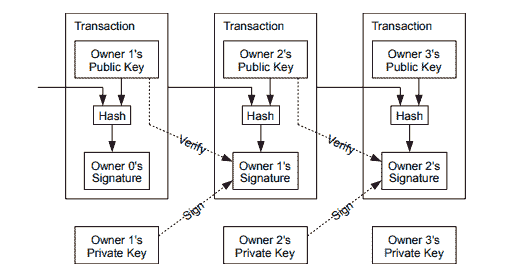

# 比特币——未来

> 原文：<https://medium.com/coinmonks/bitcoin-the-future-dd6365a27c1?source=collection_archive---------13----------------------->

**Photo by** [**Uriel SC**](https://unsplash.com/@urielsc26?utm_source=unsplash&utm_medium=referral&utm_content=creditCopyText) **on** [**Unsplash**](https://unsplash.com/?utm_source=unsplash&utm_medium=referral&utm_content=creditCopyText)

比特币是一种点对点电子现金系统，允许两个未知方在线交易，而不需要集中的中介；一种数字货币，提供了一种不受中央控制的替代金融系统。

**重复消费问题**

数字对象很容易复制。考虑一个可以快速复制的文件。然而，无成本复制在金钱上是不可取的。双重花费问题解决了接收者确信他们收到的数字货币没有同时发送给其他人的问题。这是虚拟货币特有的；不可能双倍花费实物现金。等同物是假币，它导致通货膨胀，降低货币价值和对货币的信任。

解决重复支出问题的方法是引入第三方作为中间人，核实每笔交易，或者使用分散的分类账，确保每个成员都有所有交易的完整记录。因此，参与者可以确认没有硬币被花了两次。

**摘要**

比特币通过分布式账本解决了双重花费问题。或者称为对等网络。比特币通过实现一系列交易来解决这一问题，所有交易都依赖于基于哈希的前一个块的工作证明，形成了一个序列，如果不对每个前一个块重新进行工作证明，就无法更改该序列。

最长的链证明了事件的顺序和最大的 CPU 能力池。比特币断言自己是基于这样一种信念，即大多数 CPU 能力是由好的节点控制的，而不是由合作攻击网络的节点控制的。假设好的节点将总是生成最长的链，并保持在行为不端的节点之前。

网络需要最小的结构。消息或交易是在尽最大努力的基础上广播的。由于区块链记录，节点可以随意离开和重新加入。简单地接受最长的工作链证明作为他们不在时发生的事情的证明。

**简介**

在比特币出现之前，没有任何方法可以在没有可信第三方的情况下进行在线交易。在线商务完全依赖于金融机构来处理和传递电子支付。

正是这些金融机构在 2008 年以不计后果、不受约束的行为让经济陷入崩溃。从本质上讲，比特币是对这一经济事件引发的信任危机的回应，也是为那些希望对自己的钱拥有更大控制权和自主权的人提供的一种替代金融系统。

传统的互联网商务模式:

约翰:买家
莎拉:卖家
菲利普:中介

约翰想从莎拉那里买些东西。他的订单被发送到支付处理器，后者将订单发送给 Philip。Philip 检查交易，验证交易，并授权付款。莎拉拿到了她的钱，而约翰的物品已经在路上了。

菲利普收取费用，并且该交易是可逆支付。这自然增加了对信任的需求。如果付款有争议/被撤销，对调解人的需求就会增加。这是一个基于信任的模型。约翰信任菲利普而不是萨拉。约翰必须向菲利普提供个人数据，以便他能够证明自己的身份；莎拉也是如此。收集个人数据是基于信任的模型的必要组成部分，因此中介可以识别和验证他们的客户。

比特币允许约翰在不需要菲利普的情况下从莎拉那里买东西。这就是为什么比特币被称为不可信的金融系统。它在没有可信第三方的情况下促进了两个未知方之间的支付，而不是引入信任的加密证明。

这是比特币的价值主张。通过提供分布式分类帐(每笔交易的公开记录)以及依赖于先前块的每个后续工作证明，每个参与者都可以查看所有交易的记录，从而确定它们的有效性。比特币使用计算证明，而不是中央权威。

Photo by [Milad Fakurian](https://unsplash.com/@fakurian?utm_source=unsplash&utm_medium=referral&utm_content=creditCopyText) on [Unsplash](https://unsplash.com/?utm_source=unsplash&utm_medium=referral&utm_content=creditCopyText)

**技术概述**

**交易**

两个重要的概念:公钥和私钥。

数字资产储存在区块链和无形资产上。

公钥是任何人都能看到的钱包地址。

私钥代表证明资产所有权并允许其被花费/使用的代码/签名。

想象一个巨大的玻璃建筑，里面有数千个同样由玻璃制成的盒子。每个人都可以看到盒子里面的东西，但是只有拥有私钥的人才能打开盒子并与里面的东西进行交互。这是区块链。数字资产不存放在钱包里；钱包是包含用户私钥的区块链的访问点。

[https://bitcoin.org/bitcoin.pdf](https://bitcoin.org/bitcoin.pdf)

硬币通过使用数字签名从一个所有者转移到另一个所有者。所有的交易都是公开宣布的，以确保一枚硬币没有被双重花费(即先前的所有者没有签署任何先前的交易)。以这种方式，参与者可以就单个历史达成一致。为了确认没有交易，网络共享所有交易。比特币引入了时间戳，以证明大多数节点同意这是收到的第一笔交易。

另一种选择是由一个中央机构来检查每一笔交易。然而，这将整个系统置于单一实体的手中。对整个货币系统负责，因为没有它们就不能进行支付。

**时间戳**

时间戳证明数据在特定时间的存在，允许它进入散列。每个时间戳的哈希中都包含前一个时间，每个额外的时间戳都会加强前一个时间戳。这就形成了一连串的积木。这是区块链。

区块链上的一个块由数据、该块的散列和前一个块的散列组成。

数据:发送者、接收者和移动的硬币数量

散列:散列标识一个块及其所有内容。哈希本质上是指纹。它是唯一的，在创建块时计算。因为散列是使用数据和先前的散列计算的，所以对块的任何改变都会导致散列的改变。

哈希函数用于生成固定长度的输出数据，作为对原始数据的缩短引用。解决散列函数创建一个块并获得奖励(比特币挖矿)。当散列被求解时，所有新的事务被锁定到块中，并被添加到所有先前事务的永久记录中。

散列函数的输入是所有最近的、尚未确认的事务、时间戳和对先前块的引用。

**工作证明**

比特币采用工作证明共识机制。通过这种方法，网络验证事务并向区块链广播新数据块。它通过要求计算机的处理时间或要求服务用户的工作来保护网络免受拒绝服务攻击和其他服务滥用，如垃圾邮件。

寻求获得区块奖励的矿工通过解决复杂的计算难题来相互竞争。这些挖掘器使用 ASIC(专用集成电路)挖掘器来计算散列。散列意味着将一个输入插入一个数学函数并产生一个输出。比特币使用 SHA-256 哈希函数。如果计算出的散列满足指定的标准，则提出解决方案的矿工获胜。

当找到解决方案时，矿工向网络广播该块，然后其他矿工将验证该解决方案。哈希很难解决，但很容易验证。每个经过验证的块都包含一个代表矿工所做工作的 blockhash，因此被称为工作证明。

工作证明共识算法保护比特币网络免受攻击，因为成功的攻击需要攻击者在添加恶意交易之前完成每个先前块的工作证明，并且产生的成本将大大超过攻击网络的潜在回报。

Photo by [GuerrillaBuzz Crypto PR](https://unsplash.com/@theshubhamdhage?utm_source=unsplash&utm_medium=referral&utm_content=creditCopyText) on [Unsplash](https://unsplash.com/?utm_source=unsplash&utm_medium=referral&utm_content=creditCopyText)

**哲学概述**

\ ' \ '不要低估这将走向何方。安德烈亚斯·安东诺普洛斯

比特币代表了第一个不受任何单一实体控制、完全去中心化的货币体系。这是货币领域最伟大的创新，而货币仍是人类文明核心的最古老技术。其未经许可的性质引发了创新的爆发，这个网络将各种货币体系结合在一起。

比特币于 2009 年 1 月 3 日推出。它将货币的概念从国家、主权发行者和机构中分离出来，代之以基于网络的货币。比特币允许用户成为自己的银行，对自己的钱拥有完全的自主权，掌控自己的未来。

比特币是未来的货币。

[https://bitcoin.org/bitcoin.pdf](https://bitcoin.org/bitcoin.pdf)

> 交易新手？试试[密码交易机器人](/coinmonks/crypto-trading-bot-c2ffce8acb2a)或者[复制交易](/coinmonks/top-10-crypto-copy-trading-platforms-for-beginners-d0c37c7d698c)