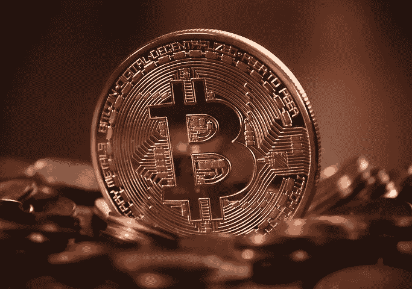

# 比特币:王者之王是有原因的，原因如下

> 原文：<https://medium.com/coinmonks/bitcoin-the-king-is-king-for-a-reason-heres-why-c476b6702a4b?source=collection_archive---------51----------------------->

pixabay

我的矿工朋友让我想起了比特币诞生的一个简单事实。根据其设计，比特币并不意味着商业化的多秒交易，因此交易速度较慢。这是一个点对点的交流。

比特币目前持有 crypto 市值的 41%左右。(以太坊 18%左右)比特币钱包超过 8100 万个，有…