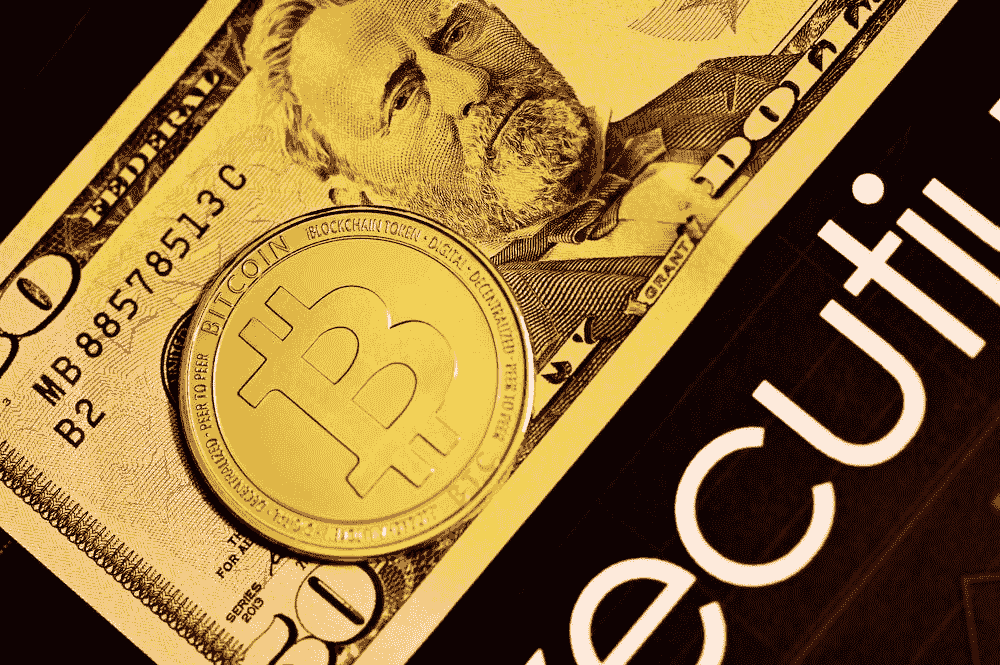

# 比特币——现代美国梦？

> 原文：<https://medium.com/coinmonks/bitcoin-the-modern-american-dream-b11181f521d6?source=collection_archive---------43----------------------->

比特币被称为很多东西——技术创新、新的数字货币、庞氏骗局等等。但这也可能是现代美国梦吗？

在其短暂的历史中，比特币已经成为企业家精神和冒险精神的体现，正是这种精神让美国变得伟大。像美国西部的早期拓荒者一样，比特币爱好者正在描绘一个新的未开发的领域…