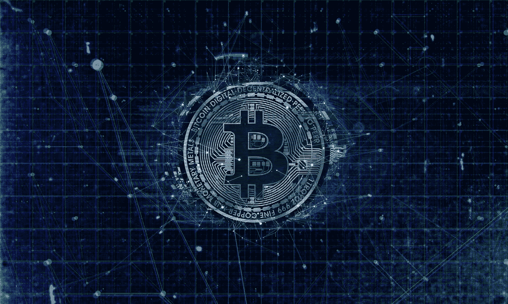

# 比特币:Satoshi 从未透露的秘密。

> 原文：<https://medium.com/coinmonks/bitcoin-the-secret-satoshi-never-revealed-5cc2bfc9b04?source=collection_archive---------9----------------------->

itcoin 是一项同类资产。尽管比特币经常被与黄金相提并论，并与科技股和其他加密货币一起被追踪，但它既不是黄金，也不是技术或加密货币。人类从未创造出像比特币这样具有不对称宇宙力量水平的货币工具。

Image Courtesy of [Pixabay](https://pixabay.com/illustrations/bitcoin-blockchain-currency-3396302/)

比特币的行为类似于货币，但功能更像能源。它像货币一样具有流动性，但缺乏…