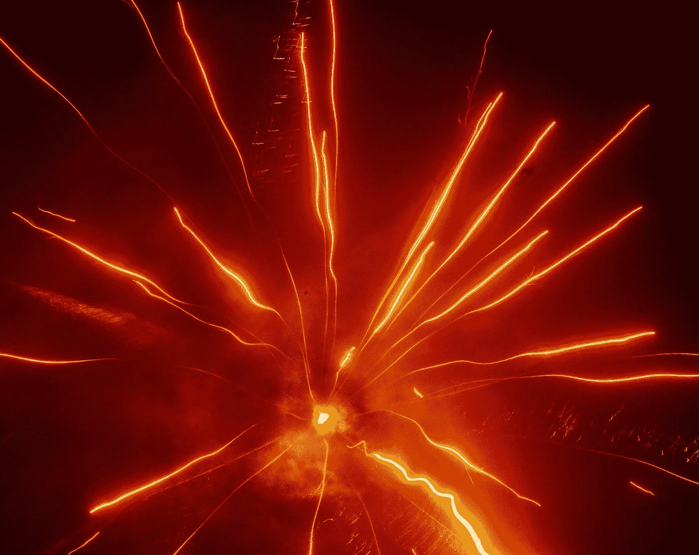
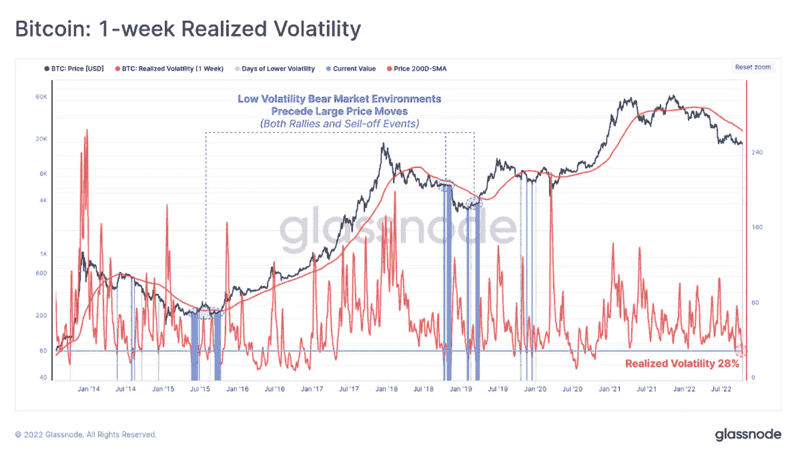
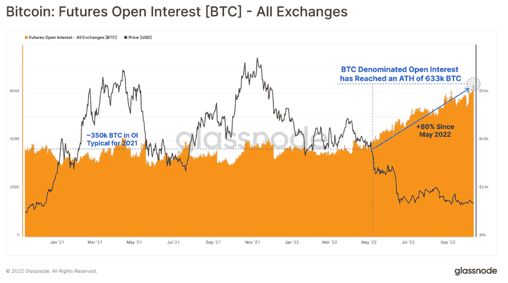
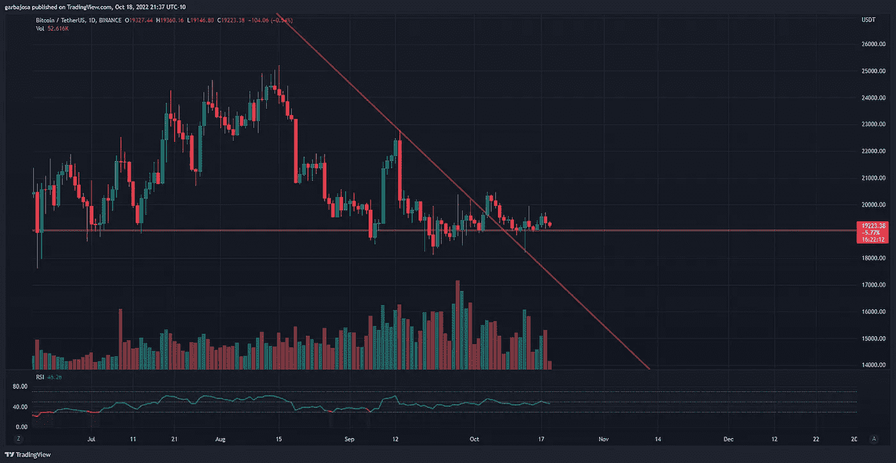
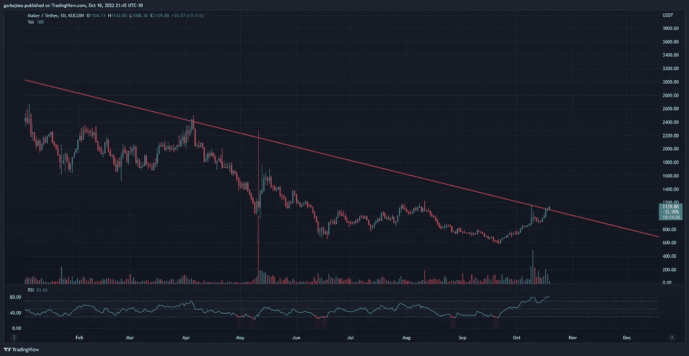
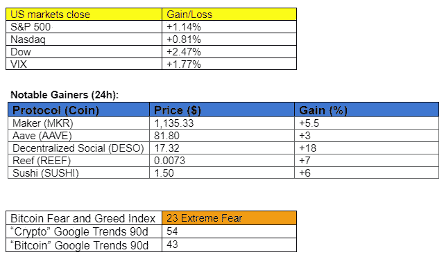
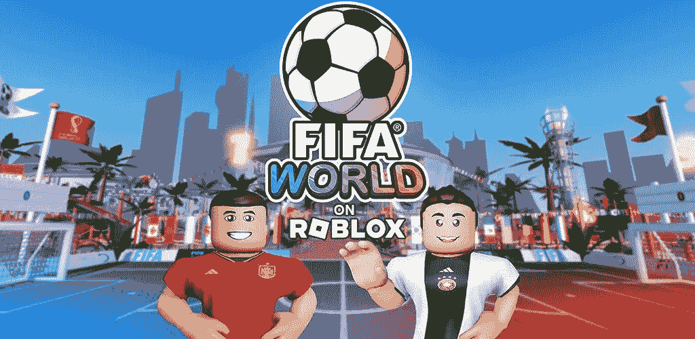
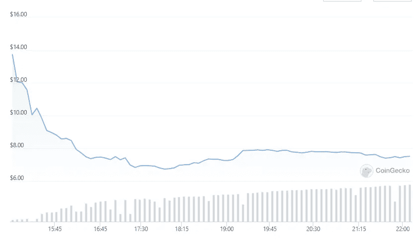

# 比特币波动进站！

> 原文：<https://medium.com/coinmonks/bitcoin-volatility-inbound-e0034810236b?source=collection_archive---------13----------------------->

## 每日征服#107

最好的每日新闻、见解和阿尔法信息来源。

Photo by [Jonas Frey](https://unsplash.com/@jonasfrey?utm_source=medium&utm_medium=referral) on [Unsplash](https://unsplash.com?utm_source=medium&utm_medium=referral)

*密码市场是一个狂野、奇妙而令人生畏的地方；不要一个人跋涉！订阅加密征服者，让我们成为您的向导。*

订阅这份每日时事通讯，永不错过任何一期。

**概述**

*   Glassnode:比特币波动正在路上！
*   制造商(MKR)在经历了 91%的攀升后测试主要的下降趋势阻力。
*   新闻:短期内不会有稳定的纸币。
*   zkSync 离 mainet 又近了一步。
*   在 Roblox 上介绍 FIFA World。

早上好，家人，

**波动来了！**

至少，这是最近 Glassnode [时事通讯](https://insights.glassnode.com/the-week-onchain-week-42-2022/?&utm_source=gn_youtube&utm_medium=youtube_woc&utm_campaign=woc_42_2022)的叙述。

Glassnode 的分析师使用各种图表来显示，当比特币在过去达到如此低的已实现波动性时，波动性很快就会随之而来。例如，在下图中，分析师突出显示了导致大幅上涨和下跌的蓝色区域。

尽管价格下跌，期货未平仓合约仍处于创纪录水平。这一指标突显了投机和对冲头寸的巨大水平，可能会加剧任何重大波动。自今年 5 月以来，未平仓合约增加了 80%。

报告最后总结如下:

*“比特币市场已经为波动性做好了准备，已实现和期权隐含波动性都降至历史低点。”*

和

*“波动性很可能即将出现，比特币的价格不会停滞很久。”*

# 市场更新🌍

BTC/USDT·1D

BTC 在美国市场早盘触及 19.6 美元的高点后，交易员纷纷抛售。尽管美国股市持续走强，但加密市场却举步维艰。像前两周一样，每一次上涨都会遇到强大的阻力，并回落到一直存在的 19k 美元支撑位。BTC 在美国市场收盘下跌 1.14%，至 19327 美元。

*高分辨率* [***图表***](https://www.tradingview.com/x/TkQScFZ7/)

MKR/USDT·1D

最受信任的分散式稳定硬币提供商 Maker (MKR)在过去 30 天的排行榜上出现了大幅上升。在 9 月 22 日达到 581 美元的年度低点后，MKR 令牌已经成为加密领域表现最好的资产之一。自低点以来，MKR 价格已攀升 92%，至 1，131.27 美元的高点，看起来将打破 2021 年 8 月开始的下降趋势阻力(红色)。MKR 收盘上涨 1.08%，至 1103 美元。

*高清* [***图表***](https://www.tradingview.com/x/90DjUyrh/)

如果你喜欢这份报告，并且认为它值 20 分(0.01 美分)，请点击下面的鼓掌按钮来支持我的写作。(最多 50 次！)谢谢！

# 新闻观察📰

本届国会没有稳定的货币法案。在周二的金融会议上，众议员吉姆·希姆斯结束了关于国会是否会通过稳定货币法案的猜测，他说:“稳定货币法案不会很快通过。”

**欧盟打算打击地下采矿。欧盟委员会希望在该地区对抗能源短缺的严冬到来之前打击地下采矿。欧盟委员会正在为区块链开发一种能源效率标签，这可能会导致矿工减少负荷。**

**zkSync 完成校样合并。zkSync 2.0 正式成为世界上第一个在公共测试网上运行的 zkEVM [。经过开发者的大量测试后，Mainnet 将于 10 月 28 日发布。](https://twitter.com/zksync/status/1582088277951062016?s=20&t=nb1C-QAEpdmP_iW5U-SVGQ)**

**IRS 扩展税收语言，将非税收入纳入其中。新草案将“虚拟货币”更新为更广泛的“数字资产”，以涵盖 2022 年的非金融资产。所以，如果你做了一些有利可图的 NFT 交易，不要忘了向税务员缴税。**

**新闻花絮:**

*   [**罪犯 V2**](https://twitter.com/rasputincat_/status/1582146127410778112?s=20&t=fjIR6yoqJvo6F85yssRJRQhcxtVwzuAQUiBGYQMSA) **即将来到 Synthetix。**
*   **Aptos**[**token omics**](https://twitter.com/AptosLabs/status/1582274687467339777?s=20&t=cIg9puzvf9O3JwSTR9cH6g)**。**
*   稳定的货币是钱吗？
*   **网飞** [**美眉**](https://twitter.com/FirstSquawk/status/1582467428189368320?s=20&t=TdPeLSYidbn0oFSnbaMaBQ) **收益。**
*   **拜登向** [**宣布**](https://twitter.com/unusual_whales/status/1582476204153573376?s=20&t=77MNCuOOYRDIYEmTODbNQA) **从战略石油储备中释放多达 1500 万桶石油。**

**NFT &元宇宙更新🐵**

*   **FIFA 与 Roblox** [**介绍**](https://twitter.com/FIFAcom/status/1580140969613213696?s=20&t=QWYwx3fApdpVgCVBEuY8fg) **FIFA World，一个颂扬足球力量的虚拟环境。**
*   **志那都红豆**

**我的五分钱……**

*来源:*[*coin gecko*](https://www.coingecko.com/en/coins/aptos)

APT——新 L1 Aptos 的本土标志——迈出了相当大的一步。该代币推出后，股价从 13.73 美元跌至 6.93 美元的低点，市值缩水一半。即使在这些水平上，以 78 亿美元的完全稀释估值(FDV)，APT 仍然是一个艰难的购买。

***加百列***

*关注我* [*推特*](https://twitter.com/web3_gabri) *每日更新！*

订阅这份每日简讯，不要错过任何一期。

> 交易新手？试试[加密交易机器人](/coinmonks/crypto-trading-bot-c2ffce8acb2a)或者[复制交易](/coinmonks/top-10-crypto-copy-trading-platforms-for-beginners-d0c37c7d698c)