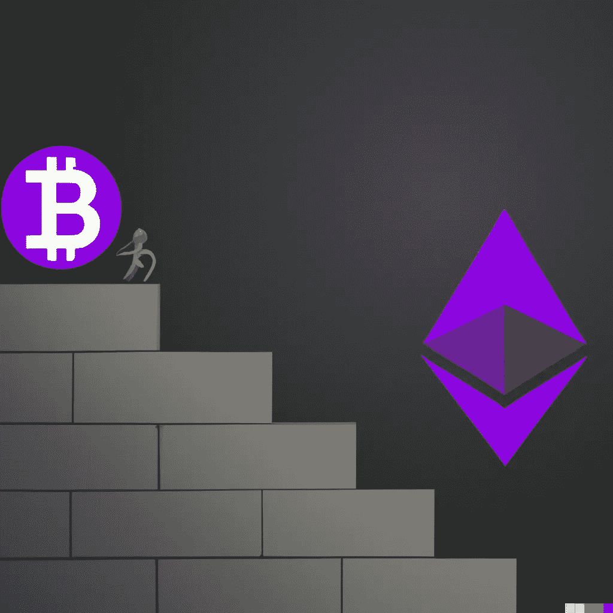

# 比特币与以太坊:比较可扩展性和增长潜力

> 原文：<https://medium.com/coinmonks/bitcoin-vs-ethereum-comparing-scalability-and-growth-potential-56402989c29a?source=collection_archive---------27----------------------->

Image created with [**DALL·E**](https://labs.openai.com/) **AI**

比特币和以太坊都是基于区块链的平台，使用户能够进行广泛的交易和操作。虽然它们有许多相似之处，但这两个平台之间也有一些关键差异，特别是在可伸缩性和增长潜力方面。

比特币和以太坊的主要区别之一是它们的可扩展性。可伸缩性是指平台处理大量事务和操作而不会遇到延迟或性能问题的能力。

比特币使用工作验证(PoW)共识机制，允许用户相互竞争解决复杂的数学难题，以验证交易并将其添加到区块链中。这种方法非常安全，但也可能非常慢，而且需要大量资源，限制了比特币网络在任何给定时间可以处理的交易数量。

另一方面，以太坊使用利益证明(PoS)共识机制，允许用户根据他们持有的以太(ETH)数量来验证交易。这种方法比 PoW 更快更有效，它允许以太坊网络每秒处理大量的事务。

比特币和以太坊的另一个关键区别是它们的增长潜力。比特币是第一种也是最广泛使用的加密货币，它拥有完善的用户基础和强大的采用和增长记录。截至 2022 年 12 月，比特币的市值超过 8000 亿美元，被广泛认为是避险资产和价值储存手段。

另一方面，以太坊是一个相对较新的平台，于 2015 年推出。虽然近年来它的增长令人印象深刻，截至 2022 年 12 月，其市值超过 2000 亿美元，但它仍远小于比特币，并面临来自其他区块链平台的激烈竞争。

尽管如此，许多专家认为以太坊具有巨大的增长潜力，特别是越来越多的企业和组织开始探索在以太坊平台上使用智能合同和其他去中心化应用程序(dApps)。一些专家预测，以太坊网络最终可能在市值和用户采用方面超过比特币，尽管这很难准确预测。

在未来的波动性方面，很难预测比特币和以太坊的表现。这两种加密货币都以其高波动性而闻名，它们的价格会随着市场条件、新闻事件和其他因素而大幅波动。然而，许多专家认为，比特币和以太坊将继续受到投资者和用户的欢迎，其价格将长期持续上涨。

总之，虽然比特币和以太坊都是基于区块链的平台，让用户能够进行广泛的交易和操作，但它们在可扩展性和增长潜力方面有所不同。比特币拥有稳固的用户基础，并有着强劲的采用和增长记录，但其权力共识机制可能会很慢，而且需要大量资源。另一方面，以太坊拥有更快、更有效的 PoS 共识机制，随着越来越多的企业和组织探索在其平台上使用 dApps，以太坊具有巨大的增长潜力。很难预测这些加密货币未来的表现如何，但许多专家认为它们将继续受到投资者和用户的欢迎。

感谢阅读，并让我知道你的想法！

> 从顶级交易者那里复制交易机器人。免费试用。

# 另外，阅读

*   [如何匿名购买比特币](https://coincodecap.com/buy-bitcoin-anonymously) | [比特币现金钱包](https://coincodecap.com/bitcoin-cash-wallets)
*   [币安 vs FTX](https://coincodecap.com/binance-vs-ftx) | [最佳(SOL)索拉纳钱包](https://coincodecap.com/solana-wallets)
*   [比诺莫评论](https://coincodecap.com/binomo-review) | [斯多葛派 vs 3Commas vs TradeSanta](https://coincodecap.com/stoic-vs-3commas-vs-tradesanta)
*   [Capital.com 评论](https://coincodecap.com/capital-com-review) | [香港的加密借贷平台](https://coincodecap.com/crypto-lending-hong-kong)
*   [如何在 Uniswap 上交换加密？](https://coincodecap.com/swap-crypto-on-uniswap) | [A-Ads 评论](https://coincodecap.com/a-ads-review)