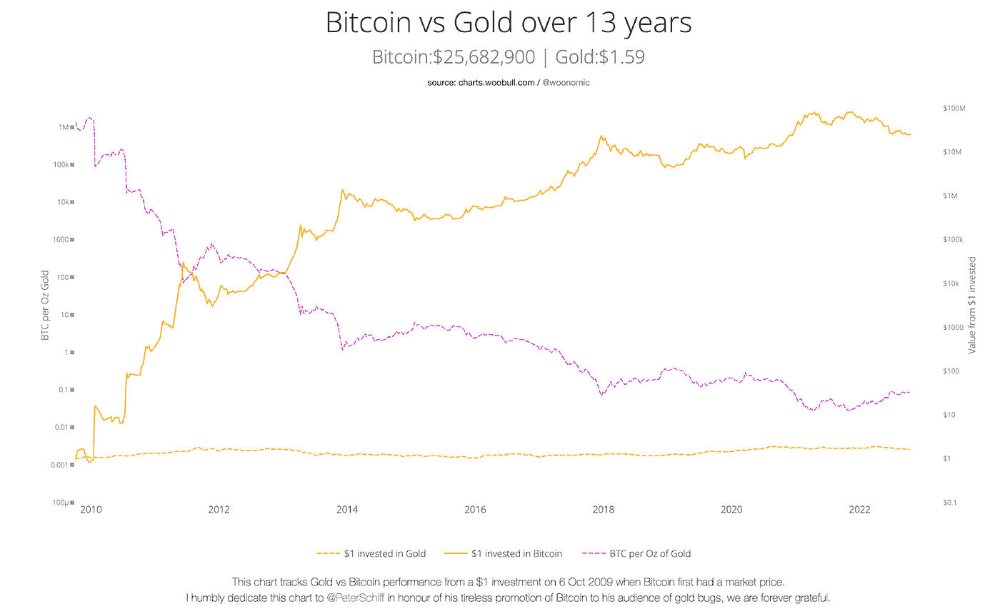

# 比特币与黄金:拥有什么？

> 原文：<https://medium.com/coinmonks/bitcoin-vs-gold-what-to-own-353808124a35?source=collection_archive---------12----------------------->

Source: [Bitcoin Magazine](https://twitter.com/bitcoinmagazine/status/1586771463637532673?s=46&t=mRE1bFAp_h6jTpaKMDw1Jw)

*本文收录了我于 2022 年 11 月 29 日发表在《比特币》杂志上的一篇文章的部分内容，标题为* [*《为什么比特币是终极财富保值技术》*](https://bitcoinmagazine.com/culture/bitcoin-is-ultimate-wealth-preservation) *。由于这个话题涉及方方面面，我将在此基础上进行更详细的阐述。*

关于比特币相对于黄金的优势，人们已经写了很多。为了让我自己和我周围的人有一个好的概述，我决定也写一写。我希望能帮助我周围的人踏上比特币之旅，并证明这将对你个人的比特币之旅有价值，或帮助你的朋友和家人。

比特币因其波动性而臭名昭著。我们目前正处于熊市。从历史上看，比特币在 5 年内大幅回调后，总会回到并跑赢历史高点。鉴于比特币的长期价格历史，这提供了一个以具有吸引力的价格购买比特币的机会。

比特币和黄金都在承诺成为价值储存手段方面展开竞争。过去十年，比特币的表现超过了黄金。下面我将分析为什么会出现这种情况，并说明为什么这种情况很可能会继续发生。

**什么是好的价值储存？**

正如 [Vijay Bojapati](https://vijayboyapati.medium.com/the-bullish-case-for-bitcoin-6ecc8bdecc1) (2018)所解释的，当价值储存相互竞争时，正是独特的属性使一个好的价值储存能够超越另一个。好的价值储存的特征被认为是持久性、便携性、可分性、可替代性，尤其是稀缺性。这些属性决定了什么被用作价值储存手段。在人类文明的初期，珠宝被用来储存价值。珠宝可能是稀缺的，但它很容易被破坏，不可分割，当然也不可替代。黄金更好地满足了这些特性。因此，随着时间的推移，黄金已经取代珠宝成为人类首选的价值储存手段，成为 5000 多年来最有效的价值储存手段。然而，自 2009 年推出比特币以来，黄金面临着数字化的颠覆。数字化优化了几乎所有的价值储存功能。

我将比特币比作黄金。使用好的价值储存的五个特征(耐久性、便携性、可分性、可替代性和特别是稀缺性)来说明为什么比特币是优于黄金的价值储存。

**比特币 vs 黄金**

**耐久性** [黄金是无可争议的耐久性之王](https://vijayboyapati.medium.com/the-bullish-case-for-bitcoin-6ecc8bdecc1)。大多数被开采出来的黄金现在仍然存在，将来也可能会被开采出来。比特币基本上是数字记录。因此，应该考虑的不是它们的有形表现的持久性，而是发行它们的机构的持久性。比特币没有发行机构，只要保护它们的网络完好无损，就可能被认为是耐用的。鉴于比特币仍处于起步阶段，现在就对其耐用性下强有力的结论还为时过早。然而，有令人鼓舞的迹象表明，尽管出现了民族国家试图监管比特币的情况和多年的攻击，但该网络仍继续发挥作用，表现出显著的“[抗脆弱性](https://en.wikipedia.org/wiki/Antifragility)”(Bojapati，2002)。事实上，它是有史以来最可靠的计算机网络，几乎有 99.99%的正常运行时间。比特币的两次宕机事件( [2010，2013](https://buybitcoinworldwide.com/bitcoin-downtime/#:~:text=Conclusion,has%20maintained%20very%20stable%20uptime.) )都是早期，此后网络一直保持非常稳定( [Tuwiner，2022](https://buybitcoinworldwide.com/bitcoin-downtime/#:~:text=Conclusion,has%20maintained%20very%20stable%20uptime.) )。

**便携性**比特币的便携性远远优于黄金，因为信息可以以光速移动(多亏了电信)( [Breedlove，2022](https://breedlove22.medium.com/the-number-zero-and-bitcoin-4c193336db5b) )。黄金在数字时代已经失去了吸引力。你不能通过互联网发送黄金。有各种以黄金为基础的金融产品。例如 ETCs、金矿 ETF、衍生品等。然而，它们的使用并没有反映出黄金的一个良好的数字用例，而是在数字时代保持黄金的价值储存功能的一个不成功的尝试。几十年来，无法将黄金数字化给我们历史上以黄金为基础的货币体系带来了问题。随着货币的数字化，随着时间的推移，人们不再理解国家货币是否真的受到黄金的支持。此外，黄金因其重量而难以运输，这给全球化贸易带来了问题。由于黄金在便携性方面的弱点，我们目前的法定货币体系存在。在全球社会中，任何实物货币(非数字)都需要第三方(将实物货币数字化并允许远程支付)，最终导致了法定货币的发展( [Arman The Parman，2022](https://insights.bitcoinreserve.com/is-bitcoins-distribution-fair) )。比特币是这个问题的解决方案，因为它是一种数字原生的稀缺商品，易于运输。

**整除性**比特币是纯数字的，所以它的整除性相比黄金要好得多。信息可以几乎零成本(像数字一样)进行几乎无限的细分和重组( [Breedlove，2019](https://breedlove22.medium.com/money-bitcoin-and-time-part-1-of-3-b4f6bb036c04) )。一个比特币可以分成 100，000，000 个单位，称为 satoshi。另一方面，黄金很难分割。它需要特殊的工具，并且在这个过程中有丢失黄金的风险，即使只是灰尘。

**可替代性**黄金可以通过雕刻的标志或盾形纹章来区分，但也可以熔化后完全可替代。对于比特币，可替代性是“棘手”的。比特币是数字信息，是宇宙中最客观可辨别的物质(就像文字一样)( [Breedlove，2019](https://breedlove22.medium.com/money-bitcoin-and-time-part-1-of-3-b4f6bb036c04) )。然而，由于比特币交易是透明的，政府可以禁止被用于非法活动的比特币的使用。这可能会对比特币的可替代性及其作为交易媒介的用途产生负面影响。当货币不可替代时，货币的每个单位都有不同的价值，货币就失去了它的交换媒介属性。比特币既是价值的数字存储，也是货币，它作为货币使用的任何缺点也会对它作为价值存储的功能产生负面影响。黄金也是一样。黄金的可替代性优于比特币。黄金的便携性缺点使其无法作为交换媒介和价值的数字储存手段，这使得比特币总体上更具优势。

稀缺是价值储存的最重要的属性。黄金相对稀缺。它的年通货膨胀率大约为 [1.5%](https://www.seabridgegold.com/the-case-for-gold/basic-facts-about-gold-prices-elasticity-and-uses) 。但是，供给上不封顶。总是有新的黄金发现，我们有可能在太空中遇到大型金矿(【mining.com】T4，2019 )。黄金的供应并非完全没有弹性。当黄金价格上涨时，人们就有动机更密集地开采黄金，从而增加供应。此外，实物黄金被不太贵重的金属稀释了。此外，通过交易所交易商品(ETCs)或其他金融产品在网上账户中持有的黄金经常被再抵押，这是一种银行和经纪人为自己的目的使用客户作为抵押品的资产的做法，这通过人为增加供应对价格产生了负面影响。另一方面，比特币的供应量是有上限的，永远不会超过 2100 万。比特币是反通胀的，这意味着随着时间的推移，比特币会越来越少。比特币的年通胀率目前在 [1.75%](https://charts.woobull.com/bitcoin-inflation/) 左右，并将随着时间的推移继续降低。根据协议规定，采矿奖励大约每 4 年减半。10 年后，其通胀率将可以忽略不计。2140 年将开采出最后一枚比特币。之后，比特币的年通胀率将为零。

比特币交易所也可以通过向用户出售“假比特币”来人为增加供应。正如詹姆森·洛普(2022)所解释的，现实是绝大多数用户都是通过集中交易的方式加入的。他们通过银行向交易所汇款，然后下单购买比特币。但是当这个指令被交易所的交易引擎执行时会发生什么呢？私有数据库中的一个条目被更新，从而给交易所用户一个与他们购买的比特币数量相对应的借据。借据是“我欠你的”的拼音首字母缩写，是一份承认债务存在的文件([肯顿，2021](https://www.investopedia.com/terms/i/iou.asp#:~:text=and%20financial%20planning) )。这张借条没有比特币的任何属性。它只是一种金融工具，让借据持有人暴露于比特币汇率。稀缺性是比特币的关键属性和基本价值驱动因素之一。如果违反了这个属性，就有问题了。幸运的是，比特币是完全可以被听到的，因为它的相关信息在区块链是公开的、可验证的。

**可审计性**不是储值商店的独特销售主张，但很重要，因为它提供了对一项资产是否适合公平透明的金融体系的洞察。比特币对最小单位都是完全可审计的。没有人知道世界上有多少黄金，也没有人知道世界上有多少美元。正如萨姆·阿巴西向我指出的那样，比特币是第一种完全公开、全球可审计的资产。例如，这可以防止再抵押风险，从而消除金融系统的巨大风险。这使得像 FTX 这样的庞氏骗局不太可能发生。现在已经破产的加密交易所将客户存放的资产用于自己的目的，并通过投资毫无价值的加密令牌来赌博

**回报**比特币相对于黄金的优势也体现在两种资产的价格走势上，如下图所示。在 2009 年 10 月 6 日比特币首次有市场价格时，投资 1 美元在撰写本文时价值约 25000 美元。相比之下，同时投资于黄金的 1 美元今天将价值 1.60 美元左右。下图还显示了每盎司黄金的比特币数量。在 2009 年 10 月 6 日，1 盎司黄金可以换来 100 万比特币。今天，它会让你得到一个糟糕的 0.089 比特币，下跌 99.99%。我认为这种趋势没有理由不继续下去。随着越来越多的人理解比特币作为数字价值储存手段的好处，这一趋势甚至可能加速。

[Source](https://charts.woobull.com/bitcoin-vs-gold/)

比特币相对于黄金的优势如此之大，以至于拥有黄金不再具有经济意义。我喜欢把它比作汽车和马。今天，没有人会拥有一匹马去长途旅行。人们总是更喜欢汽车。但是有人可能想骑马，因为它很有趣，或者因为它更漂亮。同样，有人可能因为喜欢而想戴金表。但要永久储存价值或将价值从 A 地转移到 B 地，就应该使用比特币。黄金倡导者将黄金的工业用途作为潜在的价值催化剂之一；然而，该行业使用的大部分黄金用于珠宝，约占总供应量的 55%。但是，珠宝中使用的黄金并不是因为它是一种很好的材料，而是因为它很稀有，珠宝被用作价值储存手段，例如在像印度这样的国家，金饰是在婚礼上赠送的。因此，黄金的工业应用主要与其价值储存功能直接相关。用于技术目的的黄金仅占全球黄金需求的 8.2%(stastista.com[，2022](https://www.statista.com/statistics/299609/gold-demand-by-industry-sector-share) )。

总的来说，比特币是一种比黄金好得多的价值储存手段，黄金目前正被比特币淘汰。从软货币到硬货币的缓慢过程贯穿了人类的进化。贝壳、玻璃珠让位给了难以制造和充气的珍贵奖牌，沿着奖牌的轨迹，软的让位于硬的。铁在几千年前就被废弃了。数百年前的铜和 19 世纪的银到金(Ammous，2021)。当时，黄金和白银都被用作货币标准。例如，在德意志帝国，使用黄金，而在英国，英镑与白银挂钩。由于黄金越来越稀有，这种贵金属开始变得比白银更有价值，将白银挤出了市场。正如路德维希·冯·米塞斯在他的经典著作《货币与信用理论》(1912 年)中所详述的那样。从 1870 年到 1909 年，伦敦银价下跌了 60%。随着白银用途的减少，白银的价值肯定会下降。现在，黄金正在被比特币所取代。这个过程类似于 19 世纪和 20 世纪黄金对白银的妖魔化。

另一个支持黄金虫制造的黄金的论点是，人类已经使用黄金作为价值储存手段 5000 年了，因此黄金在未来将继续具有价值。大约在公元前 3500 年，马首次被驯化。然而，我在高速公路上很少看到马。仅仅因为一项技术已经存在了很长时间，并不意味着它永远是最好的技术。更先进的技术(比特币)更有成效、更有效率地发挥其功能。允许对更简单的技术(gold)的机制进行清楚的阐述，并暴露其弱点(Ammous，2021)。从历史上看，黄金在股票投资组合中一直是一种有用的下行对冲工具。当股票下跌时，黄金通常会上涨。历史上第一次，2022 年的熊市没有出现这种情况。这最终给了金致命的一击。

**结论**

从长期来看，比特币是保护和增加财富的更好资产。因此，比特币的回报在未来十有八九会继续显著高于黄金。比特币是数字时代最好的价值储存手段。一种绝对稀缺的数字本地无记名资产，没有交易对手风险，不能膨胀，可以在世界上最强大的计算机网络上轻松运输和转移。当你赌比特币输的时候，你就是在赌互联网输。互联网是信息的基本协议。比特币是互联网上转移价值的基本协议。只要有一个比特币节点与区块链保持在互联网上，就会有比特币。比特币节点是运行比特币软件实现并存储整个区块链(比特币数据库)的任何计算机。卫星上有节点，大学校园有节点，树莓 pis 有节点，云服务器遍布全球。我们已经有效地创造了一种数码商品。

考虑到比特币网络理论上可以存储世界上所有的财富([根据波士顿咨询集团](https://www.bcg.com/press/9june2022-global-wealth-grew-double-digits-to-530-trillion)的数据，2021 年全球财富达到创纪录的 530 万亿美元)，这很可能是我们人类迄今为止发现的最有效的存储价值的方式。[通过持有比特币，你的财富将得到保护，在这个早期的货币化过程中，可能会增加 10 倍、100 倍，甚至 500 倍。如果再坚持几十年](https://podcasts.apple.com/de/podcast/read-516-conclusion-of-the-long-term-debt-cycle/id1359544516?i=1000517163396)。比特币大大优于黄金。这是它的电气化版本。比特币不仅作为价值储存手段，还作为一种固有的数字货币，最终在数字时代击败了黄金。

*[*因此【比特币】可以作为黄金和其他此类财富资产的分散器。最重要的是拥有一些这类供应有限的资产，它们是可流动的，是财富的储存库。*](https://www.reddit.com/r/IAmA/comments/k9b4g8/comment/gf3i271/?utm_source=share&utm_medium=web2x&context=3)*

*雷伊·达里奥——Bridgewater Associates 创始人兼联席首席信息官。AUM 总计:1380 亿美元。*

*如果你喜欢这篇文章，你可以在 [Twitter](https://twitter.com/leonamschel) 上关注我，访问我的[主页](http://www.asystemofrules.org/)或者给我发一些 sat:[law@getalby.com](/coinmonks/law@getalby.com)*