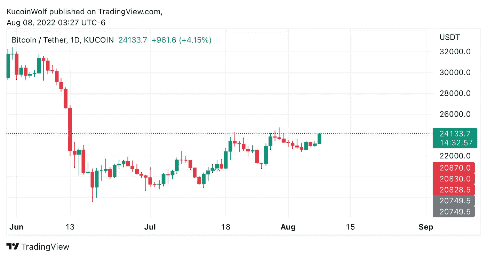
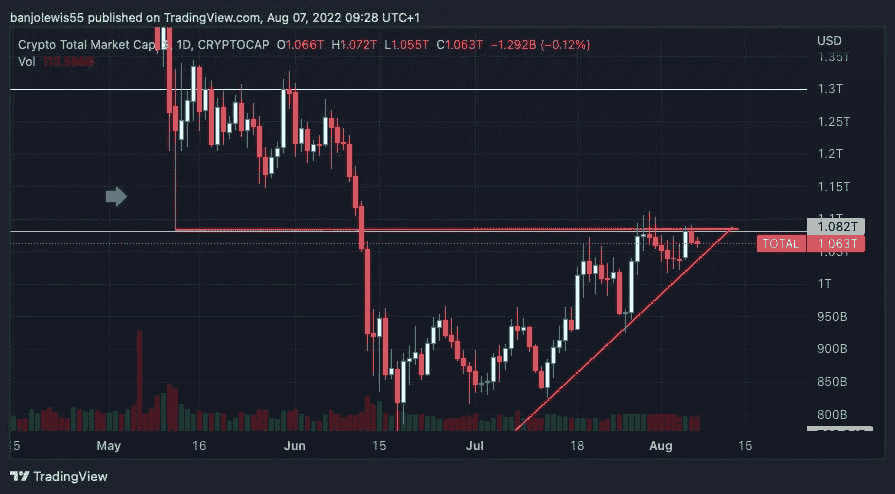

# 比特币每周分析集。

> 原文：<https://medium.com/coinmonks/bitcoin-weekly-analysis-episode-a43f11f06f77?source=collection_archive---------51----------------------->

过去几周，比特币图表上出现了一些有趣的趋势。这在日线图上更明显，它清楚地指出市场目前处于上升趋势。自从 6 月份访问 17k 美元区域以来，当我们看比特币图表时，我们一直在回调中获得更高的高点和更高的低点。从上一个高点的回调到形成一个新的高点，这些波动需要大约 7-11 天来完成它的旅程。

大多数情况下，我们在一周内都会得到红蜡烛，然后在周末冲动达到新高，但在少数情况下，我们会看到在一周内创造的新高，然后在周末下降。

如果这种趋势继续下去，本周预计将是少数几个机会之一，我们有冲动走向新高，然后预计在周末或下周初回调。

如果这一趋势继续下去，我预计下一个高点将把我们带到 25k 美元或更高的区域，因为上一个高点距离 24800 美元只有几个点。我还预计我正在关注的大多数 alt 会上涨，特别是像 ETH、ENS、BNB 和 KCS 这样的公司。

我对本周的预期是乐观的，然而，比特币每日收盘价低于 20，720 美元将彻底结束这一新趋势。这是趋势的关键支撑位，如果被突破，我们就会崩溃。另一个值得关注的重要趋势是 crypto 的总市值。如果你在日线图上缩小一点，或者看一下周线图，很明显市场仍然处于下降趋势，直到一个确定的趋势反转或突破。

其他分析师看到了什么？

# Anorak 来自 discord reports 的专家

今天我在看总市值，只是想看看正在发生的事情的全貌！！我们可以看到红色的水平趋势线，从月球坠毁跨越到我们现在的位置。市值还未能在这次暴跌之上收蜡烛，那么这给我们留下了什么？

在我看来，我们仍处于熊市，整体趋势仍在下行！即使我们已经有了好几个星期的抬高，我们已经从极度的恐惧中走出来，进入了仅仅是恐惧！我真的认为这条“月亮趋势线”对于找出我们下一步的走向非常重要。

> 加入 Coinmonks [电报频道](https://t.me/coincodecap)和 [Youtube 频道](https://www.youtube.com/c/coinmonks/videos)了解加密交易和投资

# 另外，阅读

*   [瓦济里克斯 NFT 评论](https://coincodecap.com/wazirx-nft-review) | [比茨盖普 vs 皮奥克斯](https://coincodecap.com/bitsgap-vs-pionex) | [坦吉姆评论](https://coincodecap.com/tangem-wallet-review)
*   [如何使用 Solidity 在以太坊上创建 DApp？](https://coincodecap.com/create-a-dapp-on-ethereum-using-solidity)
*   [加密交易机器人](/coinmonks/crypto-trading-bot-c2ffce8acb2a) | [OKEx vs 币安](https://coincodecap.com/okex-vs-binance)
*   [币安 vs FTX](https://coincodecap.com/binance-vs-ftx) | [最佳(SOL)索拉纳钱包](https://coincodecap.com/solana-wallets)
*   [如何在 Uniswap 上交换加密？](https://coincodecap.com/swap-crypto-on-uniswap) | [A-Ads 审查](https://coincodecap.com/a-ads-review)