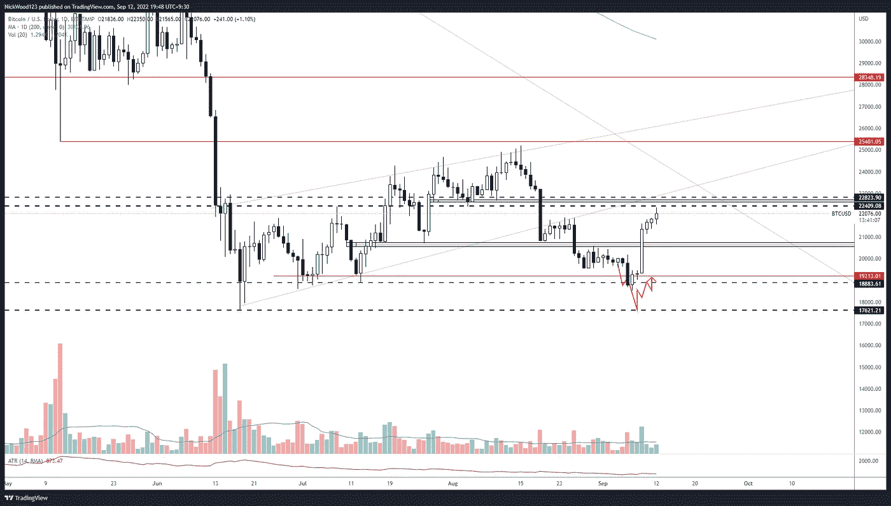
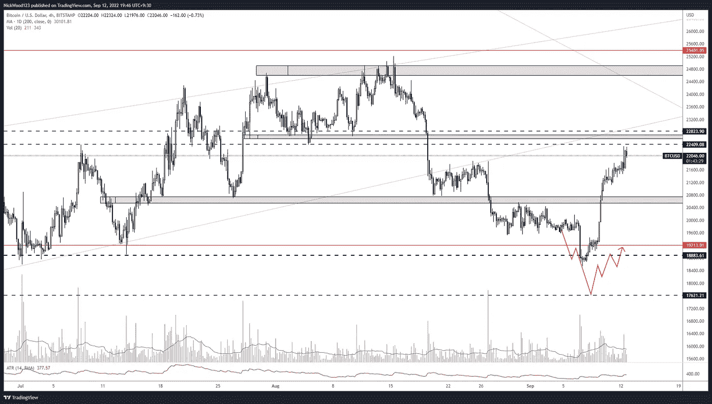
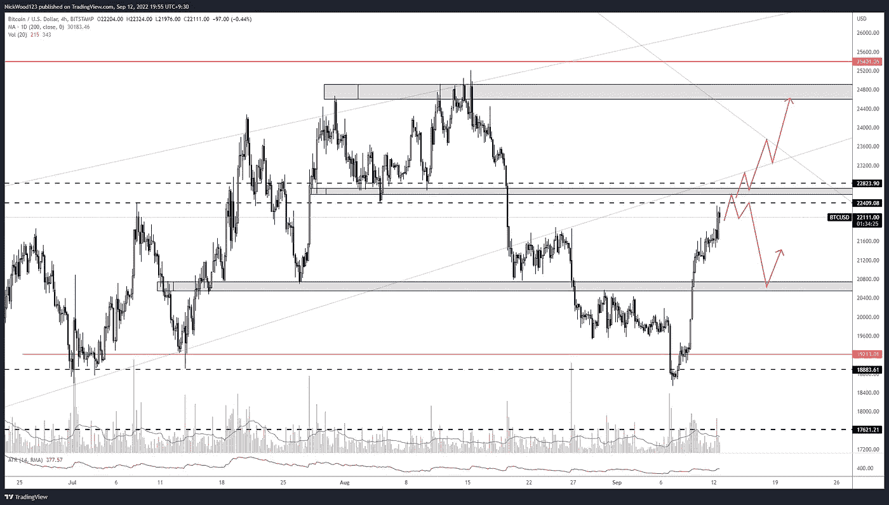
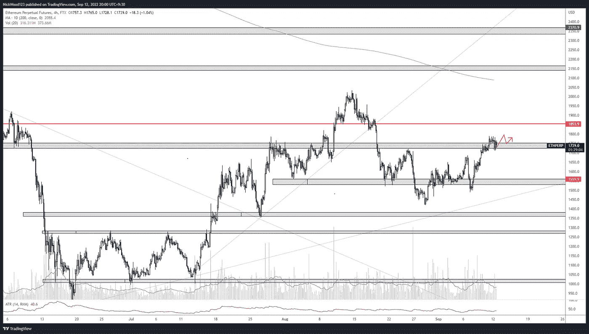

# 比特币周报——比特币泵 15%回收水平支撑。

> 原文：<https://medium.com/coinmonks/bitcoin-weekly-report-bitcoin-pumps-15-reclaiming-horizontal-support-144a98224278?source=collection_archive---------40----------------------->

## 比特币报告(2022 年 9 月 12 日)

比特币在过去一周上涨了 15%，突破了我们在 20，000 点的本地阻力。本周早些时候，它继续向 22，400 点水平推进，我预计会在那里看到一些阻力和回调。

本周我们将关注比特币的潜在买卖机会

# BTC 日报

BTC/USD Daily

[https://www.tradingview.com/x/qJoBSuYO/](https://www.tradingview.com/x/qJoBSuYO/)

上周我们预测会进入 18800 点的虚线区域，但是我们预计会有一个比实际情况更深的回撤。收回 19000 英镑是做多的好机会。正如你在图表上看到的，我们正接近日线的下一个清晰的阻力点。如果价格在此拒绝一段时间，回撤至 21，000 水平是有意义的。

# 4 小时时间范围

在 4 小时图上，红线的收回和感兴趣的区域更加清晰。

BTC/USD 4hr

https://www.tradingview.com/x/gMmHFjlE/

上周我声明

> 场景的第二部分还没有结束，我们正在寻找向下移动到 **18，000** 的水平，我们期望看到某种**购买压力**到来。

正如上文在日线部分所述，再次测试比预期的要浅，但 18500 水平在价格在此停留一段时间并显示出支撑区域以外的力量之前被标记。

BTC/USD 4hr Potential scenario

[https://www.tradingview.com/x/dtTcIz7A/](https://www.tradingview.com/x/dtTcIz7A/)

本周，我预计这种情况会发生，并将为两种情况中的任何一种做好准备。向上突破 22800 点将触发买入和继续交易。上涨到 22，600 点水平和看跌拒绝将触发做空机会，目标是 20800 点水平，以获取利润。然后如果拒绝发生，潜在地寻找长条目。

# 瑞士法郎/美元

ETH/USD 4hr

[https://www.tradingview.com/x/ycPCR1Nw/](https://www.tradingview.com/x/ycPCR1Nw/)

我希望 ETH 能更上一层楼，清楚地声明这个级别，因为这个级别本身是一个小区域，已经开始变得有点不清楚了。考虑到我们正处于 BTC 的抵抗之下，我对 ETH 变得更加谨慎，因为我知道如果 BTC 拒绝抵抗，ETH 也可能会停滞不前。

我试图将它们作为独立的硬币进行交易，但是在交易主要和次要备用硬币时，考虑 BTC 的动向是很重要的。

本周对 crypto 来说是重要的一周，因为它已经设法尊重区间低点，并向区间高点移动。我认为积累可能正在发生，现在是时候开始考虑在未来几个月的潜在上升趋势中装载。试图标记底部总是极其困难的，所以如果你长期看好加密货币，我认为计划一些长期交易并现在积累可能是一个好主意。记得想出你自己的计划和对你有意义的事情，试着逻辑地思考并坚持你的计划。

这就是本周的比特币报道。

如果你想和我联系，请跟着我

推特:@NickWoodFX

电子邮件:nw.forex@outlook.com

缺口

这不是财务建议。本文包含的信息是一般性的，没有考虑到您的个人情况。你应该考虑这些信息是否适合你的需要，如果合适的话，向理财顾问寻求专业建议。你并且只有你对你的交易和投资决定负责。我不是专业人士。我对你可能遭受的任何损失或损害不承担任何责任。

> 交易新手？试试[密码交易机器人](/coinmonks/crypto-trading-bot-c2ffce8acb2a)或者[复制交易](/coinmonks/top-10-crypto-copy-trading-platforms-for-beginners-d0c37c7d698c)