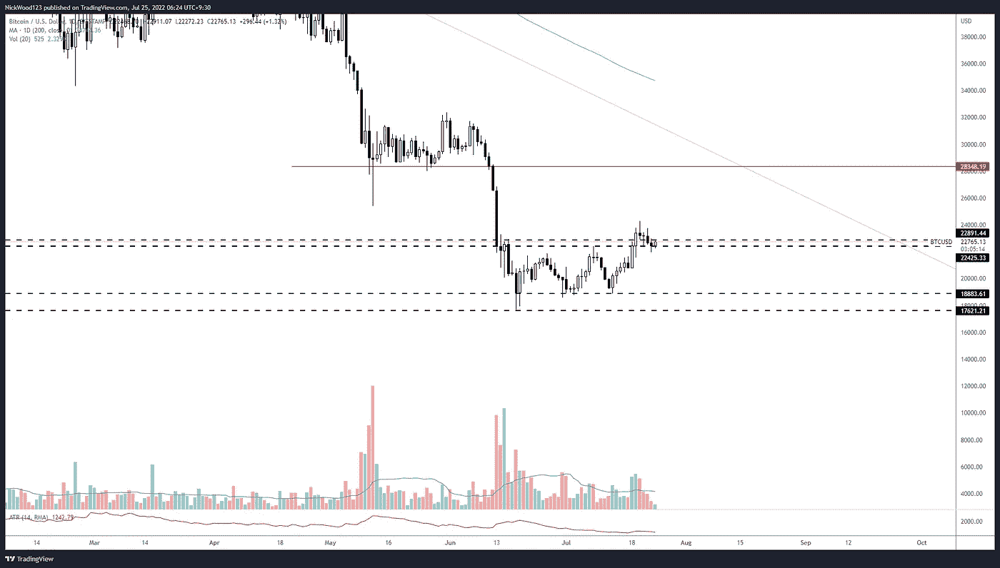
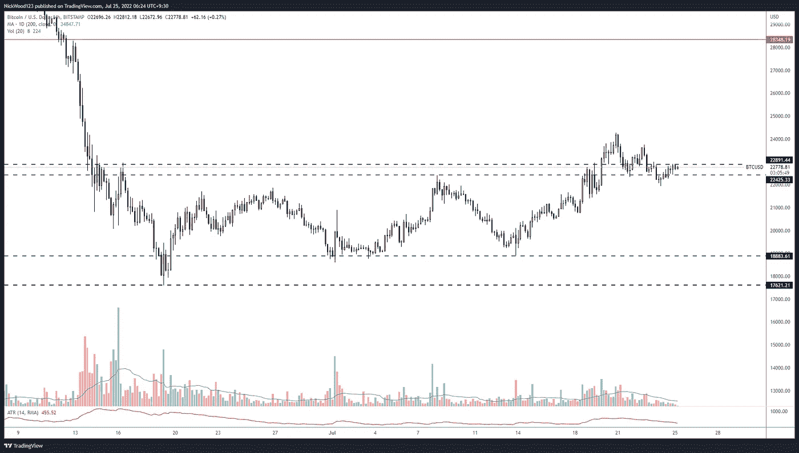
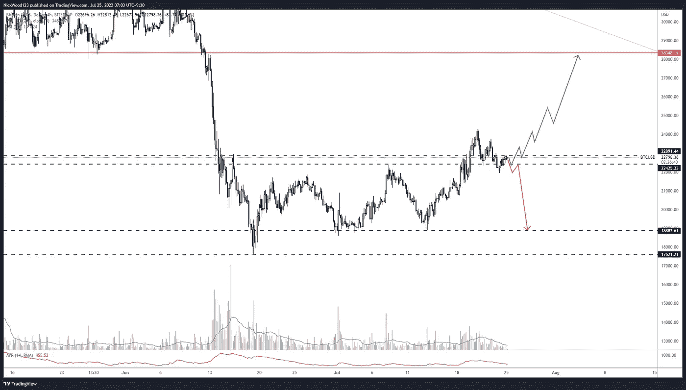
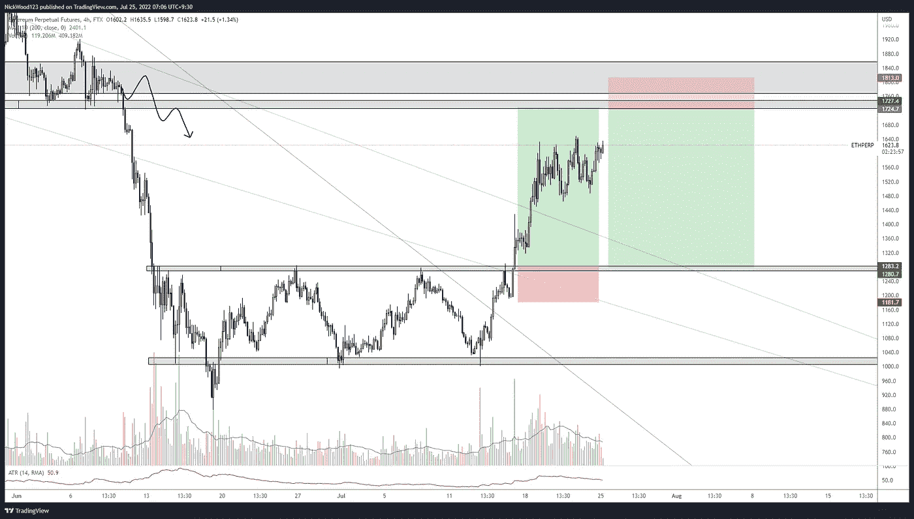

# 比特币周报——比特币处于关键水平。看跌和看涨的情景。

> 原文：<https://medium.com/coinmonks/bitcoin-weekly-report-bitcoin-sitting-at-key-level-bearish-and-bullish-scenarios-b995884363c9?source=collection_archive---------17----------------------->

## 动荡的走势即将到来，但 BTC 会打破什么方向呢？

# 比特币报告(2022 年 7 月 25 日)

上周我们谈到了该区间高点的关键水平:22，000 点(T0)和 28，000 点(T4)的下一个 T2 阻力点(T3)。我们谈到了保持区间高位并突破阻力区并保持在阻力区上方的重要性。最理想的情况是拒绝低于 **23，000 的价格。**目前价格在**2.27 万。BTC 现在所处的位置很难判断这是一次成功的突破还是一次假突破。在这份报告中，我们将介绍我们将如何交易这些潜在的情景，以及为了做出交易决策，我们将寻找什么。我们还将介绍**以太坊**以及我们预计一些替代硬币将如何移动。**

# BTC 日报

BTCUSD Daily

[https://www.tradingview.com/x/zkCR0nEg/](https://www.tradingview.com/x/RLlf1yOd/)

**日线图**显示，价格一直在努力高于**24000**水平，在日线图上出现一些**反转锤**显示拒绝上涨。价格随后缓慢回撤至**区间**并停留在一个区域，我们预计该区域要么会出现拒绝和**阻力**被**转化为**支撑或回落至区间高点以下并成为**阻力**导致再次向 **18，000** 水平移动。对于看涨的情况，我们必须坐在日线之上。目前的每日收盘将决定我对看涨形势的看法。如果我们在另一次拒绝中保持这个水平，我认为这是一个很好的**机会**开始考虑继续**下去**。在做这件事之前，我会在较低的时间范围内仔细检查我要找的东西。

# 4 小时时间范围

BTCUSD 4HR

[https://www.tradingview.com/x/5e3o35NY/](https://www.tradingview.com/x/Qk25Z3Fq/)

在 **4 小时**时间框架中，我们看到价格已经到达阻力区域，然后开始形成**较低的高点**和**较低的低点。**这是目前让我远离多头的一件事。当这种情况发生变化的时候，我就会把我的短线交易变成长线交易。价格在这个区域已经拉锯很长时间了，一个方向的突破即将到来，在这个方向的右边是很重要的。

技术上，我们已经看到区间高点的**突破和再次测试**，正如我们之前提到的，这种情况持续的时间越长，我认为短期内对**【BTC】**越有利，这将最终导致价格测试在 **28，000** 区域附近。

Bullish and Bearish Scenarios for BTC

[https://www.tradingview.com/x/RP0VbhUc/](https://www.tradingview.com/x/RP0VbhUc/)

这是我上面提到的两种情况。我希望看到较低的时间框架结构发生变化，然后在创造更高的高点之前，明确要求 22900 点。跌破 **22425** 水平将使我看跌，并期待在 **18000 的范围低点实现利润。**

## 瑞士法郎/美元

ETH/USD 4hr TF

[https://www.tradingview.com/x/SxSGOyUI/](https://www.tradingview.com/x/SxSGOyUI/)

以太坊上周有一次出色的推动，我在我之前文章的评论中提到我正在等待区间高点的重新测试。这仍然是可能的，但显然我们需要一个强有力的下降。下一个我预计会看到强烈拒绝的点是 **1724** 级别。这个价位是前期的支撑位，即使只是短暂的阻力位。

对我来说有趣的是， **ETH** 的表现与**BTC**截然不同，在过去的 **8 天里有 **26%** 的推动。其他替代币也有类似的表现，有些仍在区间阻力下运行，有些则突破了区间阻力，在区间阻力之上运行。现在市场上可能有一些机会来捕捉 altcoin 运行，即使它们是**短暂**和**不稳定**。我记得在以前的周期中**奥特金**在表演 **BTC** 和一些人在最终再次与**BTC**的动作结盟之前进行了极限推动。**

如果你想和我联系，请跟着我

推特:@NickWoodFX

电子邮件:nw.forex@outlook.com

缺口

这不是财务建议。本文包含的信息是一般性的，没有考虑到您的个人情况。你应该考虑这些信息是否适合你的需要，如果合适的话，向理财顾问寻求专业建议。你并且只有你对你的交易和投资决定负责。我不是专业人士。我对你可能遭受的任何损失或损害不承担任何责任。

> 交易新手？试试[加密交易机器人](/coinmonks/crypto-trading-bot-c2ffce8acb2a)或者[复制交易](/coinmonks/top-10-crypto-copy-trading-platforms-for-beginners-d0c37c7d698c)