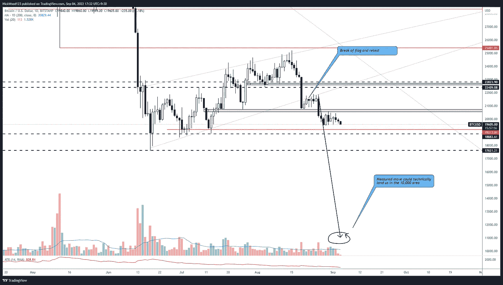
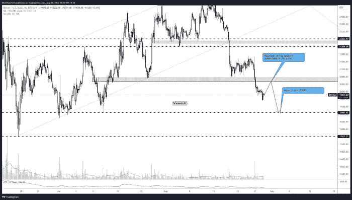
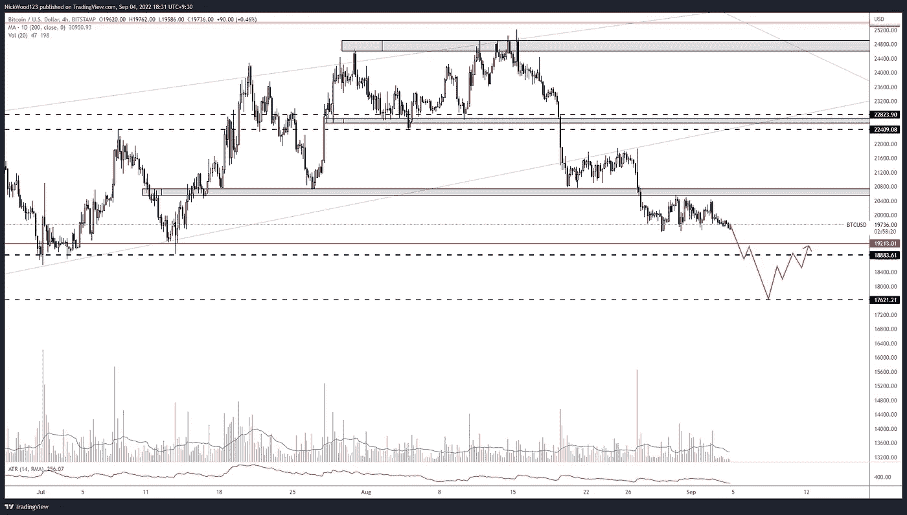
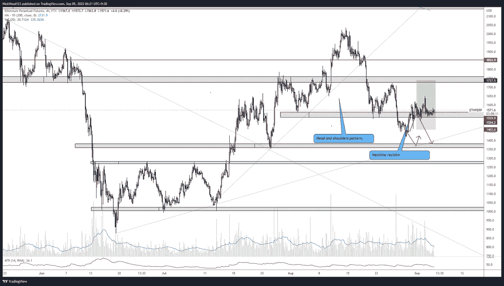

# 比特币周报——比特币坐在关键水平支撑下。

> 原文：<https://medium.com/coinmonks/bitcoin-weekly-report-bitcoin-sitting-under-key-horizontal-support-268612d5e44e?source=collection_archive---------40----------------------->

## 比特币报告(2022 年 9 月 5 日)

在过去的六天里，比特币和 T2 在一个较低的时间范围内整合。 **BTC** 目前位于**20500**关键支撑位下方。上周我们讨论了不同的场景，场景# 1**看起来是上周发生的一个场景。**

在本周的报告中，我们将回顾上周的预测，并将其与当前的市场结构进行比较，我们还将分析我们认为未来一周可能会出现的情况。

# BTC 日报

BTCUSD Daily

[https://www.tradingview.com/x/kmNoWjFA/](https://www.tradingview.com/x/kmNoWjFA/)

我想首先说，我个人不相信这将会发生，但同时这是值得考虑和准备的。对我来说，最突出的是日线上出现的清晰的熊市形态，我们得到了对阻力支撑的重新测试，在接下来的一周里，价格下跌了 10%。从更大的模式测量的移动表明 **10，000** 区域是可能的。

然而，就目前情况来看，我希望价格能停留在 **18，000** 和 **17，600** 的水平。这是一些我认为多头会介入的强支撑位。

# 4 小时时间范围

下面是上周报告的截图，讨论了我们认为价格可能会拒绝的地方。

Last week Scenario #1

[https://www.tradingview.com/x/jN5WqqKi/](https://www.tradingview.com/x/jN5WqqKi/)

引用前一份报告

> 在我看来，我认为未来几天很有可能出现一波救济性反弹，触及 20，000 点水平导致拒绝，并向下填补 18，800 点水平的缺口。

场景的第二部分还没有结束，我们正在寻找向下移动到 **18，000** 的水平，我们期望看到某种**购买压力**到来。

BTC/USD 4hr

[https://www.tradingview.com/x/V0flU8ZM/](https://www.tradingview.com/x/QtnLTbkV/)

我预计会深入回撤至该区域。我将密切关注价格走势，因为价格会下跌到这个区域，我将寻找抛售压力减轻和多头控制的迹象。20，500 点仍然是一个重要的阻力位。目前的**19500**水平也是一个保持价格一段时间的水平，失去这个水平将触发向**18800**的移动。

# 瑞士法郎/美元

ETHUSD 4hr

[https://www.tradingview.com/x/uGwYSkmD/](https://www.tradingview.com/x/uGwYSkmD/)

**ETH** 在过去几周的 4 小时图上有一个清晰的头肩顶形态，我正在寻找**颈线**的拒绝**。这种拒绝从未发生，相反，price **占据了**颈线**的位置**，并且自那以后一直位于颈线上方。我目前确实持有 ETH 的多头头寸，但随着价格继续横盘整理，它开始看起来更像是一个较低的高点已经形成，下一次下跌即将来临。**

这是一个我愿意犯错的交易，价格还没有在我的区域内收盘，在那之前我会持有这个交易。我们可以期待看到的是**移动**到 **1730** 我期待看到一些拒绝，或者我们可以回落到**趋势线**在 **1410** 的位置。在这方面有很好的支持，这绝对是一个我会关注的地方，因为拒绝会出现。

## **本周学习内容**

我们的设想在最近的时间里一直在上演，当市场在变动时，对所有情况的计划使我们更容易做出合理的交易决定。想出“如果那么”的陈述很重要，这样你就能在市场的每种情况下都有规则可循。

举个例子，让我们看看 ETH。

*如果 ETH 移动到 1400 区域，等待以多根 4 小时蜡烛线的形式拒绝，并输入一个多头，如果随后价格跌破该水平，则关闭交易并在 1250 区域或 1000 水平寻找多头，如果价格跌破这些支撑位中的任何一个并再次测试它们看跌，则在拒绝这些水平时输入空头头寸。如果这些都没有发生，那就没有交易。*

这只是一个非常快速和粗略的例子，说明了如果那么语句可能是什么样子，但它是一个很好的起点，让你思考如何规划交易，并知道如何以及何时执行交易。

一如既往地规划你的交易，耐心和过程胜于结果。

如果你想和我联系，请跟着我

推特:@NickWoodFX

电子邮件:nw.forex@outlook.com

缺口

这不是财务建议。本文包含的信息是一般性的，没有考虑到您的个人情况。你应该考虑这些信息是否适合你的需要，如果合适的话，向理财顾问寻求专业建议。你并且只有你对你的交易和投资决定负责。我不是专业人士。我对你可能遭受的任何损失或损害不承担任何责任。

> 交易新手？试试[密码交易机器人](/coinmonks/crypto-trading-bot-c2ffce8acb2a)或者[复制交易](/coinmonks/top-10-crypto-copy-trading-platforms-for-beginners-d0c37c7d698c)