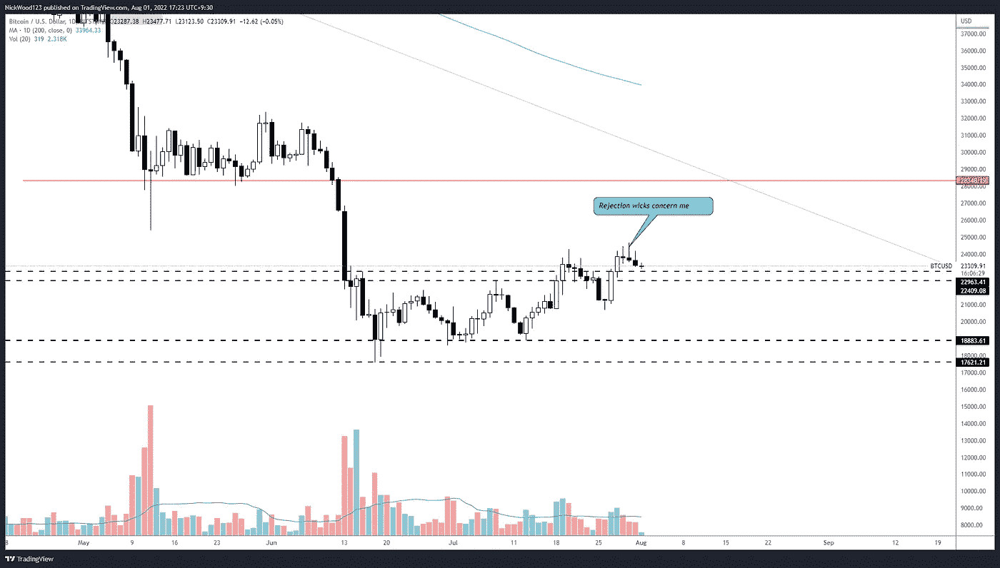
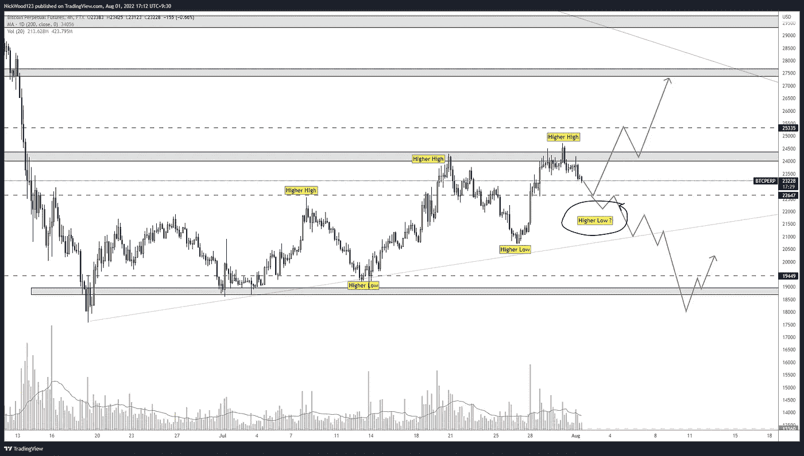
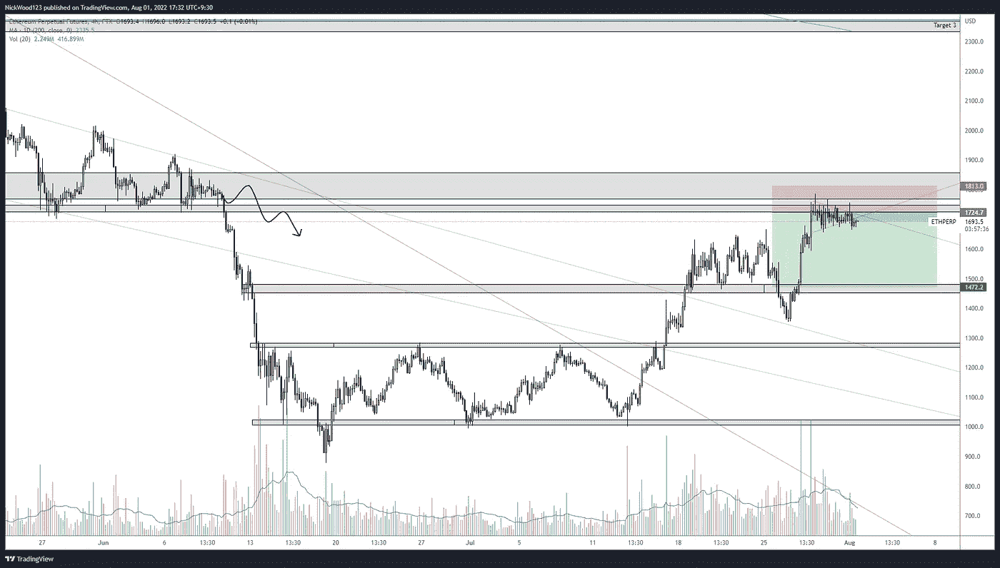

# 比特币周报——在前期高点挣扎的比特币。

> 原文：<https://medium.com/coinmonks/bitcoin-weekly-report-bitcoin-struggling-at-previous-highs-6e30c8a43b99?source=collection_archive---------34----------------------->

## 随着更高的高点和更高的低点的形成，本周将会发生什么。

# 比特币报告(2022 年 8 月 1 日)

八月快乐，在很大程度上，目前的趋势看起来对 T2 比特币的多头非常有利。在今天的报告中，我们将讨论我们预期的趋势延续，或者我们预期的价格下跌。

# BTC 日报

BTC Daily

【https://www.tradingview.com/x/XdWyeFIv/ 

如**日线图**所示，我们有**拒绝灯芯**，这意味着价格正在努力高于**24000**–**25000**水平。但这仍可能意味着，在另一轮上涨之前，我们只需要一次短暂的回调。重要的是观察以前的价格走势，分析价格如何反应，以及当 BTC 做出更大的变动时蜡烛线是什么样子。例如在 7 月 18 日我们可以看到一根**倒锤蜡烛**，这是一个重要的**信号**表明价格已经准备好**从此点拉回**。在接下来的 5 天里，BTC 下跌了 11%，直到我们有了一根锤子蜡烛，从那时起，我们看到价格在仅仅 4 天内上涨了 19%。

这对我们意味着什么？**更高的低点和更高的高点**，在我们更低的时间框架上形成**上升趋势**。因此，让我们看看我们的 4 小时图表，以获得确认和更详细的版本。

# 4 小时时间范围

BTCUSD 4HR

[https://www.tradingview.com/x/cKvKlj5C/](https://www.tradingview.com/x/cKvKlj5C/)

如 **4hr 图表**所示，这里我们有在过去**月**形成的**高点**和**高点低点**。不可否认，前一个高点只是一个更高的高点，并显示出拒绝前一个阻力，这是一个轻微的关注。如果一个**清晰的更高低点**形成，然后开始向上移动，这将是一个可取之处。重要的是要注意我们的原始范围与**虚线**在 **22647** 和 **19449** 处。在我看来，这些价位仍然很重要，可能会再次被测试为支撑位或最终阻力位。

记住我们的**日线趋势是** **下跌**，但是如果我们想继续朝着**28000**水平努力，目前的 **4 小时趋势**显示出积极的迹象。如果 **BTC** 能够再次站上**24500**水平并守住，我将看涨**28000**水平，寻找支撑做多，并瞄准之前的**支撑作为阻力。**

如果形成了一个更低的低点，我认为价格会一路回撤至 18000 点 T21，甚至 17600 点区域。

# 瑞士法郎/美元

ETHUSD 4hr

[https://www.tradingview.com/x/Qw93uPJS/](https://www.tradingview.com/x/Qw93uPJS/)

引用上周的报告，我说我正在等待 **ETH** 到**“在 1724 级别显示拒绝”。这正是本周发生的事情，也是为什么我在那个价位做空，因为我看到了拒绝。这就是让事情变得简单的力量，以及在价格触及利益之前了解利益水平的力量。有一个**计划**你**想看什么**在什么水平，几乎有一个**指导手册**关于什么图表和价格必须**看起来像** **或者在你进入交易之前做**。**

对我来说，我希望价格在这个水平暂停，在 4 小时的时候显示一些拒绝的信号，并进入一个空仓，目标是先前的支撑，但也有一个计划，如果价格移动并关闭在我的关键区域之上，在亏损的情况下提前结束交易。计划中的另一种情况是，如果价格变动对我有利，但在 **1600 水平**到**停止，获利**并等待新的设置

我很好奇 **ETH 在这么长时间**接近阻力**后仍然保持**这个水平，我经常听说这是一个**建立**和一个**牛市标志**，如果我们不是坐在**阻力**下，我会对**牛市标志设置**更开放。然而，建立的想法仍然是有趣的，很少看到价格在拒绝这么长时间后没有下降，换句话说，有东西在支撑价格。本周很可能会有一个突破和**不稳定** **移动，这是你决定可能的方向。**

像往常一样，规划你的交易，耐心和过程胜于结果。

如果你想和我联系，请跟着我

推特:@NickWoodFX

电子邮件:nw.forex@outlook.com

缺口

*这不是理财建议。本文包含的信息是一般性的，没有考虑到您的个人情况。你应该考虑这些信息是否适合你的需要，如果合适的话，向理财顾问寻求专业建议。你并且只有你对你的交易和投资决定负责。我不是专业人士。我对你可能遭受的任何损失或损害不承担任何责任。*

> 交易新手？试试[加密交易机器人](/coinmonks/crypto-trading-bot-c2ffce8acb2a)或者[复制交易](/coinmonks/top-10-crypto-copy-trading-platforms-for-beginners-d0c37c7d698c)