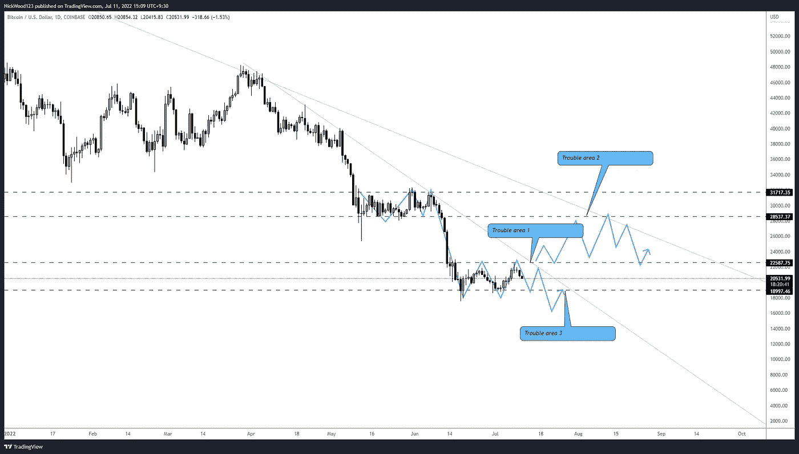
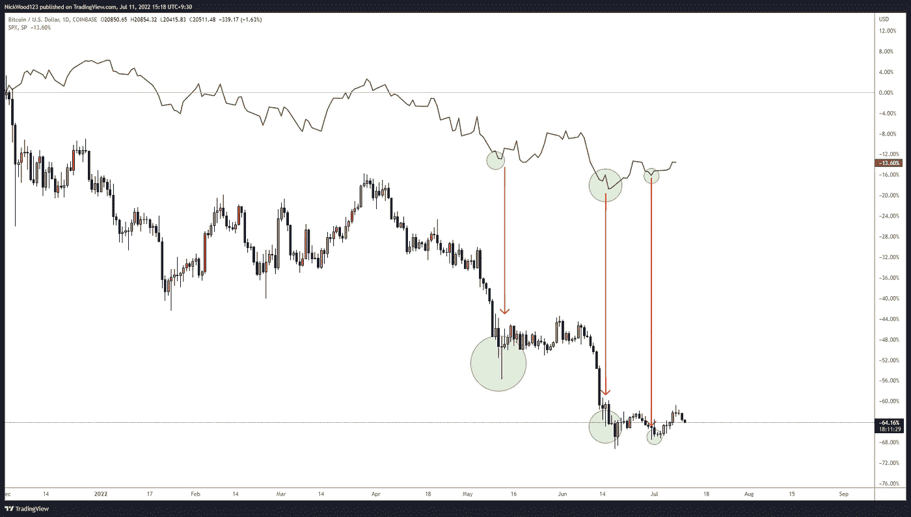
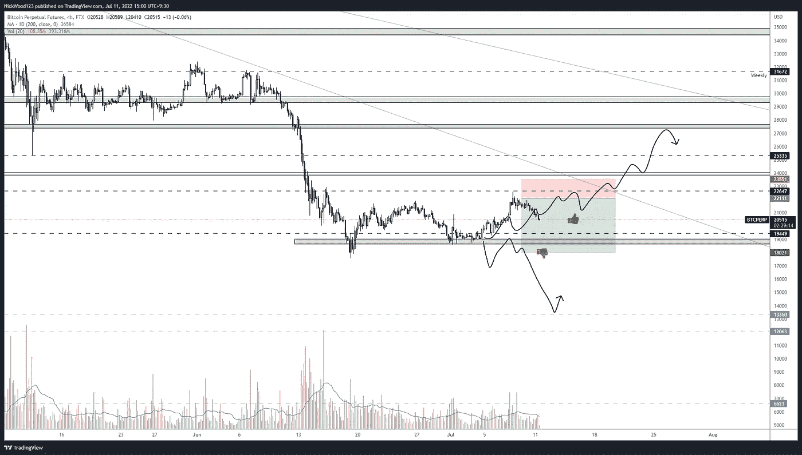

# 比特币周报——低位反弹，会持续吗？

> 原文：<https://medium.com/coinmonks/bitcoin-weekly-report-bounce-at-range-low-will-it-carry-through-c094ae504b88?source=collection_archive---------64----------------------->

## BTC 获得了强大的反弹支持，但它能走多远？

# 比特币报告(2022 年 7 月 11 日)

对 BTC 来说，这是有趣的一周。随着最近的反弹，我看到目前最常见的问题是， **BTC** 的底部了吗？在我们的上一份报告中，我们针对这种情况制定了一个计划，从这里我们可以继续查看未来的潜在选项。

# BTC 日报

BTC Daily Potential Scenarios

【https://www.tradingview.com/x/ViH5zueA/ 

**日线图**仍然显示出明显的**看跌**倾向。虽然我们在区间低点反弹，但老实说，如果目标是本周我们看到的区间高点，这是一个很好的做多机会。但是我们已经看到日线上的晚间星反转形态，我预计这一势头至少会将我们带到低位。当我们在高位开始看到拒绝时，我做空了这一对。未来几周，我仍然持有看跌的中期时间框架偏好，并观察这一回撤会带我们走多远。

跌破 **$18，000** 水平以及支撑位下方的拒绝将是另一个针对之前提到的水平的做空信号，例如 **$13，000** 和 **$12，000** 价格区域。

Correlation between S&P 500 and BTC

[https://www.tradingview.com/x/G4IT6WOC/](https://www.tradingview.com/x/G4IT6WOC/)

另外要提的是 **S & P 500** 和 **BTC** 之间的关联。很明显，这两者是高度相关的，在世界经济的不确定性开始稳定并再次变得积极之前，BTC 也将陷入困境。

当恐惧袭击市场时，它往往会影响金融市场的所有领域，看起来密码不再被排除在这种影响之外。任何大股东都要记住的一点是，如果 **S & P500** 以这种方式行事，那么公平地说，考虑到其他资产的表现如此糟糕，关于加密货币的负面信息和新闻并不真正值得。

> 交易新手？尝试[加密交易机器人](/coinmonks/crypto-trading-bot-c2ffce8acb2a)或[复制交易](/coinmonks/top-10-crypto-copy-trading-platforms-for-beginners-d0c37c7d698c)

我认为问这个简单的问题很重要。如果 **BTC** 和 **SPX** 之间的相关性如此之强，那么当 **SPX** 再次找到力量时会发生什么？(过去 60 多年来一直如此)。我让你自己回答这个问题。

# 4 小时时间范围

BTCUSD 4hr

[https://www.tradingview.com/x/rWloZ52t/](https://www.tradingview.com/x/rWloZ52t/)

4 小时在高位显示出明显的拒绝信号。不过要记住的是，正如图表所示，我们实际上可能会开始形成更高的低点，如果我们能够尽快再次接近区间高点，并最终实现这一点，这对 BTC 来说实际上是一个非常短期的积极信号。

请记住，我们必须考虑到更大的趋势和水平，但在短期内，上周的计划仍然进行得很好。因此，按照计划，等待价格告诉你它的下一步行动。

在我考虑再次看好加密货币之前，还需要更高的水平。但是永远不要忘记去年年底我们在哪里，我们现在在哪里，我们可能会在哪里结束。

> “如果你愿意以 4 万美元、5 万美元、6 万美元的价格购买比特币，为什么你对 2 万美元的价格如此不确定？”

一如既往，感谢您的阅读，我希望您能从这篇文章中学到一些东西。

> *交易你的交易计划，管理风险。*

如果你想和我联系，请跟着我

推特:@NickWoodFX

电子邮件:nw.forex@outlook.com

缺口

*这不是理财建议。本文包含的信息是一般性的，没有考虑到您的个人情况。你应该考虑这些信息是否适合你的需要，如果合适的话，向理财顾问寻求专业建议。你并且只有你对你的交易和投资决定负责。我不是专业人士。我对你可能遭受的任何损失或损害不承担任何责任。*