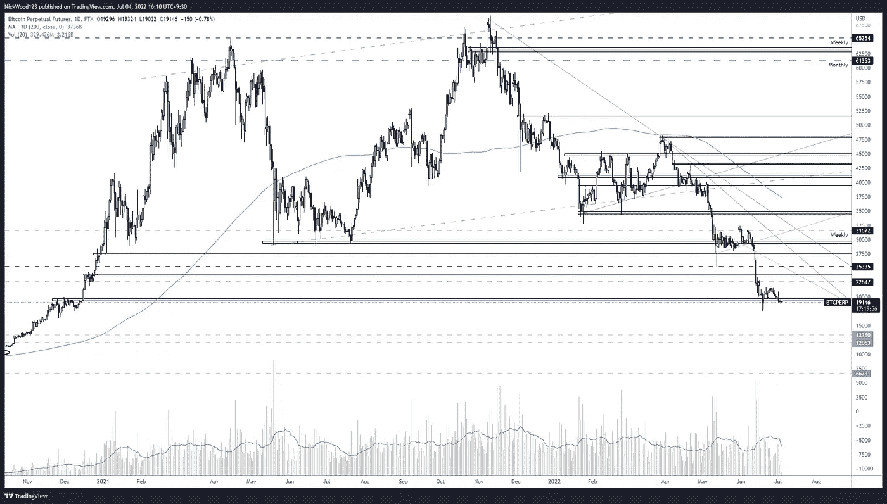
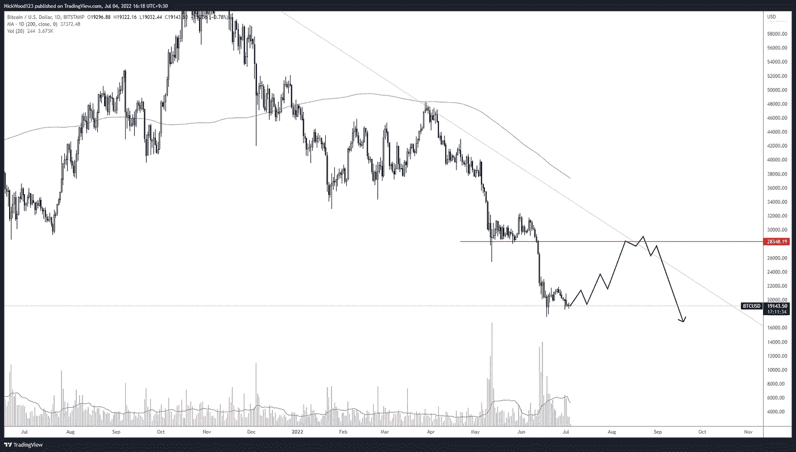

# 比特币周报——我们如何知道何时见底？

> 原文：<https://medium.com/coinmonks/bitcoin-weekly-report-how-will-we-know-when-the-bottom-is-in-394938962a6f?source=collection_archive---------57----------------------->

## 合并中的加密，但它的下一步是什么？

# 比特币报告(2022 年 7 月 4 日)

大家好，首先我想告诉大家为什么报告停止了一段时间。由于个人原因，我无法继续撰写我乐于发表的高质量内容。我需要抽出一些时间来照顾自己和我关心的人，这意味着我必须完全离开交易一段时间。所以谢谢你的理解，希望这篇内容能给你带来一些有用的信息。

# BTC 日报

BTC Daily

[https://www.tradingview.com/x/CEbkIUFr/](https://www.tradingview.com/x/CEbkIUFr/)

这张照片相当糟糕。对我来说，它描绘了一幅分布图和下跌趋势前的下跌。虽然价格目前保持在**19，000 美元**，但我预计这个价格点会尽快下降。在我们开始在日线上创造更高的高点和更高的低点之前，我仍然倾向于看跌。同样，正如之前的文章所述，这并不意味着比特币已死，远非如此，但当我们着眼于更高的时间框架时，这种回调可能是意料之中的。

> 交易新手？试试[密码交易机器人](/coinmonks/crypto-trading-bot-c2ffce8acb2a)或[复制交易](/coinmonks/top-10-crypto-copy-trading-platforms-for-beginners-d0c37c7d698c)

每天对区间低点 30，000 美元进行测试仍然会让我不确定是否会形成新的高点。在下面的图片中，如果达到了 30，000 美元的价格，我可能会预期这种情况会发生。

BTC Daily retest reject example.

[https://www.tradingview.com/x/9Vx5myA0/](https://www.tradingview.com/x/9Vx5myA0/)

事实是，我们低于日线 200 毫安，我们正在形成更低的高点和更低的低点。试着触底就像试着接住落下的刀，这不是我感兴趣的事情。

# 4 小时时间范围

BTC 4 Hour timeframe

[https://www.tradingview.com/x/B1yk2xu0/](https://www.tradingview.com/x/B1yk2xu0/)

如上所述，思考游戏的大趋势是至关重要的。我们提到更低的低点和更低的高点正在形成，尽管这两种情况中的一种可能会导致向**30，000 美元**价格点移动，但偏见仍然必须是严重看跌。

价格目前在支撑位附近变得越来越紧，虽然该支撑位保持不变，但我的感觉是，如果这一点不能很快反弹，随着价格继续下跌，该支撑位将再次成为阻力。

如果这种情况真的发生了，那么我们可以建立一个空头头寸，试图抓住向下到**13，000 美元**价位的波动。

最后，我确实相信，倾听市场消息和恐惧是重要的，但我持相反的观点。人们开始质疑 crypto 是否是一个骗局，以及它是否已经死亡。甚至我的父母都在问我这件事(大警钟)。这些年来，我在观察比特币的过程中多次注意到，这些观点往往始于精明的资金积累之时。现在我知道这违背了之前的讨论，是的，我仍然看空比特币。但是当我开始听到这种类型的新闻故事和文章出现时，我知道末日就在眼前。因此，当市场结构发生变化，开始看起来像是积累时，我将开始转变我的视角，扩大规模。

一如既往，感谢您的阅读，我希望您能从这篇文章中学到一些东西。

> 交易你的交易计划并管理风险。

如果你想和我联系，请跟着我

推特:@NickWoodFX

电子邮件:nw.forex@outlook.com

缺口

*这不是财务建议。本文包含的信息是一般性的，没有考虑到您的个人情况。你应该考虑这些信息是否适合你的需要，如果合适的话，向理财顾问寻求专业建议。你并且只有你对你的交易和投资决定负责。我不是专业人士。我对你可能遭受的任何损失或损害不承担任何责任。*