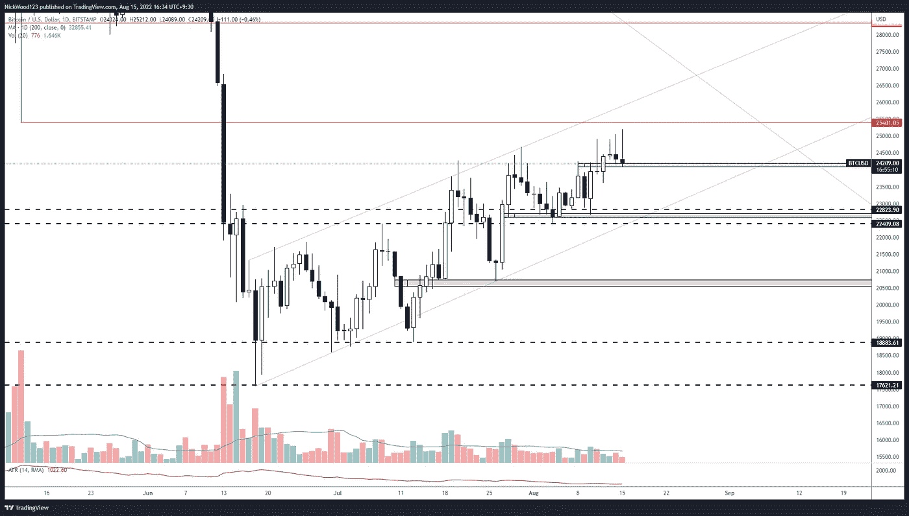
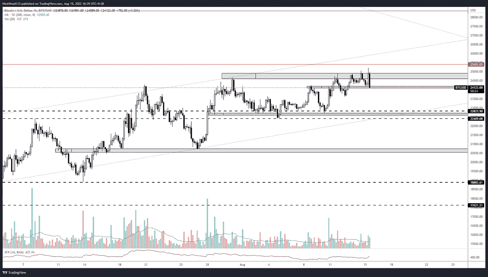
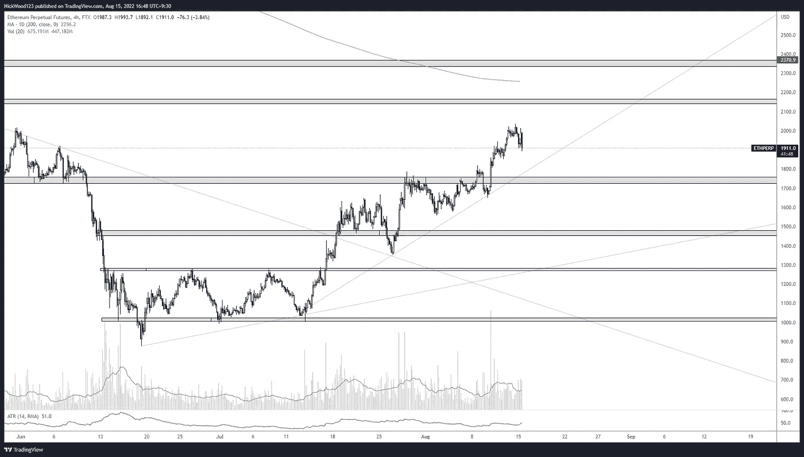

# 比特币周报——价格继续测试阻力。

> 原文：<https://medium.com/coinmonks/bitcoin-weekly-report-price-continues-to-test-resistance-1e59008291bc?source=collection_archive---------38----------------------->

## 普莱斯正试图突破 25，000 点的阻力区域。

# 比特币报告(2022 年 8 月 15 日)

上周我们谈到了在 22，000 点水平之前的潜在低点。这发生了，我们得到了一个很好的推动高点，然后最终形成了一个新的更高的高点。

# BTC 日报

BTC Daily

https://www.tradingview.com/x/leiQq1fc/

每日时间图对我来说很有趣。如果我们比较一下**过去 4 个**左右**推动**的情况，我们会看到价格在一周左右的时间里强劲上涨。然后开始用**强倒锤或者日线上的射星蜡烛减速。**这可能是一个**好的指标**，告诉我们价格在**更高的价格**被**拒绝**，可能会出现下跌。我预计价格**将在未来几天下跌**，有可能形成另一个更高的低点，并在这个**通道**中继续。当我们查看 4 小时时间框架时，我们将能够看到一些更清晰的级别，以及我们预计拒绝会发生在哪里以及为什么会发生。

# 4 小时时间范围

BTCUSD 4hr

[https://www.tradingview.com/x/a7PedWQH/](https://www.tradingview.com/x/a7PedWQH/)

上周的 4 小时我们提到了 **61.8 fib 水平**回撤，我们认为这是一个移动发生的**黄金口袋**或**区域**。价格并没有立即反弹，但最终还是一路攀升至前一个高点。

看着这张图表，我最担心的是价格试图突破 25k 区域的次数。每次我们到达这个区域，价格就会被压低，而且压低的速度相对较快。日报在这个水平上显示了强烈的拒绝，这是放大的版本。我们看到价格在**25000**处遇到阻力，然后价格很快遇到抛售压力**迫使**价格回落**下跌**。在 **22，800** 的低点对我来说很重要，但是我仍然认为通道低点是一个潜在的支撑区域。

当我打这篇文章时，我们可以看到 BTC 这次相对强烈地拒绝了抵抗。如果这不会导致更强劲的回调至 23，000 点区域，我会感到惊讶。然而，让我们永远不要忘记，市场有一个有趣的方式来做完全相反的事情，所以要谨慎交易。

总的来说，我们仍然在形成更高的高点和更高的低点，维持 4 小时的上升趋势。在 **22，000 水平被突破**之前，我将保持短期**看涨**。

# 瑞士法郎/美元

ETHUSD 4HR

【https://www.tradingview.com/x/YAuCVbLh/ 

ETH 继续**突破高点**，但方式与 BTC 不同。当比较这两个图表时，我们可以看到 ETH 的高点突破比 BTC 更明显。以太坊仍将对 BTC 的价格波动做出反应，但以太坊看起来确实比这两者更强大。

一些**关键点位**需要关注，交易寻找**支撑**可能是: **1850、1750、1570** ，而对于**阻力**和一个**空头**我们可以看一下 **2011** 、 [**2140**](/@N.Wood/bitcoin-weekly-report-price-continues-to-test-resistance-1e59008291bc) 。

这些水平为我们观察价格反应提供了非常清晰的区域，在价格到达这些点之前，我只是简单地等待和观察，不要试图强行进行不存在的交易。

一如既往地规划你的交易，耐心和过程胜于结果。

如果你想和我联系，请跟着我

推特:@NickWoodFX

电子邮件:nw.forex@outlook.com

缺口

这不是财务建议。本文包含的信息是一般性的，没有考虑到您的个人情况。你应该考虑这些信息是否适合你的需要，如果合适的话，向理财顾问寻求专业建议。你并且只有你对你的交易和投资决定负责。我不是专业人士。我对你可能遭受的任何损失或损害不承担任何责任。

> 加入 Coinmonks [电报频道](https://t.me/coincodecap)和 [Youtube 频道](https://www.youtube.com/c/coinmonks/videos)了解加密交易和投资

# 另外，阅读

*   [无聊猿游艇俱乐部(BAYC)回顾](https://coincodecap.com/bored-ape-yacht-club-bayc-review) | [拜比特 vs 比特币基地](https://coincodecap.com/bybit-vs-coinbase)
*   [5 款最佳加密交易终端](https://coincodecap.com/crypto-trading-terminals) | [最佳 DeFi 应用](https://coincodecap.com/best-defi-apps)
*   [比特币基地 vs 瓦济克斯](https://coincodecap.com/coinbase-vs-wazirx) | [比特鲁点评](https://coincodecap.com/bitrue-review) | [波洛涅克斯 vs 比特克斯](https://coincodecap.com/poloniex-vs-bittrex)
*   [德国最佳加密交易所](https://coincodecap.com/crypto-exchanges-in-germany) | [Arbitrum:第二层解决方案](https://coincodecap.com/arbitrum)
*   [币安交易机器人](/coinmonks/binance-trading-bots-d0d57bb62c4c) | [OKEx 评论](/coinmonks/okex-review-6b369304110f) | [Atani 评论](https://coincodecap.com/atani-review)