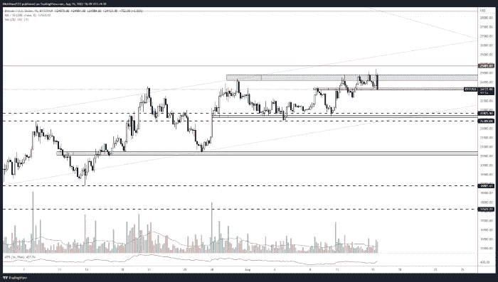

# 比特币周报——价格一天下跌 10%。

> 原文：<https://medium.com/coinmonks/bitcoin-weekly-report-price-falls-10-in-one-day-455afd28d80f?source=collection_archive---------45----------------------->

## 公牛队过去几周的所有努力都白费了吗？

# 比特币报告(2022 年 8 月 22 日)

一天之内，BTC 的价格下跌超过 10%。既然我们已经失去了上周提到的**22000 水平**，这对比特币意味着什么？我们能指望 BTC 就这样一蹶不振吗？

在今天的文章中，我们将以最简单的形式来看价格行为，并试图找出我们可能会看到价格反应的区域。

# BTC 日报

BTCUSD Daily

【https://www.tradingview.com/x/nNhh8uWy/ 

如前几篇文章所示，我们目前持有的区域是一个非常清晰的较低时间框架水平。主要问题是，我们要不要举办？我的直觉是否定的，但是在某些情况下，我可能会期待一个不错的反弹和回撤。

上周我们提到了**逆锤**我说

> “我预计未来几天价格会下跌，可能会形成另一个更高的低点，并延续这一通道。”

嗯，我们部分是正确的，价格确实继续下跌，但它突破了水平支撑和对角支撑的支撑区域，**在 20，000 区域停止。**

# 4 小时时间范围

Last weeks Chart 4HR

[https://www.tradingview.com/x/a7PedWQH/](https://www.tradingview.com/x/a7PedWQH/)

Current 4hr Chart

[https://www.tradingview.com/x/TdUSYMZS/](https://www.tradingview.com/x/TdUSYMZS/)

我想再次引用我以前的文章，让你了解我为什么谨慎并准备做空 BTC。

> 看着这张图表，我最担心的是价格试图突破 **25k** 区域的次数。每次我们到达这个区域，价格就会被压低，而且压低的速度相对较快。日报在这个水平上显示了强烈的拒绝，这是放大的版本。我们看到价格在**25000**处遇到阻力，然后价格很快遇到抛售压力**迫使**价格回落**下跌**。”

从这里我们可以看到 price 有**两个清晰的区域**可以测试，其中一个已经过半测试，尽管我真的希望 price 能更深入这个 **20，000 区域**。

我在许多文章中多次提到这一点，但当**支持**被**打破**时，**变成阻力**，反之亦然。因此，如果我们向上移动，我预计会在 **22，400 水平**看到**拒绝**。如果价格持有足够长的时间，这将为做空**头寸打开机会。**跌破**20k**水平，但随后快速回调将引发**多头机会**作为支撑位的回调，然而如果该水平下跌且价格保持在美国阻力位之下，这将允许另一个**空头机会**至 **18，900 水平**。

# 瑞士法郎/美元

ETHUSD 4hr

[https://www.tradingview.com/x/0Rxd4IK8/](https://www.tradingview.com/x/0Rxd4IK8/)

上周我提到了几个关键水平，我预计它们可能会回撤，尽管我当时认为这不太可能。

最低价格的蜡烛封在 **1575** 。同样，猜测价格可能会在哪里暂停是相对简单的，更难的是，权衡价格水平并知道如何获得正确的时机。那么，现在我们已经达到了 **1575** 的价格目标，接下来我们将何去何从呢？

老实说，我感觉 **1570** 会**倒**，对我来说下一个明确的关卡是**1480–1440 区域。**此处的另一次反弹可能会导致在 **1570** 处回到当前区域。那时的价格走势将决定我的交易决策。

如果我们守住这个区域，我预计价格会在 **1720 区域**受阻，然而这个区域并不像我希望的那样干净，它可能早在 **1680** 和晚在 **1840** 停止。我会观察这个区域的蜡烛线收盘情况来做交易决定。

## **本周学习内容**

结构的打破和重新测试允许很大的交易机会，它给你一个清晰的水平，你的交易是无效的，并允许在一个合理的位置止损。当我们注意星盘上关键区域的蜡烛类型时，它可以给我们**暗示**可能会发生什么。例如，在我们预期的 ETH 1570 水平的锤子…这可能是一个很长的信号，在 BTC 相同价格区域多次尝试后拒绝灯芯..可能是原路返回。

我们经常认为我们必须在交易中把事情复杂化，我希望今天的文章证明了少即是多。具有关键支撑位和阻力位的简单价格行为交易一直与金融市场相关。

*一如既往地规划你的交易，耐心和过程胜于结果。*

如果你想和我联系，请跟着我

推特:@NickWoodFX

电子邮件:nw.forex@outlook.com

缺口

*这不是财务建议。本文包含的信息是一般性的，没有考虑到您的个人情况。你应该考虑这些信息是否适合你的需要，如果合适的话，向理财顾问寻求专业建议。你并且只有你对你的交易和投资决定负责。我不是专业人士。我对你可能遭受的任何损失或损害不承担任何责任。*

> 交易新手？尝试[加密交易机器人](/coinmonks/crypto-trading-bot-c2ffce8acb2a)或[复制交易](/coinmonks/top-10-crypto-copy-trading-platforms-for-beginners-d0c37c7d698c)